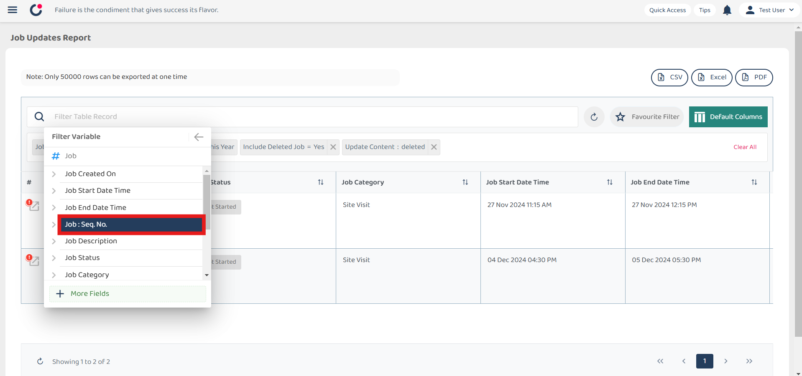
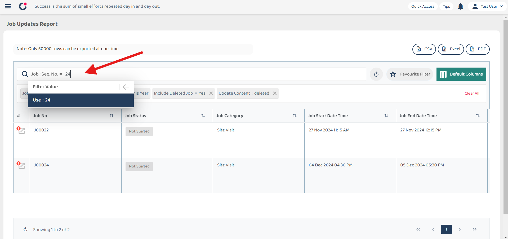
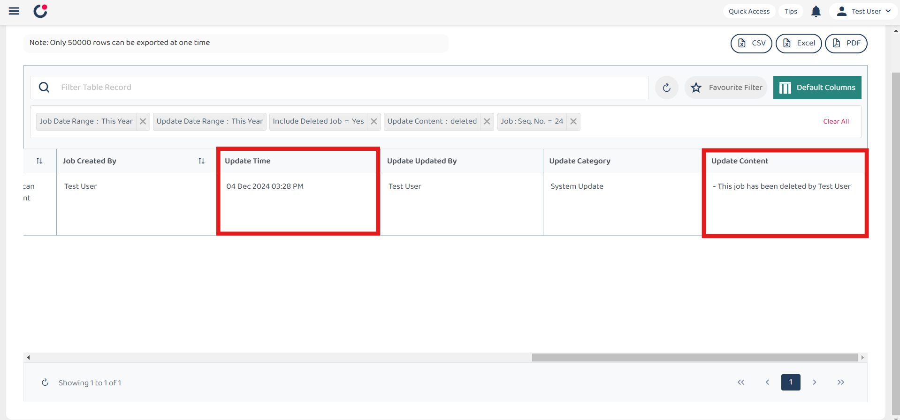

## How to filter for deleted job/Who deleted the job?

1) Select left corner menu icon to open sidebar.  

         

 

2) Select Business Reports.  

         

 

3) Select Job Update Report.  

         

 

4) Click the filter search bar, and then select job from the list.  

         

 

5) Under Job, scroll down and select include deleted job.  

         

 

6) Select 'Yes' for the filter value.  

         

 

### Filter for deleted jobs only.
#### To know how many job deleted, what jobs deleted, who deleted, when deleted.  

7) Select Job Update.

         

 

8) Select Update Content.

         

 

9) Select 'Contains'.

         

 

10) Write 'deleted' for the filter value.

         

 

11) Deleted jobs are filtered and displayed.

         
         

 

12) In you want to filter out specific deleted job, you may also need to include this filter for job Sep No.  

         

 

13) Job Equal to J00024.  

         
         
         

 

14) Then scroll to the most bottom right and see who deleted in Update Content Section.  

         
         

 
