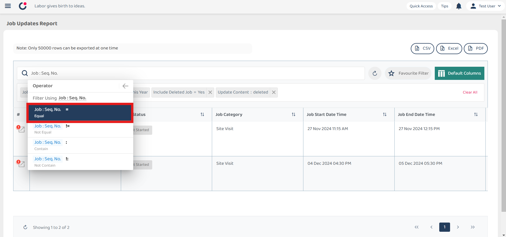
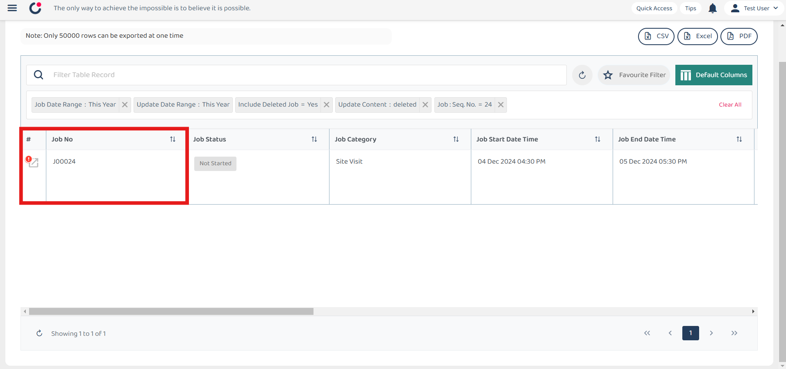

## How to filter for deleted job/Who deleted the job?

1) Select left corner menu icon to open sidebar.  

         

 

2) Select 'Business Reports'.  

         

 

3) Select 'Job Update Report'.  

         

 

4) Click the filter search bar, and then select 'job' from the list.  

         

 

5) Under Job, scroll down and select 'Include Deleted Job'.  

         

 

6) Select 'Yes' for the filter value.  

         

 

### Filter for deleted jobs only.
#### To know how many jobs were deleted, what jobs were deleted, who deleted them, and when they were deleted. 

7) Select 'Job Update'.  

         

 

8) Select 'Update Content'.  

         

 

9) Select 'Update Content : Contains'.  

         

 

10) Write 'deleted' for the filter value.  

         

 

11) Deleted jobs are filtered and displayed.  
*Note: Deleted jobs will be indicated with an exclamation (!) mark.

         
         

 

12) If you know which Job is deleted, and wanted to know who deleted the job. You may also search the deleted job by using the filter for Job Seq No.  

         

 

13) Job Equal to J00024.  

         
         

 

14) Then scroll to the most bottom right and see who deleted in Update Content Section.  

         
         

 
