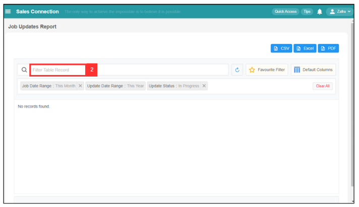

## 🧾 How to use filter function?

- **How to filter job by date range?**  

**Desktop site:** 

 1. To filter job, go to Main Navigation> Business Management > Schedule > Job Schedule. 
   **Filter Job Here:** [https://salesconnection.my/activity/scheduler](https://salesconnection.my/activity/scheduler)

    

      
    

 2. Click the calendar icon in the top right corner of the page.

    

       
    

 3. After that, it will show this Calendar. You can select which month you want to view for. For example, if you want to view the job in April 2024, you will need to click "May", and you will be able to select a month.

    

      
    
   

 4. Select "April"

    

      
    

 5. Select the date.

    

      
    

 6. Now, you are able to view the job in April 2024.

    

      
    

**Mobile App:** 
  1. At the Sales Connection mobile app, select the "Schedule" page in the bottom center.

     

       
     

     
  2. Select the filter icon in the top right of the page. 

     

       
     

  3. Click the expand button.

     

       
     

  4. Select the date range that you want.

     

       
     

  5. Click "Select".

     

       
     

  6. Here's the output.

     

       
     

       

- **How to use job update report filter?** 

1. To use job update report filter, go to Business Report > Job Update Report. 
   **Open the link here:** [https://salesconnection.my/reports/activity-update](https://salesconnection.my/reports/activity-update)

2. Click the "Filter Table Record" and it will show the filter below.

   

     
   
 

3. You can choose by what group that you want to show. For example, select "Job Update" and it will show the Filter Variable below. 

   

     
   
 

4. For example, select "Update Status". It will show the Operator, which includes "Update Status Contains" and "Update Status Not Contains".

   

     
   
 

5. For example, select "Contains" if you want to show which filter value. After that, it will show the filter value as shown below.

   

     
   
 

6. For example, select "In Progress" in the filter value. It will show relevant jobs as below. "Not Contains" means that these jobs searched by the filter are being updated.

   

     
   
  

**Wondering How to Set Your Favourite Filter? Click Here:** [https://salesconnection.github.io/Sales-Connection-Support/Favourite_Filter.md](https://salesconnection.github.io/Sales-Connection-Support/Favourite_Filter.md)
