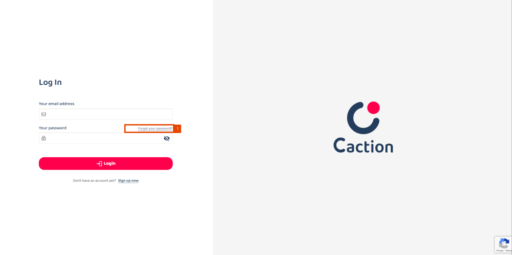
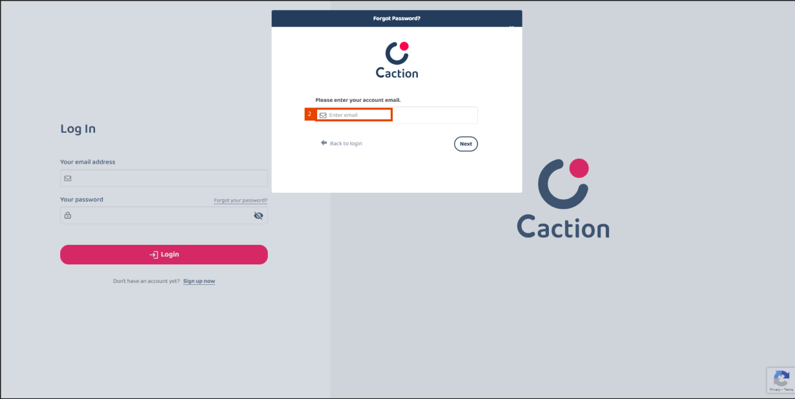
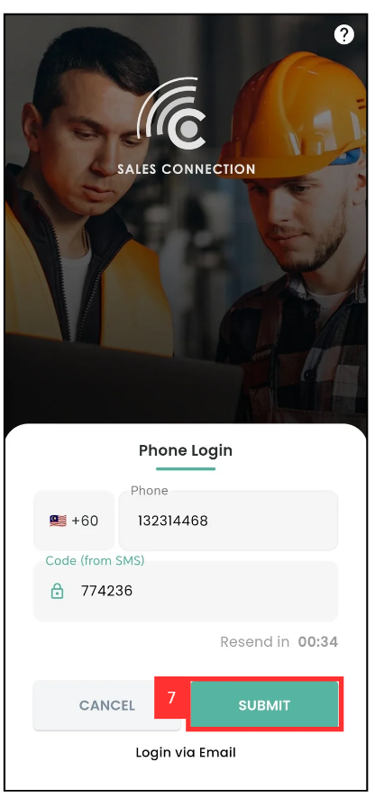

## 🔑 I forgot my password. How can I recover or reset it?
<aside>
(If yes to each, move on to the next scenario)

  <!-- Adding one line space -->

 - **Desktop Site**:

  1. At "SALES CONNECTION" login page, click “Forgot your password?

     

       
     

     
  2. Enter your account email.

     

       
     

  
  3. Click "Next".

     

       
     

     
  4. Click the hyperlink, "here".

     

       
     

     
  5. You will be redirect to your email. Please find the email sent by admin@salesconnection.my . Click on "please click on this link" and you will be able to reset your password.

     

       
     

     
  6. Enter your new password.

     

       
     

     
  7. Click "Change Password".

     

       
     

     
  8. Click "Login Now"

     

       
     

     
  9. Now, you are able to login your account by using your new password.

     

       
     

 
     
  - **Mobile App (Using Phone Number)**:

 1. At the Sales Connection login page, click “LOGIN”

    

       
    

 2. Enter your registered phone number.

    

       
    

    
 3. Click "LOGIN"

    

       
    

 4. After click "LOGIN", you will receive a code from SMS.

    

       
    

 5. A OTP will be sent via SMS, copy the OTP code. 

    

       
    

 6. Paste the OTP.

    

       
    

 7. Click "Submit", and the new password has been successfully saved.

    

       
    

 
 8. It will appear as shown below. Typically, this loading process will take around 10 seconds to complete.

    

       
    

 9. You are now able to login to your account.

    

       
    

    

- **Mobile App (Using Email)**:

 1. At the Sales Connection login page, click “Login via Email”

 2. Click “Forgot Password?”

 3. Enter the email address you registered and click “Submit”

 4. Select “YES” for the “Forgot Password?”

 5. You will received an email from admin@salesconnection.my with a link to reset your password.

 6. Enter your new password and click “Change Password”

 7. Log in with the new password.  

## I tried to click forget password and entered my email/phone number, but I didn’t receive reset password email, how?
<aside>

 1. Ensure that the email address you entered is registered and verified.

 2. Check your email spam/junk mail folder for the reset password email.  

## I still don’t get email /OTP after waiting, how?
<aside>

  1. Escalate this issue to your IT team / support to assist. It may be caused by an email bounce or mail server issue.

