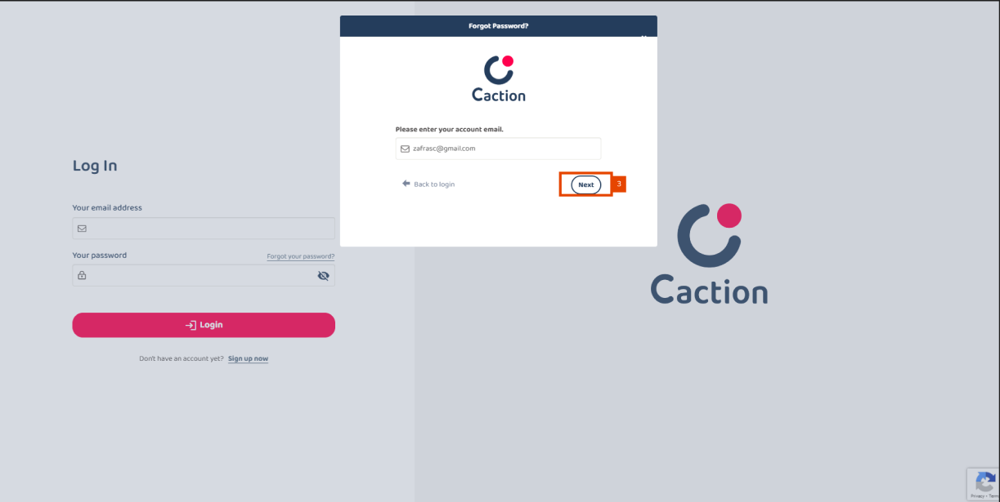
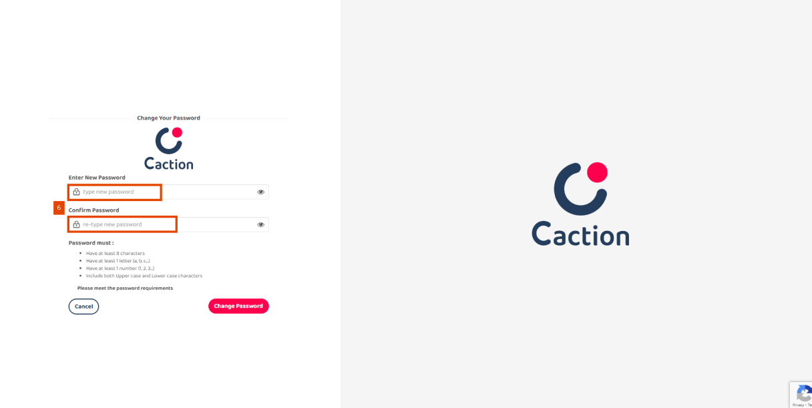
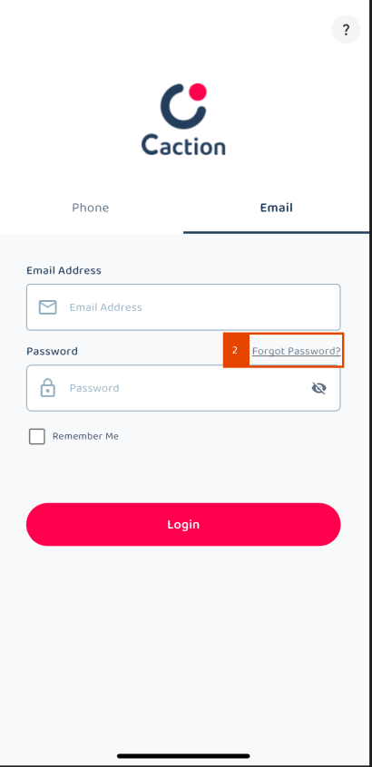
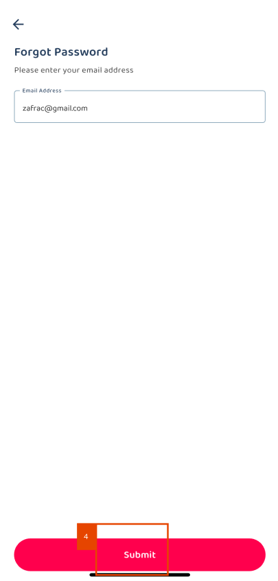
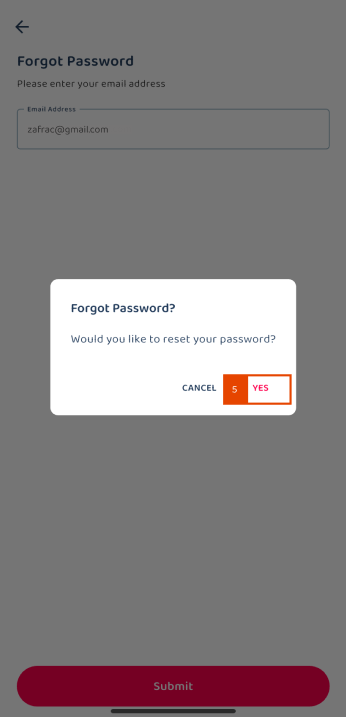
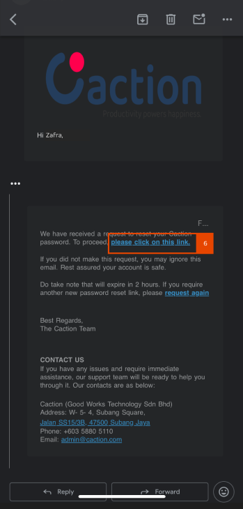
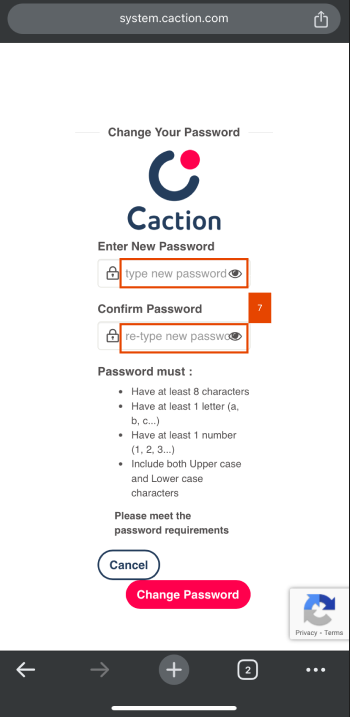
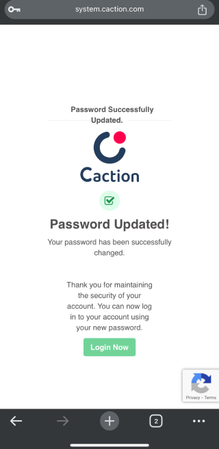
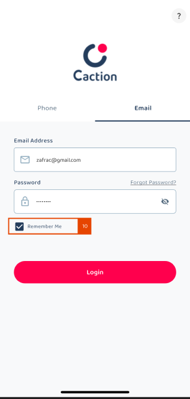

Version 1.0 
Created: 24 May 2024 
Updated: 24 May 2024 
## 🔑 I forgot my password. How can I recover or reset it?

**Navigate to the section by clicking it.** 

- [Desktop Version](#section1) 
- [Mobile App (Using Email)](#section2)
   
 

 
 - **Desktop Version**:

  1. At "Sales Connection" login page, click "Forgot your password"?

     

       
     
 
     
  2. Enter your account email.

     

       
     
 
  
  3. Click "Next".

     

       
     
 
     
  4. Click the hyperlink - "here".

     

       
     
 
     
  5. You will be redirect to your email. Please find the email sent by admin@salesconnection.my . Click on "please click on this link" and you will be able to reset your password.

     

       
     
 
     
  6. Enter your new password.

     

       
     
 
     
  7. Click "Change Password".

     

       
     
 
     
  8. Click "Login Now"

     

       
     
 
     
  9. Now, you are able to login your account by using your new password.

     

       
     
 

   If you dont' know how to login by Using Desktop, please click here: [https://salesconnection.github.io/Sales-Connection-Support/Login.html#section1](https://salesconnection.github.io/Sales-Connection-Support/Login.html#section1)
       
    
     

 
- **Mobile App (Using Email)**:

1. At the Sales Connection login page, click "LOGIN".

   

     
   
 
 
2. Click "Login via Email".

   

     
   
 

3. Click "Forgot Password?".

   

     
   
 
 
4. Enter your email address.

   

     
   
 
 
5. Click "SUBMIT".

   

     
   
 

6. Click "YES".

   

     
   
 

7. You will received an email from admin@salesconnection.my with a link to reset your password.

   

     
   
 
    
8. Enter your new password.

   

     
   
 

9. Click "Change Password".

   

     
   
     

10. When you see this "Password Updated" prompt, it means that your password has been successfully updated.

    

      
    
         

11. Now, you need to go back to Sales Connection app, and use your new password to login. 
 
12. Remember to tick “Remember Me” if the phone is owned by you.

    

      
    
     

 If you dont' know how to login by Using Email in App, please click here: [https://salesconnection.github.io/Sales-Connection-Support/Login.html#section3](https://salesconnection.github.io/Sales-Connection-Support/Login.html#section3)  

     
## I tried to click forget password and entered my email/phone number, but I didn’t receive reset password email, how?

 1. Ensure that the email address you entered is registered and verified.

 2. Check your email spam/junk mail folder for the reset password email.  

## I still don’t get email /OTP after waiting, how?

  1. Escalate this issue to your IT team / support to assist. It may be caused by an email bounce or mail server issue.

   

**Related Articles** 
- [How to Login Into Sales Connection Using Mobile and Desktop?](Login.md)
- [How to Change Account Password?](Change_Account_Password.md)

<!-- [Link Text](https://salesconnection.github.io/Sales-Connection-Support/Forgot_Password.html) -->
