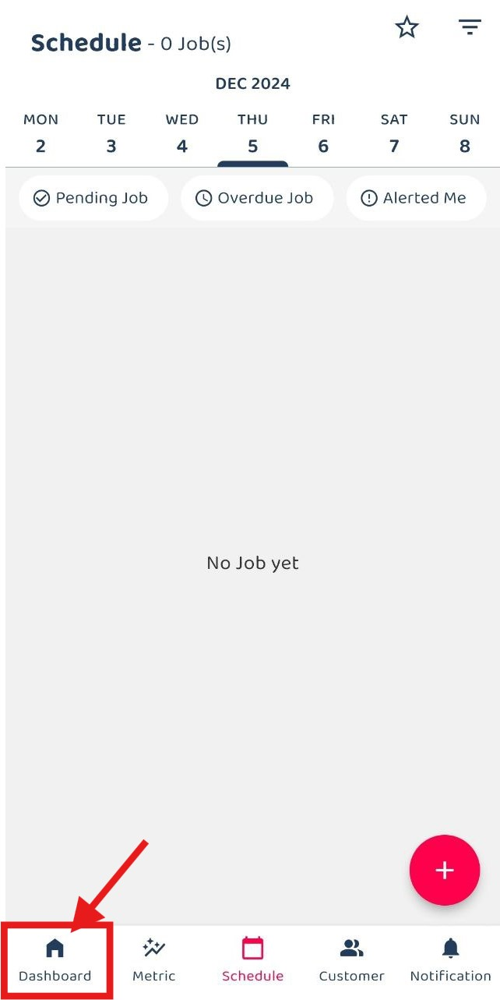
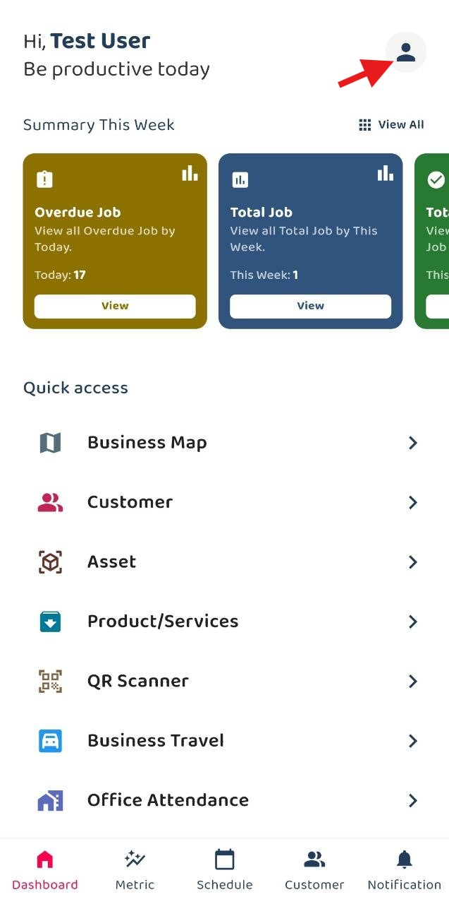
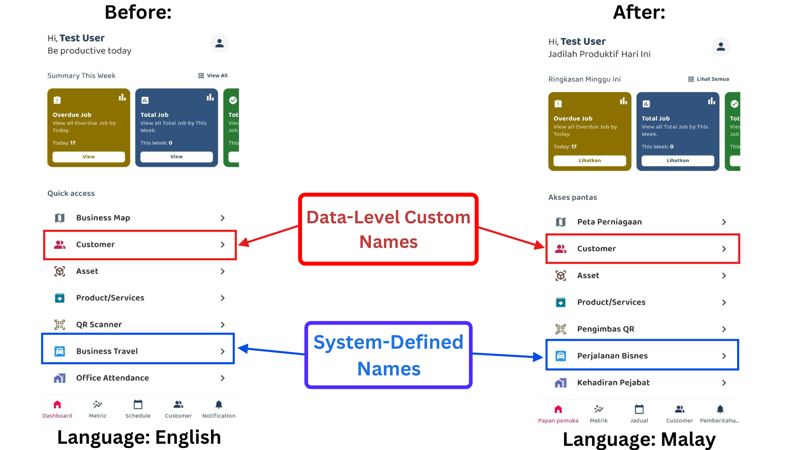

## Guide to Change Language

1. Under navigation bar > go to Dashboard 

         

 

2. Click people icon at the right corner

         

 

3. Under Menu select language

         

 

4. Choose your preferred language

         

 

5. Some preset words cannot be translated. (Language change is only supported on the mobile app.)

         

 

