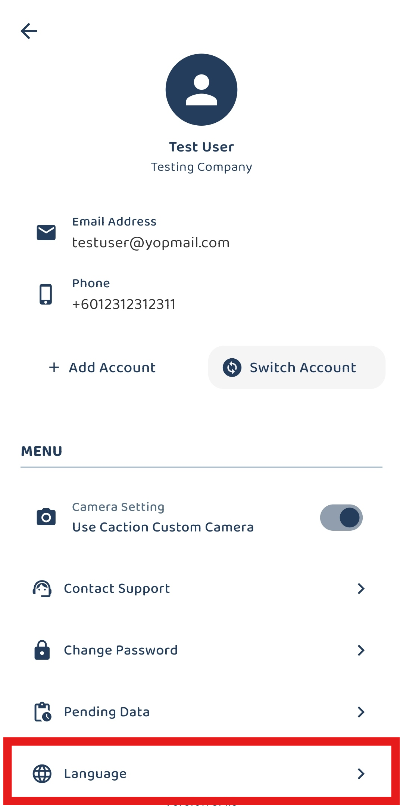
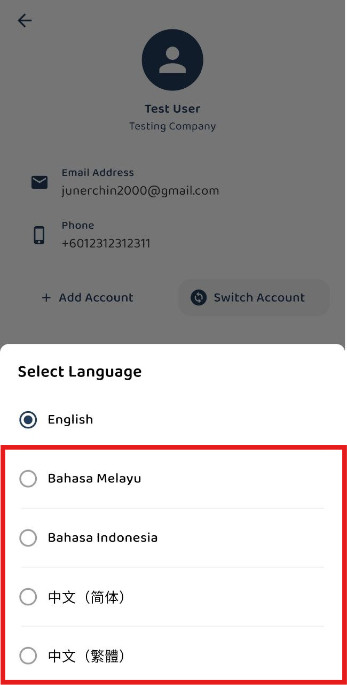

## Guide to Change Language
### Language change is only supported on the mobile app.

1. Under navigation bar > go to Dashboard 

         

 

2. Click people icon at the right corner. 

         

 

3. Under Menu select language. 

         

 

4. Choose your preferred language. 

         

 

5. Only default system-generated words will be translated. Customized page names and field names will not be translated to preserve user-defined context and accuracy.  

                                                               
          

 
