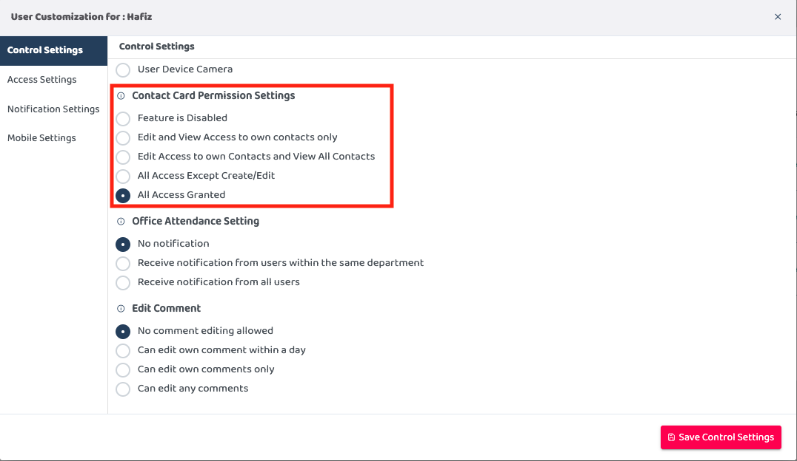
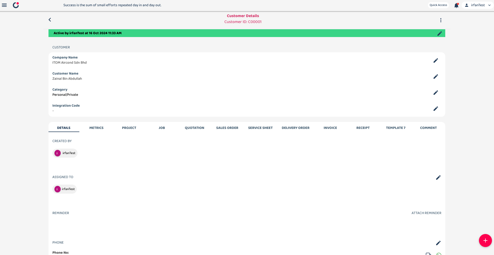
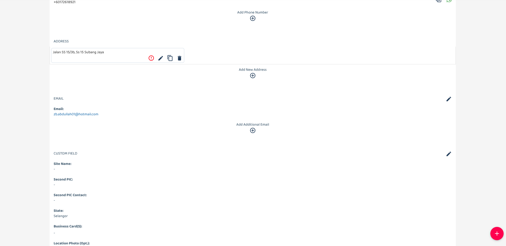
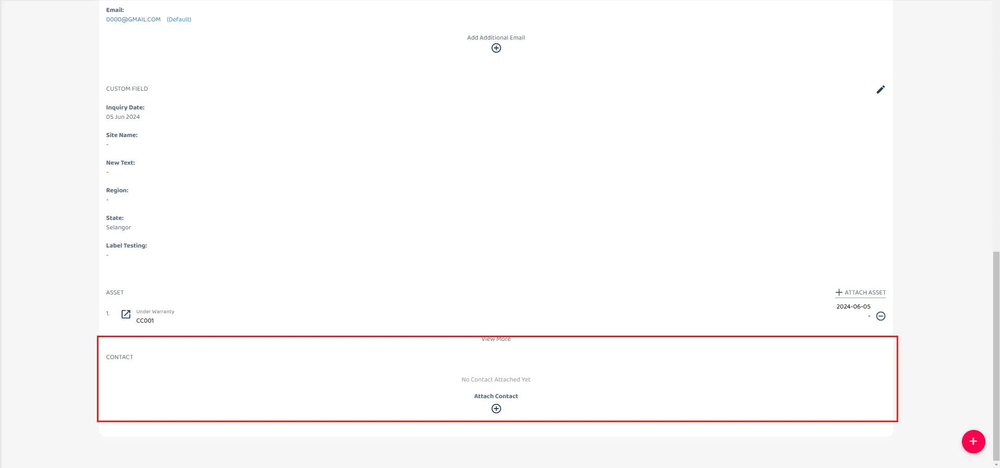
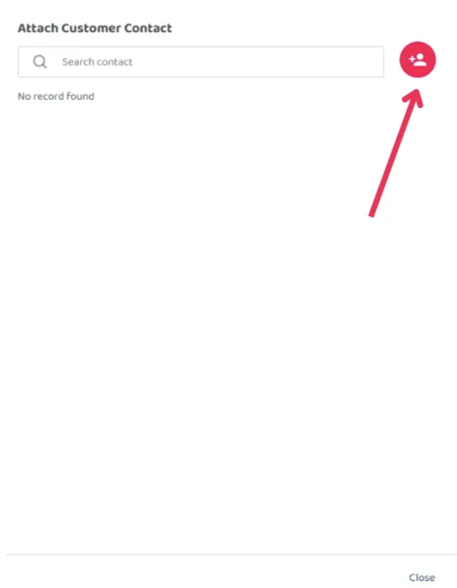
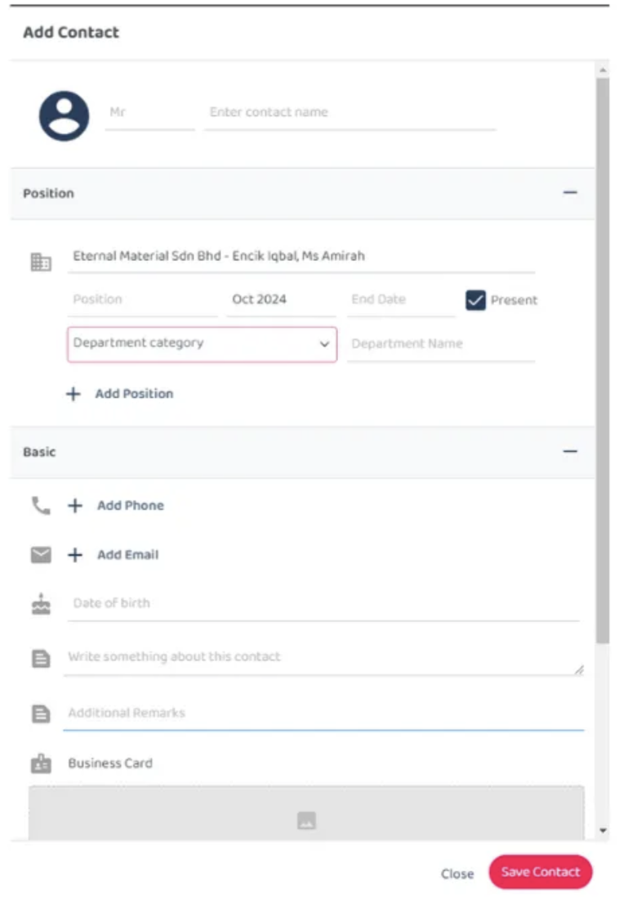
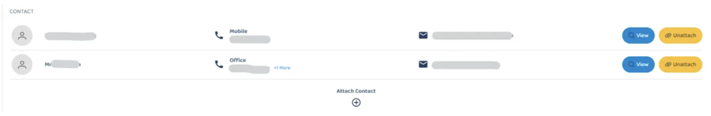
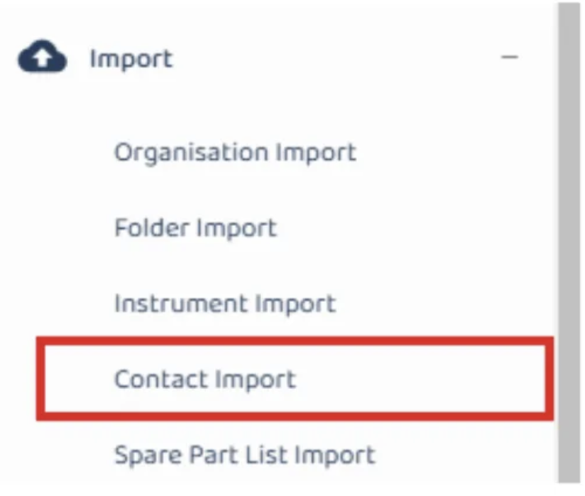

## How to Create Contact
This Contact section is control by access in UAC setting (refer picture). Add this step for them to check with their admin if they got into these scenarios : 

Scenario 1 : They don’t have contact section. 
Reason : They need to have access to contact, not necessarily ‘all access granted ’, up to their admin to give which access. 

Scenario 2 : They have this contact section, but don’t have the  “Attach Contact“ plus button 
Reason : They got access no.3 “All access except create/edit” 

         
       
 

**Navigate to section by clicking it** 

- [Desktop Version](#section1) 
- [Mobile Version - Phone](#section2) 
   
1. From customer details page, scroll down until you find contact session. Click to the plus scetion 

  

         
       

       

         
       

       

         
       

2. Click contact icon to add new contact, fill in the details. 

  

         
       
 
  

           
         
 

3. You may add more than one contact, there will be a list of contact person in Customer detail page.

  

         
       
 

4. To add large data, You may also use import module to import contact into system. 
   Refer to guide attached : https://support.caction.com/Import_Contact.html 

         
       
 
