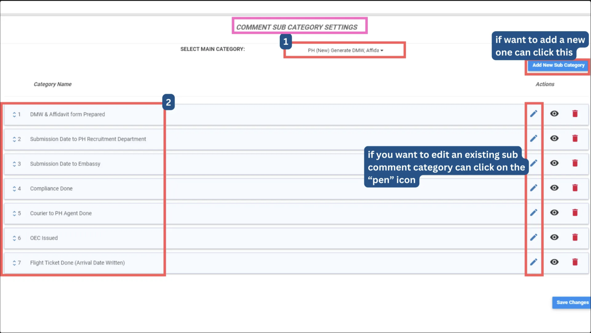
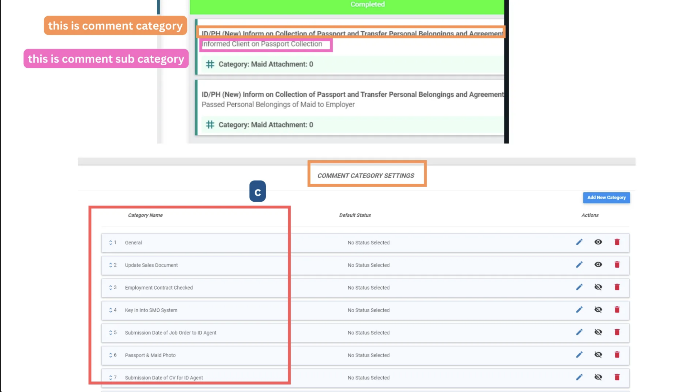

## How_to_Add_a_New_Sub_Comment_Category_In_The_To_Do_List_Feature

0. Some general information for this support docs 
    a. Pre create comment category: Cause of breakdown 
    b. Teach sub comment category: Equipment wear and tear, Lack of regular maintenance, Operator error or misuse 
    c. In todo list setting drag: Cause of breakdown > Operator error or misuse. 

1. Go to sub comment category settings to add new sub comment category 

  

       
    
 

2. Go to to do listing setting page add that new sub comment category in specific status

   

       
    
 
