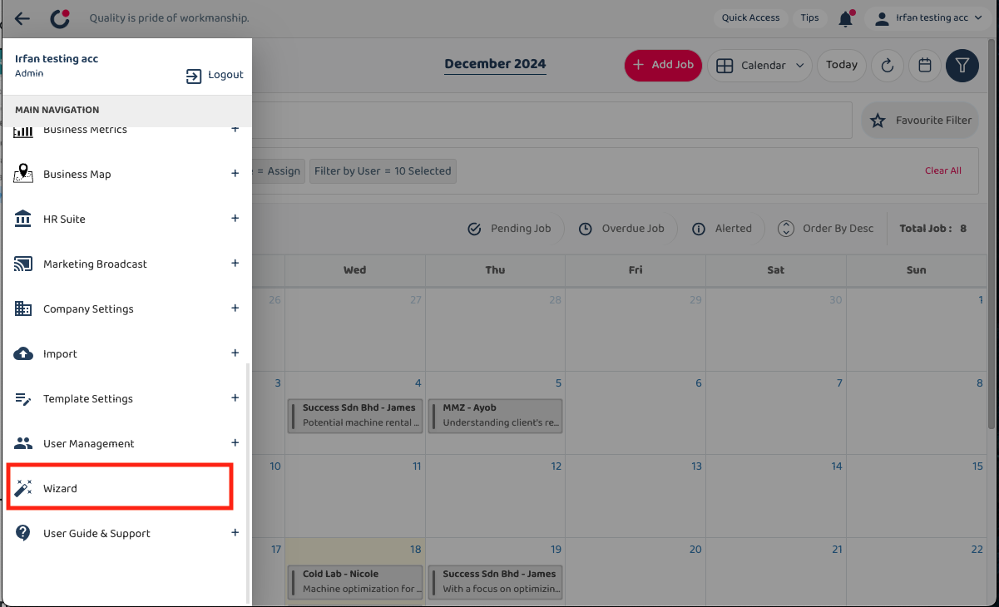
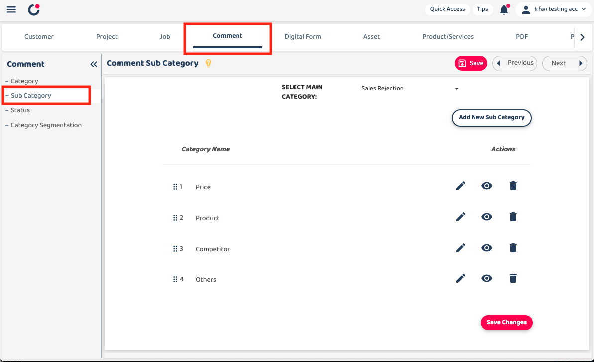
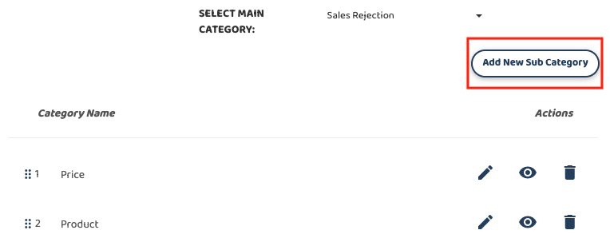

## How to Add a New Sub Comment Category In The To-Do List Feature

1. From Main Navigation and go to Wizard Page 

  

       
    
 

2. Go to Comment and click on the ‘Sub Category’. 

   

       
    
 

3. Click on the ‘Add New Sub Category’ to add new category. 

   

       
    
 

4.  Write the category name and click ‘Submit’. 

       
    
 

**Related Articles** 
- [How to Set Up Sub Comment Categories In The To Do List](How_to_Set_Up_Sub_Comment_Categories_In_The_To_Do_List.md)
