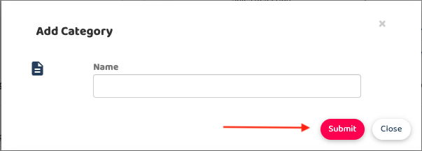

## How to Add a New Sub Comment Category In The To-Do List Feature

0. Some general information for this support docs 
    a. Pre create comment category: Cause of breakdown 
    b. Teach sub comment category: Equipment wear and tear, Lack of regular maintenance, Operator error or misuse 
    c. In todo list setting drag: Cause of breakdown > Operator error or misuse. 

1. Click the sidebar and go to Wizard Page 

  

       
    
 

2. Go to Comment and click on the sub category.

   

       
    
 

3. Click on the Add New Sub Category to add new category.

   

       
    

       
    
 

**Related Articles** 
- [How to Set Up Sub Comment Categories In The To Do List](How_to_Set_Up_Sub_Comment_Categories_In_The_To_Do_List.md)
