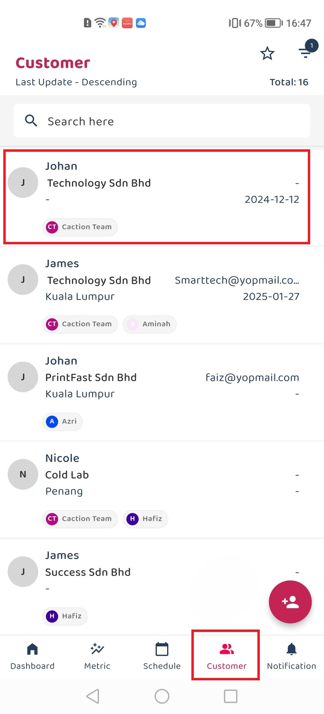

## How to Attach address using Latitude & Longitude ?

How*Attach_address_using_Latitude_Longitude_Step*
Here's a step-by-step tutorial on how to attach an address using Latitude & Longitude:

- [Desktop Version](#section1) 
- [Mobile Version](#section2)
     

- **Desktop Version**:

1.  Open Customer List 

    

      
     
 

2.  Click Edit icon 

    

      
     
s 

3.  Scroll down to the "Address" section , Click "Add New Address" 

    

      
     
 

4.  Open Google Maps in other tab 

         Open a new tab or window and visit Google Maps.

      

       
      
 

5.  Get Latitude & Longitude 

        Navigate to your desired location on Google Maps.

        Right-click exactly where you want to pinpoint.

      

       
       
 

6.  Copy Latitude & Longitude 

         The latitude & longitude coordinates will appear at the top of the context menu.

         Click on the coordinates to copy them (e.g., 3.02493,101.58849).

    

      
     
 

7.  Paste Coordinates into System 

         Go back to your system.

         Paste the copied latitude and longitude into the GPS search box provided.

    

      
     
 

8.  Submit and Confirm Location 

         Click the "Submit" button at the bottom.

    

      
     
 

9.  Save the New Address 

         Enter the location name.

         Click the "Save" button to add the address.

    

      
     
 

- **Mobile Version**:

1.  In the Customer section, click on the Customer that wants to attach an address 

  

2.  Click ellipsis icon at above right 

    

      
     
 

3.  Click Edit section 

    

      
     
 

4.  Click Add New Address on Address Section 

      

       
      
 

5.  Open Google Maps apps 

        Navigate to your desired location on Google Maps.

      

       
       
 

6.  Copy Latitude & Longitude 

         Press and hold at the exact location you want to mark on the map.
         A dropped pin will appear with location information.
         The coordinates (latitude, longitude) will be displayed in the format shown in your images (3.0540662, 101.5994493).

   

      
     
 

7.  Paste Coordinates into System 

         Click the coordinates to copy it.
         Go back to your system.
         Paste the copied latitude and longitude into the GPS search box provided.
         Click the "Confirm" button.

    

      
     
 

8.  Submit and Confirm Location 

         Provide the address name.
         Verify that the pin appears at the correct address.
         Click the "Save" button.

    

      
     
 

9.  Save the New Address 

         The New Address will appear at Address section.
         Click the "Save" button right above to save it.

    

      
     
 
