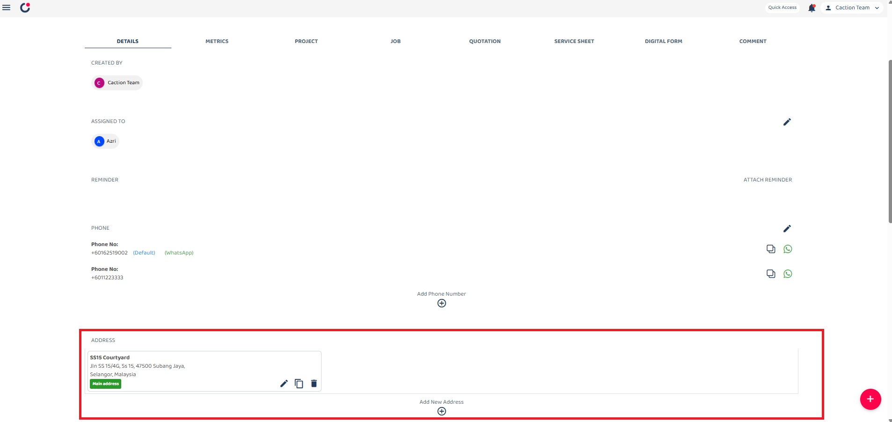

## How to Attach address using Latitude & Longitude ?

How Attach address using Latitude Longitude Step.
Here's a step-by-step tutorial on how to attach an address using Latitude & Longitude:

- [Desktop Version](#section1) 
- [Mobile Version](#section2)
     

- **Desktop Version**:

1.  Open Customer List 

    

      
     
 

2.  Click Edit icon 

    

      
     
 

3.  Scroll down to the "Address" section, where users can either edit existing addresses or add new ones. Click the "Add New Address" to create a new address entry.  

     

      
     
 

4.  Open Google Maps in a new tab  

      

       
      
 

5.  Navigate to your desired location on Google Maps.
    Right-click exactly where you want to pinpoint. 

      

       
       
 

6.  Copy Latitude & Longitude at the top of the context menu.
    Click on the coordinates to copy them (e.g., 3.02493,101.58849). 

    

      
     
 

7.  Return to the system and paste the copied latitude and longitude into the designated GPS search box. 

    

      
     
 

8.  Submit and Confirm Location 

    

      
     
 

9.  Enter the location name and Save the New Address 

    

      
     
 

- **Mobile Version**:

1.  In the ‘Customer List’, choose the customer who requires an address to be added. 

  

2.  Click the ellipsis icon in the top right corner and select Edit. 

    

      
     

      

3.  In the Address section, click Add New Address. 

    

      
     
 

4.  Open Google Maps app and navigate to your desired location on Google Maps. 

      

       
      
 

5.  Press and hold on the desired location to mark it on the map. The coordinates (latitude, longitude) will be displayed (e.g., 3.0540662, 101.5994493). Click the coordinates to copy it. 

      

       
       
 

6.  Write the location name, and adjust the address if needed. then click the Save button.

   
  
 

  
 
 

7.  The New Address will appear at Address section. Save the New Address  

    

      
     
 
