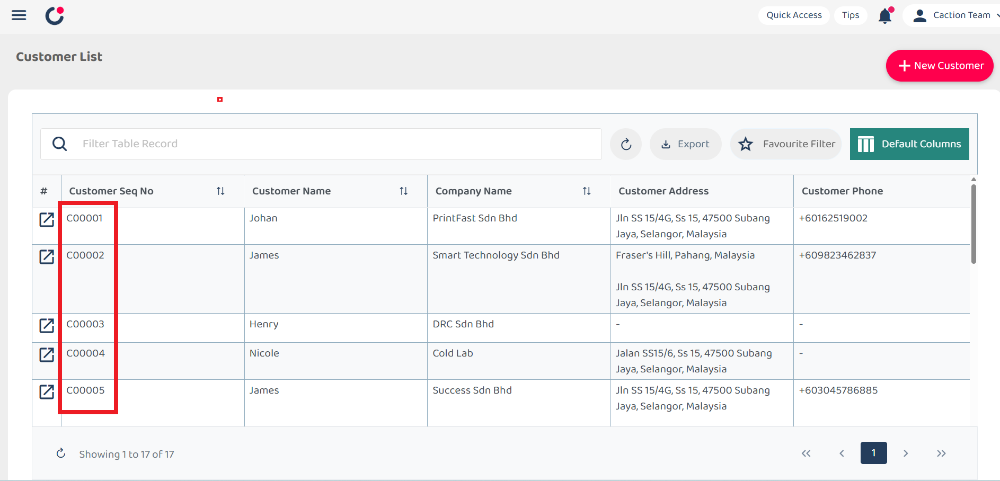
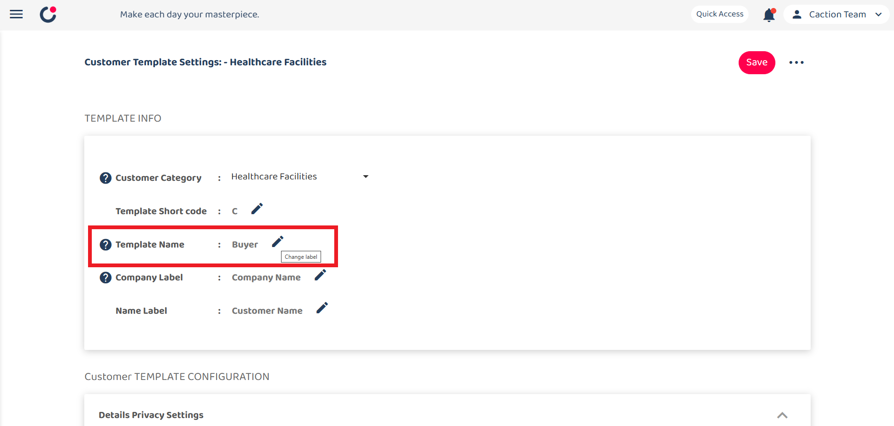
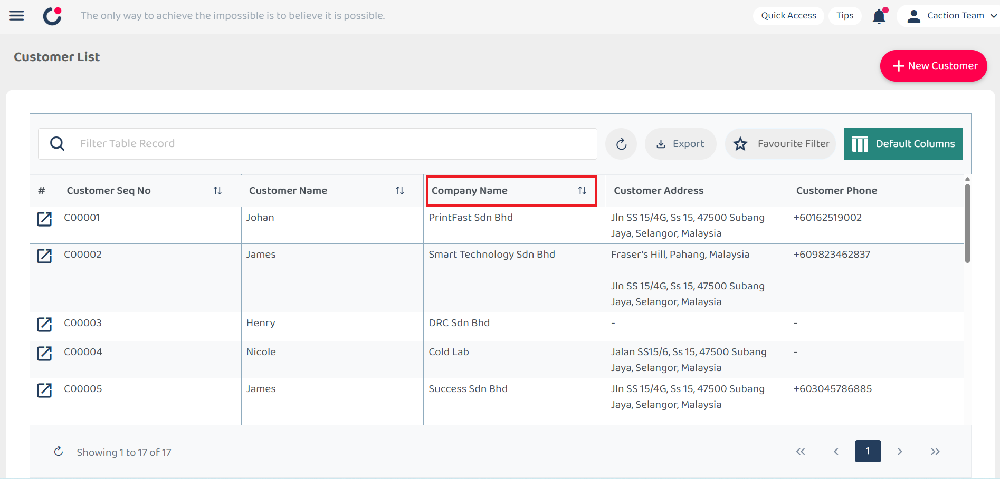
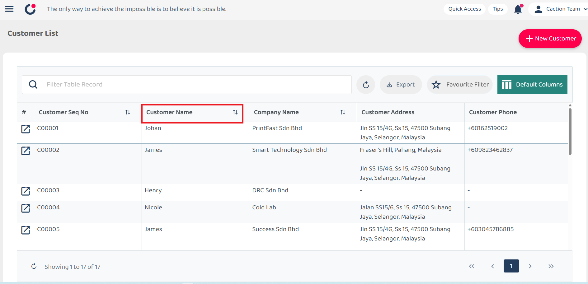

# Customer Template

**Customer Template** is a standardized format or structure used in customer relationship management (CRM) systems to consistently collect and organize customer information.

_Note: The template configuration for these functions will affect both the web and mobile app_

## Table of Contents

- [Template Info](#template-info)
- [Details Privacy Settings](#details-privacy-settings)
- [Details Variable Settings](#details-variable-settings)
- [Quick Search Settings](#quick-search-settings)
- [Prepopulate Assigned User](#prepopulate-assigned-user)
- [Default Field](#default-field)
- [Custom Field](#custom-field)

## Getting Started

1. From the desktop's navigation bar:

   - Select **Template Settings**
   - Then select **Customer Templates**

   **Open Project Templates Here**:
   [https://system.caction.com/templateSettings/CustomerTemplates](https://system.caction.com/templateSettings/CustomerTemplates)

   _Note: If you do not have access to the Template Settings page, please contact your administrator._

   

      
   

## Template Info

2. The Template Info section contains 5 fields:

   - Customer Category
   - Template Short code
   - Template Name
   - Company Label
   - Name Label

   

     
   

   ### Customer Category

   The Category field provides a dropdown menu for selecting different customer template categories for editing. The current selection is "Healthcare Facilities".

   

     
   

   ### Template Short code

   The short code represents the customer code identifier (example: the first customer created will be assigned "C0001").

   

     
   

   ### Template Name

   Template Name modifies the name of the template throughout the system.

   For instance, modifying the Template Name to "Buyer" will replace all instances of "Customer" with "Buyer" across the entire system.

   

     
   

   ### Company Label

   This field allows modification of the label name for the company field. It is recommended to prioritize key information in this field, as it is utilized for duplicate checking.

   

     
   

   ### Name Label

   This option enables modification of the customer name label.

   

     
   

## Details Privacy Settings

3. This section controls the visibility parameters of customer status and customer category in the customer section.

   

     
   

## Details Variable Settings

4. Details Variable Settings provides customization options for displayed customer information fields.

   The section currently displays 5 enabled fields:

   - Customer Name
   - Company Name
   - Status Name
   - Category Name
   - Inquiry Date

   Each field includes a removal option ("X" button).

   The "Open Setting" button provides access to additional field options and configuration modifications.

   

     
   

   The selected fields will be displayed and tracked in the mobile customer list interface.

   

     
   

## Quick Search Settings

5. Quick Search Settings facilitates efficient keyword searches within the customer page.

   

     
   

   When elements such as "customer name" are added to the quick search functionality, users may search by name identifiers to locate specific customer records.

   

     
   

   Selecting "Open Settings" provides options for defining which elements to include in the quick search functionality.

   

     
   

## Prepopulate Assigned User

6. The Prepopulate Assigned User feature enables automatic user assignment during the Customer Creation process.

   

     
   

## Default Field

7. This section displays system default fields that cannot be edited or deleted.

   

     
   

   For each field, the following parameters are configurable:

   ### Editable Field

   - Controls access permissions for field content modification (Only Administrators have access to edit content even when the field is locked)

   ### Required Field

   - Designates the field as mandatory prior to saving records

   ### Access Permission

   - Determines field visibility during customer creation processes

   Upon completing template settings configuration, select the "Save" button to apply and store all changes.

## Custom Field

8. Custom fields are user-defined fields that may be added to customer templates to supplement standard default fields.

   

     
   

   ### Custom Field Element (Left panel):

   This displays available field types that may be added to the template:

   |    Field Type     | Definition                                                     |
   | :---------------: | :------------------------------------------------------------- |
   |       Text        | Simple single-line text fields for basic information           |
   |     Text Area     | Larger multi-line text fields for extended notes               |
   |      Number       | Fields that accept only numerical values                       |
   |       Date        | Calendar-based fields for date selection                       |
   |     Date Time     | Fields that capture both date and time information             |
   |     Drop Down     | Selection fields with predefined options in a dropdown menu    |
   | Multiple Checkbox | Fields that enable selection of multiple options from a list   |
   |    Attachment     | Fields that enable file uploads and attachments to the project |

   ### Custom Field View (Right panel):

   For each custom field, the following parameters are configurable:

   ### Locked Field

   - Prevents any modifications to the field, including by users who would typically have edit permissions.

   ### Enabled Field

   - When enabled (toggled on), the field will be displayed and available for implementation on customer forms.

   Upon completing custom field configuration, select the "Save" button to apply and store all changes.

 

## Settings section

9. This dropdown menu provides additional management options:

   

     
   

   |       Field Type       | Definition                                                                                                            |
   | :--------------------: | :-------------------------------------------------------------------------------------------------------------------- |
   |    Version history     | Access to previous versions of the template                                                                           |
   | Save to all categories | Implementation of changes across all customer categories                                                              |
   |       Copy from        | Importation of settings from alternative templates                                                                    |
   |          Save          | It is essential to save all work after implementing changes to template settings to ensure configuration preservation |
