## Customer Template

**Customer Template** displays a standardized format or structure used in customer relationship management (CRM) systems to consistently collect and organize customer information.

  

**Navigate to the section by clicking it.** 

- [Template Info](#section1) 
- [Details Privacy Settings](#section2) 
- [Details Variable Settings](#section3) 
- [Quick Search Settings](#section4) 
- [Prepopulate Assigned User](#section5) 
- [Default Field](#section6) 
- [Custom Field](#section7)
       

The desktop's navigation bar, go to Template Settings > Customer Templates. 

  

     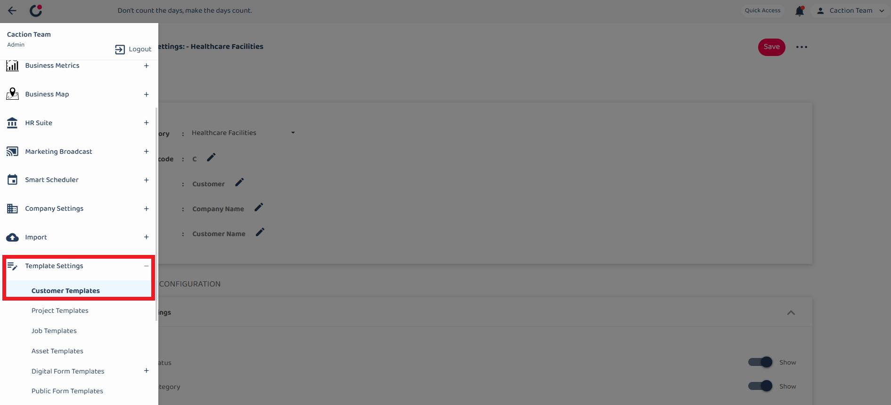
  

    

## Template Info

For the Template Info section, it contains 5 field.

  

    
  

### Customer Category

The Category field has a dropdown menu that lets users select different customer template categories they want to edit. Currently "Healthcare Facilities" is selected

   

     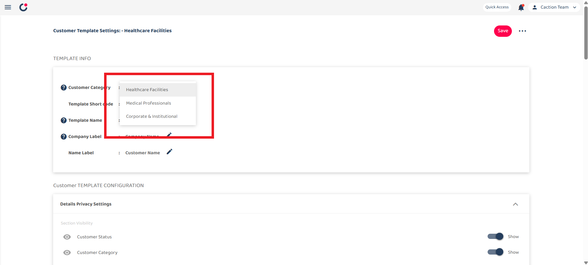
   

### Template Short code

the short code represent for customer code

(eg: The First Customer Created will call "C0001")

    

### Template Name

Template Name will change the name of customer template throughtout the system over time, for immediate update can re-login the system.

    
   
   ### Company Label

Change the label name for company (eg: company name) , prioritize key information in this field, as it used for duplicate checking.

    
   
   ### Name Label

Change the field of the label name (eg: customer name).

 

### Details Privacy Settings

   

     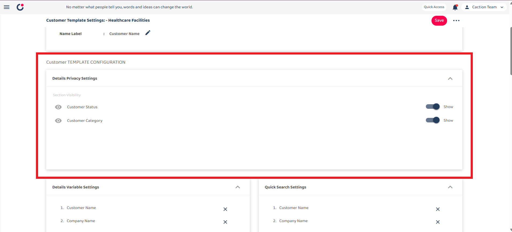
   

For this section is show the visibility of customer status and customer category in customer section.

   

     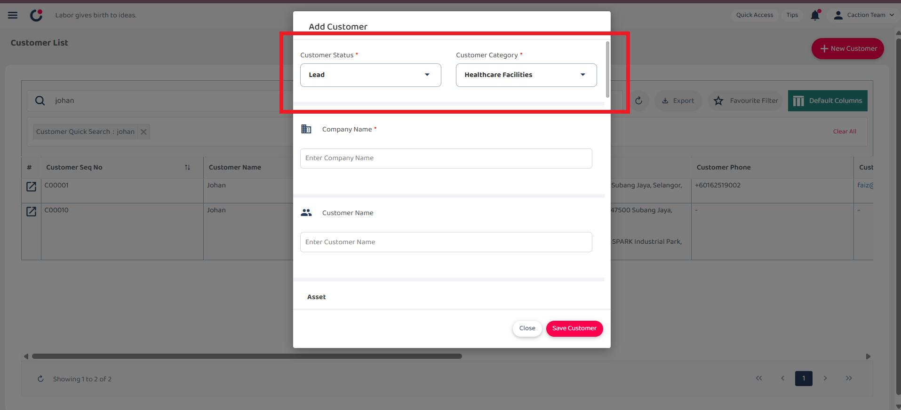
   

    

## Details Variable Settings

Details Variable Settings allows you to customize what customer information fields.

The section shows 5 fields that are currently enabled:

- Customer Name

- Company Name

- Status Name

- Category Name

- Inquiry Date

Each field has an "X" button to remove it if desired.

The "Open Setting" button at the bottom of the panel allows you to add fields or modify these configurations further.

   

     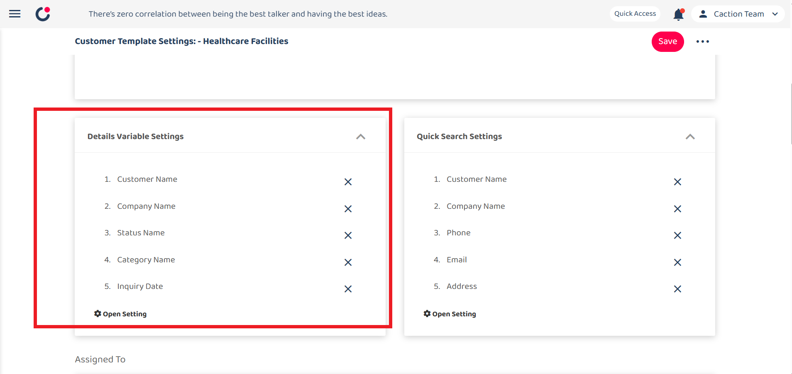
   

   

It displayed and tracked in mobile.

   

   

     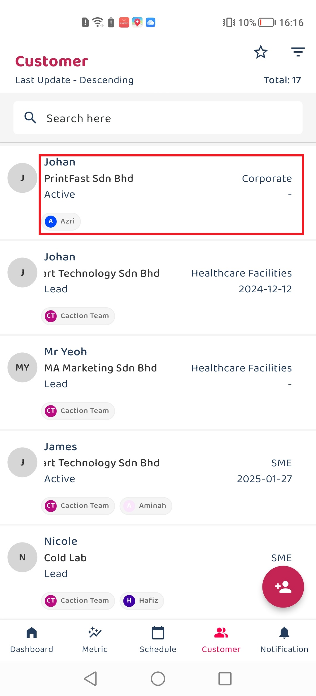
   

## Quick Search Settings

   

     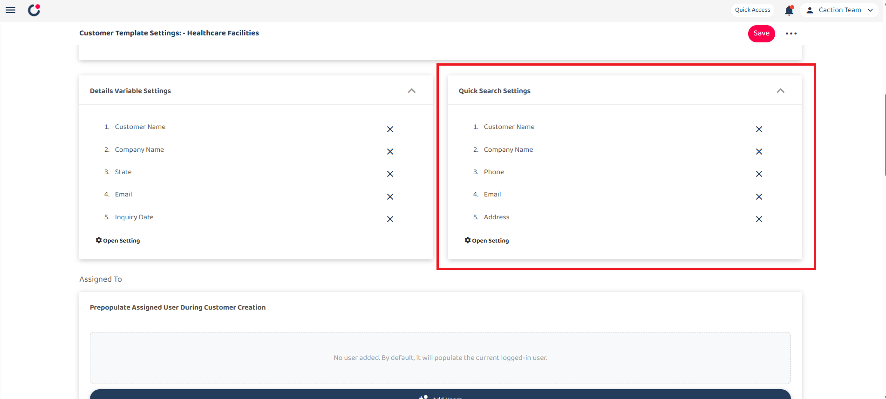
   

    

Quick Search Settings is function to easily searching the keywords you need in customer page.

- eg: I drag the element "customer name" on quick search, so i can just search the name "johan" to find my customer.

     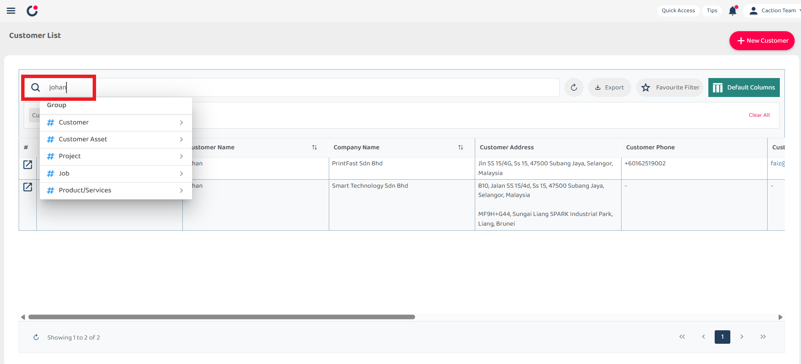

 

It can choose which elements for your quick search from "open settings"

   

  

      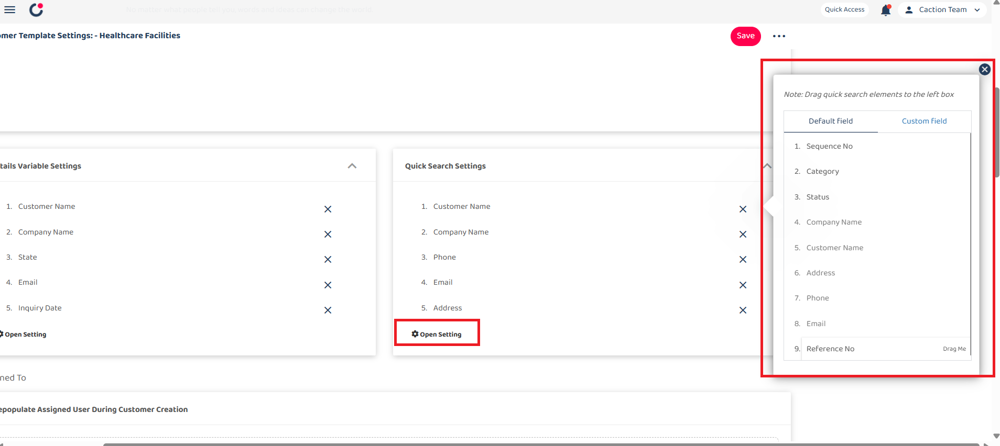
  

   

## Prepopulate Assigned User

Prepopulate Assigned User is it will automatically assign the user to the customer during Customer Creation

  

     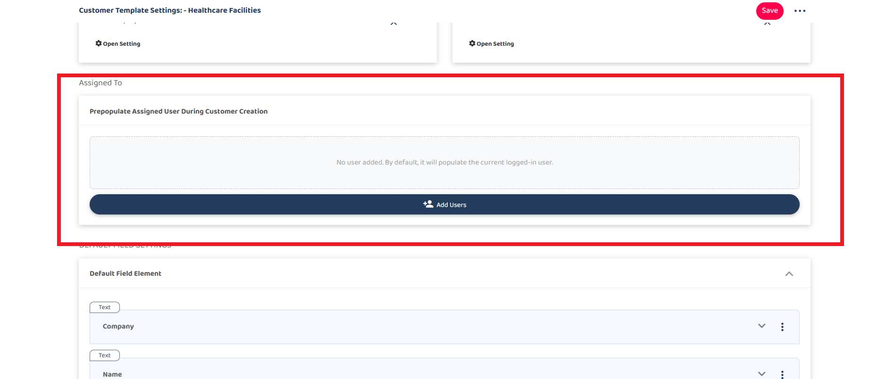
  

    

## Default Field

   

     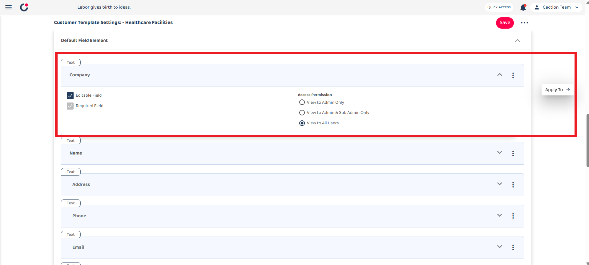
   

    

It shows the that contains fields element which default on the system (which the field can't be edit or delete)

In each field you can decide :

### Editable Field

- Controls access to modify of the field's content (Only Admin have the access to edit even is closing the field)

### Required Field

- Makes the field mandatory before saving

### Access Permission

- Determines visibility during customer creation

 

After configuring template settings, click the "Save" button to apply and store your changes.

 

## Custom Field

A custom field is a user-defined field that you can add to your customer template beyond the standard default fields.

   

     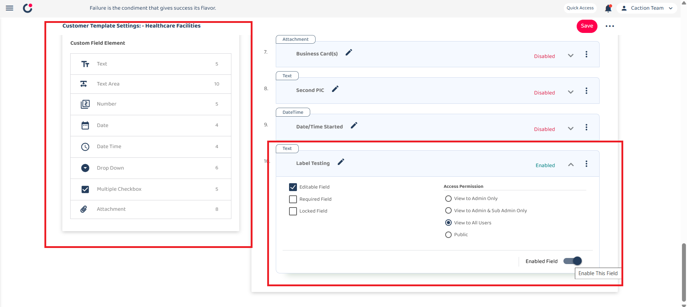
   

In each field you can decide :

### Locked Field

- Locking the field to preventing any modifications even by users who would normally have edit permissions.

### Enabled Field

- When enabled (toggled on), the field will be displayed
and available for use on customer forms.

    

After configuring template settings, click the "Save" button to apply and store your changes.

    

   

     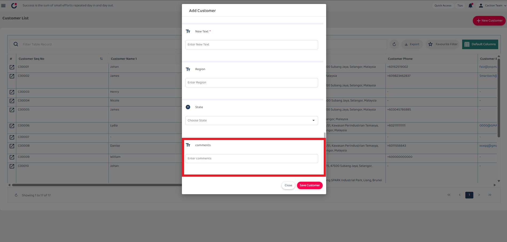
   

   

## Settings section

   

     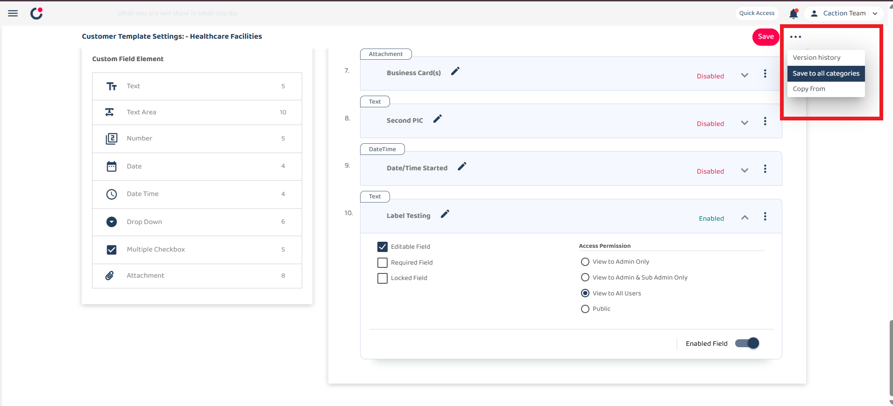
   

This dropdown menu shows additional management options:

### Version history:

- View past versions of the template

### Save to all categories:

- Apply changes across all customer categories

### Copy from:

- Import settings from another template

   

**Related Articles**

- [How to Add New Customer?](Add_New_Customer.md)

<!-- [Link Text](https://support.caction.com/Template.html) -->
