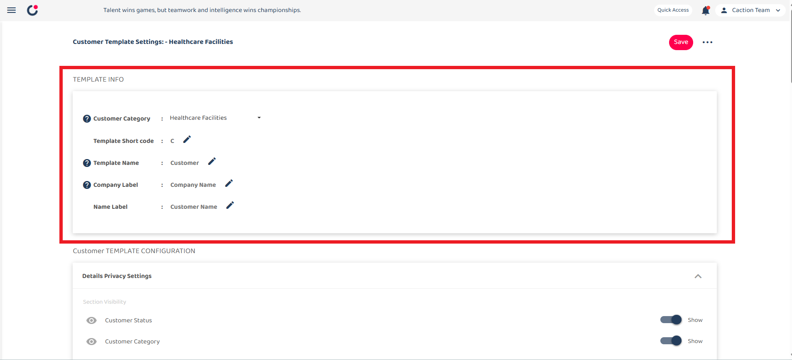

# Customer Template

**Customer Template** displays a standardized format or structure used in customer relationship management (CRM) systems to consistently collect and organize customer information.

_Note: The template configuration for these functions will affect the web and mobile app_

## Table of Contents

- [Template Info](#template-info)
- [Details Privacy Settings](#details-privacy-settings)
- [Details Variable Settings](#details-variable-settings)
- [Quick Search Settings](#quick-search-settings)
- [Prepopulate Assigned User](#prepopulate-assigned-user)
- [Default Field](#default-field)
- [Custom Field](#custom-field)

## Getting Started

1. From the desktop's navigation bar, go to **Template Settings > Customer Templates**.

   **Open Project Templates Here**: [https://system.caction.com/templateSettings/CustomerTemplates](https://system.caction.com/templateSettings/CustomerTemplates)

   _Note: If you do not have access to Template Settings page, please contact your admin._

   

      
   

## Template Info

2. The Template Info section contains 5 fields:

   - Customer Category
   - Template Short code
   - Template Name
   - Company Label
   - Name Label

   

     
   

### Customer Category

The Category field has a dropdown menu that lets users select different customer template categories they want to edit. Currently "Healthcare Facilities" is selected.

  

### Template Short code

The short code represents the customer code (e.g., The First Customer Created will be "C0001").

  

### Template Name

Template Name will change the name of template throughout the system.

For example, changing the Template Name to "Buyer" will replace "Customer" with "Buyer" across the entire system.

  

### Company Label

Change the label name for company (e.g., company name). Prioritize key information in this field, as it is used for duplicate checking.

  

### Name Label

Change the field of the label name (e.g., customer name).

  

## Details Privacy Settings

3. This section controls the visibility of customer status and customer category in the customer section.

   

     
   

   

     
   

## Details Variable Settings

4. Details Variable Settings allows you to customize what customer information fields are displayed.

   The section shows 5 fields that are currently enabled:

   - Customer Name
   - Company Name
   - Status Name
   - Category Name
   - Inquiry Date

   Each field has an "X" button to remove it if desired.

   The "Open Setting" button at the bottom of the panel allows you to add fields or modify these configurations further.

   

     
   

   These fields will be displayed and tracked in the mobile customer dashboard.

   

     
   

## Quick Search Settings

5. Quick Search Settings is a function to easily search for keywords you need in the customer page.

   

     
   

   Example: If you drag the element "customer name" to quick search, you can simply search for "johan" to find your customer.

   

     
   

   You can choose which elements to include in your quick search by clicking "Open Settings".

   

     
   

## Prepopulate Assigned User

6. Prepopulate Assigned User will automatically assign a user to the customer during Customer Creation.

   

     
   

## Default Field

7. This section shows fields that are default in the system (these fields cannot be edited or deleted).

   

     
   

   For each field, you can configure:

   ### Editable Field

   - Controls access to modify the field's content (Only Admin has access to edit even when the field is locked)

   ### Required Field

   - Makes the field mandatory before saving

   ### Access Permission

   - Determines visibility during customer creation

   After configuring template settings, click the "Save" button to apply and store your changes.

## Custom Field

8. A custom field is a user-defined field that you can add to your customer template beyond the standard default fields.

   

     
   

   ### Custom Field Element (left panel):

   This shows the available field types that can be added to the template.

   |    Field Type     | Definition                                                        |
   | :---------------: | :---------------------------------------------------------------- |
   |       Text        | Simple single-line text fields for basic information              |
   |     Text Area     | Larger multi-line text fields for longer notes                    |
   |      Number       | Fields that accept only numerical values                          |
   |       Date        | Calendar-based fields for selecting dates                         |
   |     Date Time     | Fields that capture both date and time information                |
   |     Drop Down     | Selection fields with predefined options in a dropdown menu       |
   | Multiple Checkbox | Fields that allow selecting multiple options from a list          |
   |    Attachment     | Fields that allow users to upload and attach files to the project |

   ### Custom Field View (right panel):

   In each field you can configure:

   ### Locked Field

   - Locking the field prevents any modifications, even by users who would normally have edit permissions.

   ### Enabled Field

   - When enabled (toggled on), the field will be displayed and available for use on customer forms.

   After configuring template settings, click the "Save" button to apply and store your changes.

   

     
   

## Settings section

9. This dropdown menu shows additional management options:

   

     
   

   ### Version history:

   - View past versions of the template

   ### Save to all categories:

   - Apply changes across all customer categories

   ### Copy from:

   - Import settings from another template

   ### Save

   - Always remember to save your work after making changes to the template settings - it's the only way to ensure your configurations are preserved.

---
