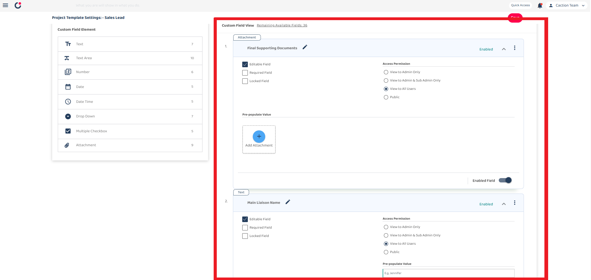

## Project Template

**Project Template** displays a standardized format or pre-defined structure in project management software designed to help you set up new projects quickly and efficiently.

\*Note:The template configuration for these functions will affect the web and mobile app

 

**Navigate to the section by clicking it.** 

- [Template Info](#section1) 
- [Details Variable Settings](#section2) 
- [Project Settings](#section3) 
- [Prepopulate Assigned User](#section4) 
- [Default Field](#section5) 
- [Custom Field](#section6)
     

1. The desktop's navigation bar, go to Template Settings > Project Templates.

   **Open Project Templates Here**: [https://system.caction.com/templateSettings/DealTemplates](https://system.caction.com/templateSettings/DealTemplates) 

   \*Note: If you do not have access to Template Settings page, please contact your admin. 

 
  

     
  

   
 

# Template Info

 
  

     
  

 

2. For the Template Info section, it contains 5 field. 

|        Term         | Definition                                                                                                |
| :-----------------: | :-------------------------------------------------------------------------------------------------------- |
|  Project Category   | Indicates the type of Project                                                                             |
| Template Short code | Indicates short code represent for project code                                                           |
|    Template Name    | Lets users name the template (e.g., "Project") to reflect its purpose or type.                            |
|  Outstanding Label  | Lets users defines label (e.g., "Outstanding") for items like pending tasks or issues within the project. |
|  Collection Label   | Sets a label (e.g., "Collection") for grouping related items, such as invoices or documents.              |

 
  

     
  

 

In the Template Info section, you can customize several important labels, when we change the Template name into "Project 123", Outstanding label into "Outstanding 123", Collection label into "Collection 123".

 
  

     
  

 

After saving your changes, the system will apply your custom labels throughout the interface

 

# Details Variable Settings

 
  

     
  

 

3. The Details Variable Settings section allows you to customize which fields appear in your project dashboard.

   When you open the settings, you can drag variable elements to the left box to customize your view.

 
  

     
  

 

e.g., drag the "amount" elements replace with "Project End Date" in details variable settings.

 
  

     
  

 

After saving, your project dashboard will display the "amount" information in the project cards instead of the "Project End Date"

 

# Project Settings

 
  

     
  

 

4. The Project Settings allows you to control various visibility and Product/Services setttings for your project management system.

 

For the Section Visibility section:

### Project Category

- When it toggle is off , the categories section will be hidden when viewing project details or adding a new project.

### Product/Services View Settings

 
    

        
    

 

The Enable section visibility for three different user role settings, which giving you precise control over your project management interface for different user types.

 
    

        
    

 

Each visibility setting can be independently configured with dropdown menu with options:

- Default Settings -Shows everything as normal
- Hide Amount Field -Hides only the financial information (Green section)
- Hide Whole Section -Hides the entire Product/Services section (Red section)

### Collection View Settings

 
    

        
    

 

It enable collection amount visibility for respective user types, which allows giving access for different user types.

- Admin Visibility
- Subadmin Visibility
- Staff Visibility

 
    

        
    

\*Note: This is Project Details - Collection section.

 

### Project End Date View Settings

 
    

        
    

 

Same as Collection view, It enable deal end date visibility for respective user types.

- Admin Visibility
- Subadmin Visibility
- Staff Visibility

 

### Product/Services Settings

 
    

        
    

 

Force Project Product/Services Selection is setting determines whether the Product/Services section is required when creating a new project.

This ensures that all projects have associated products or services.

 

# Prepopulate Assigned User

5. Prepopulate Assigned User is it will automatically assign the user to the customer during Project Creation

 
    

        
    

 

# Default Field

6. Default Field Pre-Populate Value Settings is when users create new projects using this template, these fields would be automatically populated with these default values, saving time and ensuring consistency across projects.

The "eclipse" or three-dot menu button (⋮) at the top right of the page is likely an "apply to other categories" function. This would allow administrators to apply these template settings across multiple category rather than configuring them individually.

 
    

        
    

 

# Custom Field

7.  custom field is a user-defined field that you can add to your project template beyond the standard default fields.

 
    

        
    

 

### Custom Field Element (left panel):

This shows the available field types that can be added to the template.

|       Term        | Definition                                                        |
| :---------------: | :---------------------------------------------------------------- |
|       Text        | Simple single-line text fields for basic information              |
|     Text Area     | Larger multi-line text fields for longer notes                    |
|      Number       | Fields that accept only numerical values                          |
|       Date        | Calendar-based fields for selecting dates                         |
|     Date Time     | Fields that capture both date and time information                |
|     Drop Down     | Selection fields with predefined options in a dropdown menu       |
| Multiple Checkbox | Fields that allow selecting multiple options from a list          |
|    Attachment     | Fields that allow users to upload and attach files to the project |

 

### Custom Field View (right panel):

 
    

        
    

 

The Custom Field View panel shows the actual custom fields that have been configured for this Project Template.

In each field you can decide :

### Editable Field

- Controls access to modify of the field's content (Only Admin have the access to edit even is closing the field)

### Required Field

- Makes the field mandatory before saving

### Locked Field

- Locking the field to preventing any modifications even by users who would normally have edit permissions.

### Access Permission

- Controls which users can see the field during project creation

### Pre-populate Value

- Sets default values that appear automatically in the field

 

## Settings section

   
    

        
    

 

8. This dropdown menu shows additional management options:

### Version history:

- View past versions of the template

### Save to all categories:

- Apply changes across all customer categories

### Copy from:

- Import settings from another template

### Save

- Always remember to save your work after making changes to the template settings - it's the only way to ensure your configurations are preserved.

   

**Related Articles**

- [How do I Import New Project(s)?](Import_Project.md)
- [How to Add New Customer?](Add_New_Customer.md)
- [How to Add New Job?](Add_New_Job.md)

<!-- [Link Text](https://support.caction.com/ProjectTemplate.html) -->
