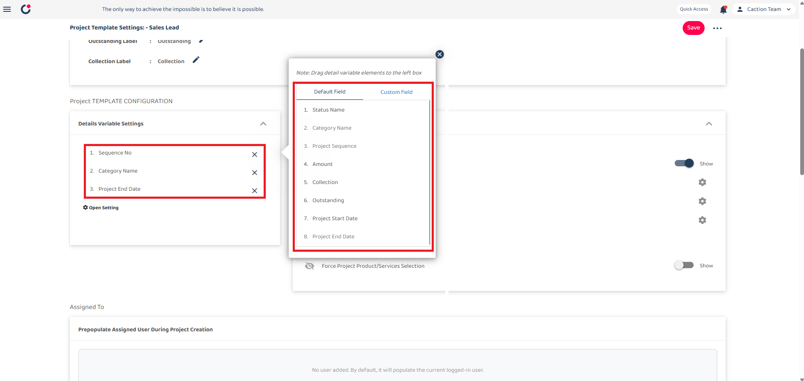
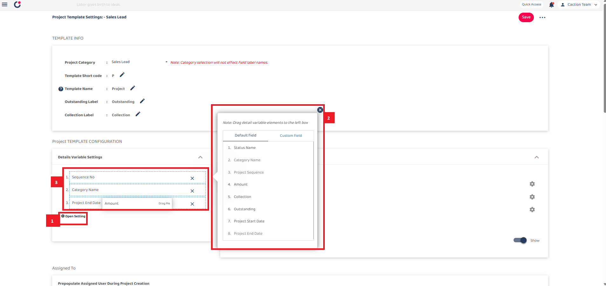
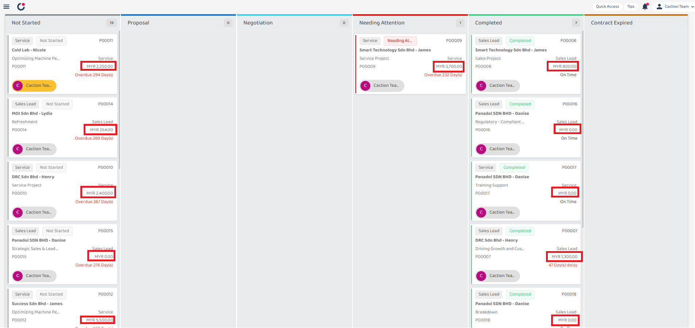
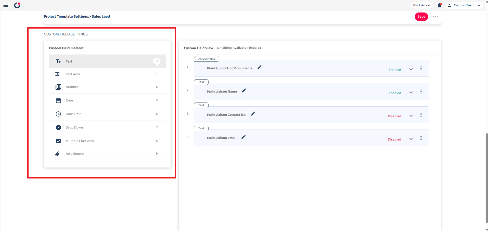

## How to Set Up Project Template?

**Project Template** controls the structure and required fields for a project, ensuring consistency and efficiency. It allows you to define what information must be filled in when creating a project.

 

**Click on a section below to navigate.** 

- [Template Info](#section1) 
- [Details Variable Settings](#section2) 
- [Project Settings](#section3) 
- [Prepopulate Assigned User](#section4) 
- [Default Field](#section5) 
- [Custom Field](#section6)
    

# Project Template
1. To access and configure a Project Template, go to desktop's navigation bar:

   - Select **Template Settings**
   - Then select **Project Templates**

   **Open Project Templates Here**: [https://system.caction.com/templateSettings/DealTemplates](https://system.caction.com/templateSettings/DealTemplates) 

   _Note: The template configuration will affect both the web and mobile applications. If you do not have access to the Template Settings page, please contact your admin._ 

 

   

   
 

# Template Info

2. The Template Info section serves as the foundation for your project template configuration.

 

   

 

The Template Info section contains 5 fields: 

|        Term         | Definition                                                                                                |
| :-----------------: | :-------------------------------------------------------------------------------------------------------- |
|  Project Category   | Indicates the type of Project                                                                             |
| Template Short code | Indicates short code representing the project code                                                        |
|    Template Name    | Lets users name the template (e.g., "Project") to reflect its purpose or type                             |
|  Outstanding Label  | Lets users define a label (e.g., "Outstanding") for items like pending tasks or issues within the project |
|  Collection Label   | Sets a label (e.g., "Collection") for grouping related items, such as invoices or documents               |

 

   

 

In the Template Info section, you can customize several important labels. When we change the Template name from "Project" to "Folder", Outstanding label remain to "Outstanding", and Collection label remain to "Collection":

 

   

 

After saving your changes, the system will apply your custom labels throughout the interface.

 

# Details Variable Settings

3. The Details Variable Settings section allows you to customize which fields appear in your project dashboard.

 

   

 

When you open the settings, you can drag a field to the left box to customize your view.

 

   

 

Dragging 'Amount' to replace 'Project End Date' in the Details Variable Settings will update the project dashboard to display 'Amount' on project cards instead.

 

   

 

# Project Settings

4. Project Settings in the Project Template control section visibility and configure Product/Service settings for projects. This ensures that only relevant sections are displayed and that product/service options align with project requirements.

 

   

 

### Project Category

- When this toggle is off, the categories section will be hidden when viewing project details or adding a new project.

### Product/Services View Settings

 

    

 

The Enable section visibility provides settings for three different user roles, giving you precise control over your project management interface for different user types.

 

    

 

Each visibility setting can be independently configured with a dropdown menu with options:

- Default Settings - Shows everything as normal
- Hide Amount Field - Hides only the financial information (Green section)
- Hide Whole Section - Hides the entire Product/Services section (Red section)

### Collection View Settings

 

    

 

It enables collection amount visibility for respective user types, allowing access for different user roles:

- Admin Visibility
- Subadmin Visibility
- Staff Visibility

 

    

_Note: This is the Project Details - Collection section._

 

### Project End Date View Settings

 

    

 

Similar to Collection view, it enables project end date visibility for respective user types:

- Admin Visibility
- Subadmin Visibility
- Staff Visibility

 

### Product/Services Settings

 

    

 

Force Project Product/Services Selection is a setting that determines whether the Product/Services section is required when creating a new project.

This ensures that all projects have associated products or services.

 

# Prepopulate Assigned User

5. Prepopulate Assigned User automatically assigns the user to the customer during Project Creation.

 

    

 

# Default Field

6. Default Field Pre-Populate Value Settings: When users create new projects using this template, these fields will be automatically populated with these default values, saving time and ensuring consistency across projects.

The "eclipse" or three-dot menu button (⋮) at the top right of the page is likely an "apply to other categories" function. This allows administrators to apply these template settings across multiple categories rather than configuring them individually.

 

    

 

# Custom Field

7. A custom field is a user-defined field that you can add to your project template beyond the standard default fields.

 

    

 

### Custom Field Element (left panel):

This shows the available field types that can be added to the template.

|       Term        | Definition                                                        |
| :---------------: | :---------------------------------------------------------------- |
|       Text        | Simple single-line text fields for basic information              |
|     Text Area     | Larger multi-line text fields for longer notes                    |
|      Number       | Fields that accept only numerical values                          |
|       Date        | Calendar-based fields for selecting dates                         |
|     Date Time     | Fields that capture both date and time information                |
|     Drop Down     | Selection fields with predefined options in a dropdown menu       |
| Multiple Checkbox | Fields that allow selecting multiple options from a list          |
|    Attachment     | Fields that allow users to upload and attach files to the project |

 

### Custom Field View (right panel):

 

    

 

The Custom Field View panel shows the actual custom fields that have been configured for this Project Template.

For each field you can decide:

### Editable Field

- Controls access to modify the field's content (Only Admin has the access to edit even after closing the field)

### Required Field

- Makes the field mandatory before saving

### Locked Field

- Locks the field, preventing any modifications even by users who would normally have edit permissions

### Access Permission

- Controls which users can see the field during project creation

### Pre-populate Value

- Sets default values that appear automatically in the field

 

## Settings Section

8. This dropdown menu shows additional management options:

 

    

 

|       Field Type       | Definition                                                                                                            |
| :--------------------: | :-------------------------------------------------------------------------------------------------------------------- |
|    Version history     | Access to previous versions of the template                                                                           |
| Save to all categories | Implementation of changes across all customer categories                                                              |
|       Copy from        | Importation of settings from alternative templates                                                                    |
|          Save          | It is essential to save all work after implementing changes to template settings to ensure configuration preservation |

   
