## How to Edit/Update Data Inside System (Mobile)

_Note: If you do not have access to the Edit or Update, please contact your admin._

**Navigate to the section by clicking it.** 

- [Edit Job](#section1) 
- [Edit Project](#section2) 
- [Edit Customer](#section3) 
- [Edit Digital Form](#section4) 

# How to Edit Job

_Note: In your system, Job may have been renamed to other (i.e Task, Ticket, Deal, etc.)_

1. At the mobile app's navigation bar, go to Schedule.

    

   

      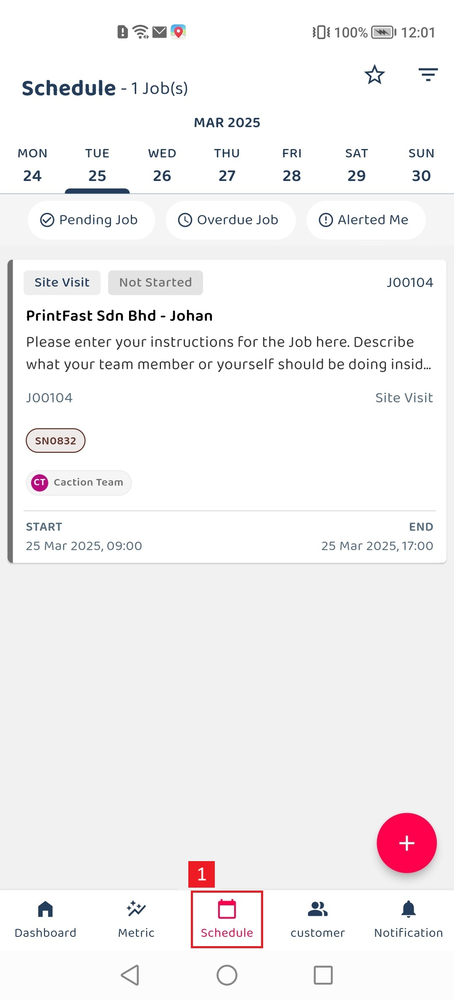
   

    

2. If the target job is not found in the schedule view, navigate to the Filter to locate the job.

    

   

      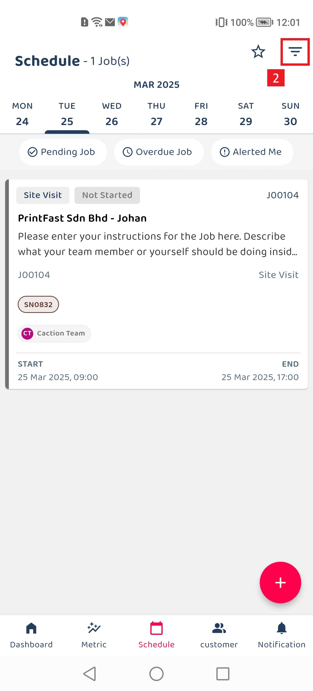
   

    

3. Using Filter function to search the target job that need to update .

    

   

      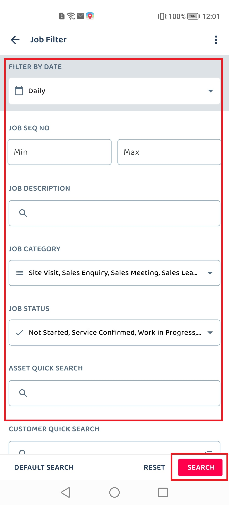
   

    

4. Click in the job section to see the job details

    

   

      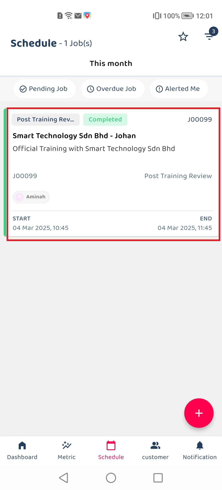
   

    

5. Click on the ellipsis icon to access the job options.

    

   

      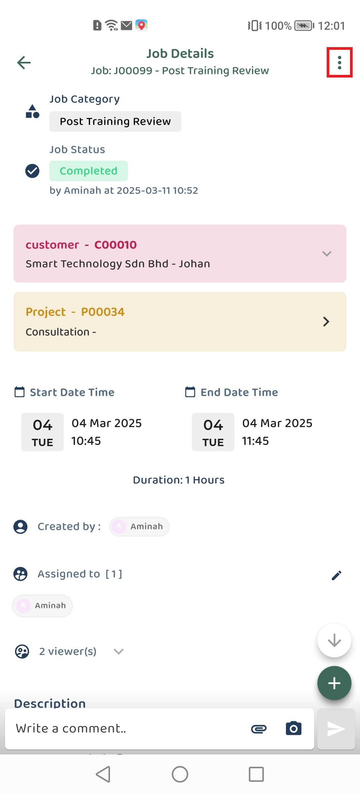
   

    

6. Click on the edit icon to access the edit job section.

    

   

      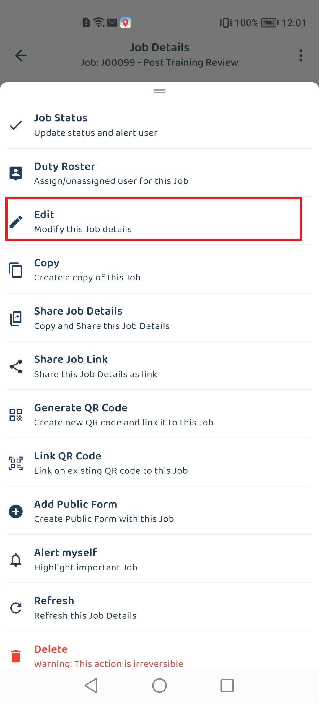
   

    

7. In Edit section containing :

| No. | Field Name          | Description                                                                        |
| --- | ------------------- | ---------------------------------------------------------------------------------- |
| A   | Category and Status | Indicates the type of job and current status of the job.                           |
| B   | Customer            | Choose a customer from those registered in the system.                             |
| C   | Project             | After selecting Customer, you will be asked to select Project under that Customer. |
| D   | Asset               | Choose an asset from those registered in the system.                               |
| E   | Start/End Date Time | Fields that capture start and end date and time information                        |
| F   | Assign To           | The user responsible for the job.                                                  |
| G   | Description         | Detailed description of the job.                                                   |

    

   

      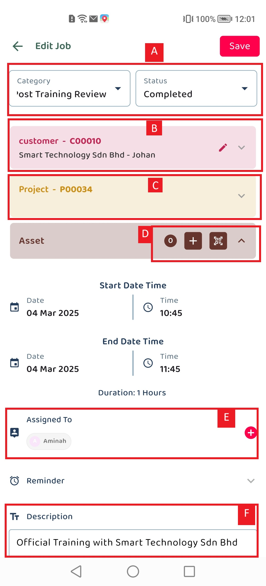
   

    

8. click the "Save" button to to update the job information.

    

   

      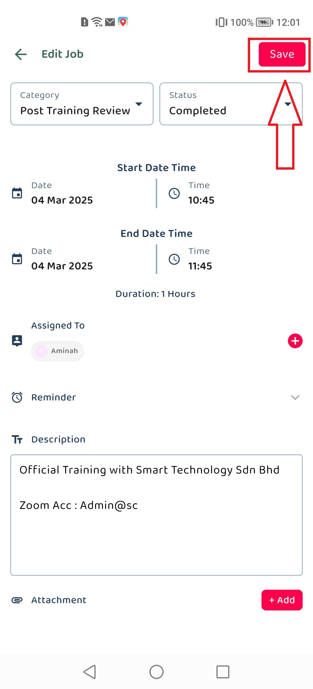
   

    

    

   

      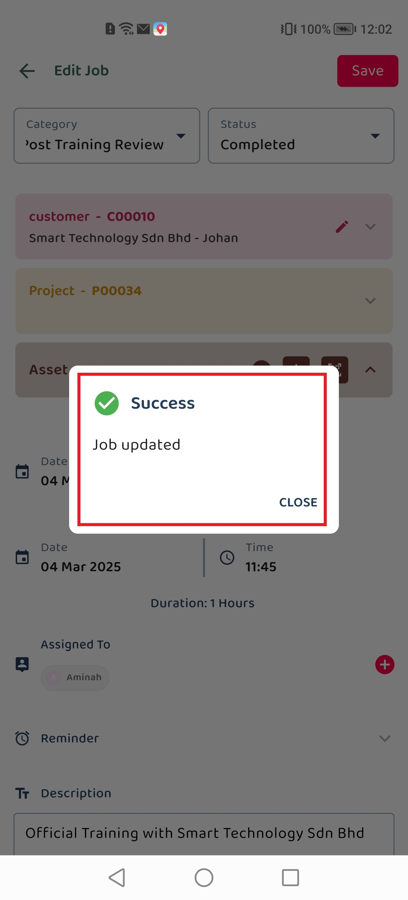
   

    

# How to Edit Project

1. At the mobile app's navigation bar, go to Dashboard and click the "Project".

    

   

         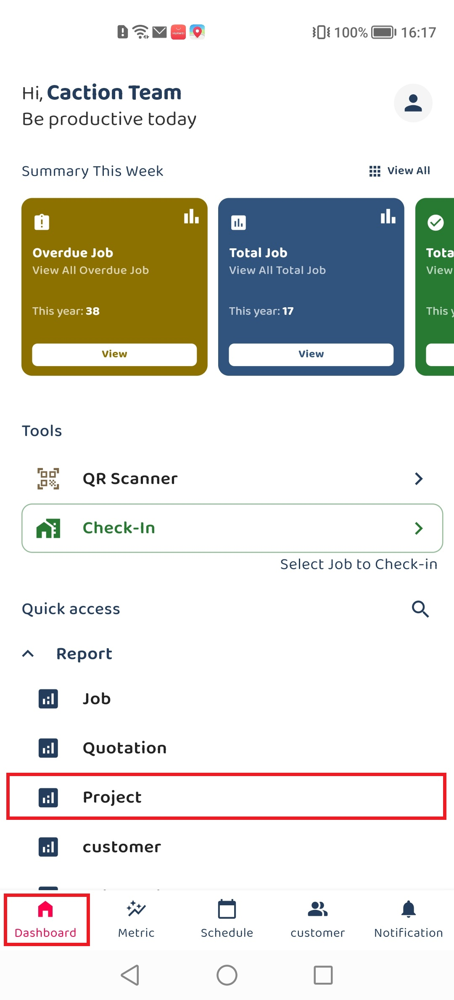
      

    

2. Navigate to the "Filter" button to searh for the target project.

    

   

         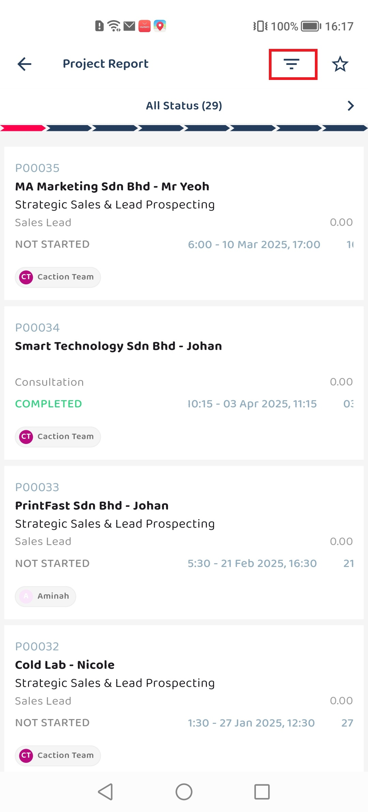
      

    

3. Select an existing project that you want to edit to view projet details.

    

   

         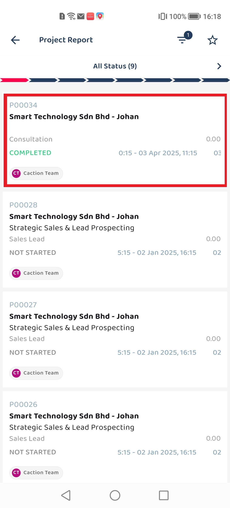
      

    

4. Click on the ellipsis icon to access the options.

    

   

         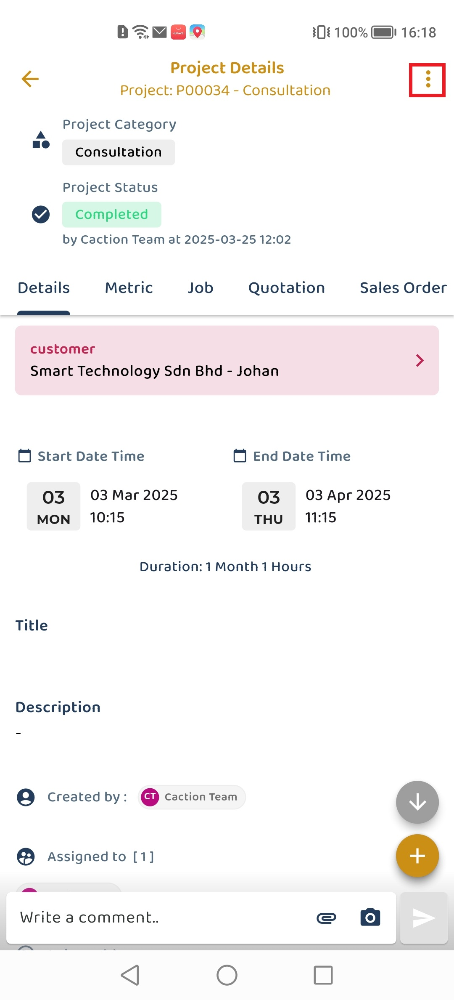
      

    

5. Select "Edit" from the dropdown menu options.

    

   

      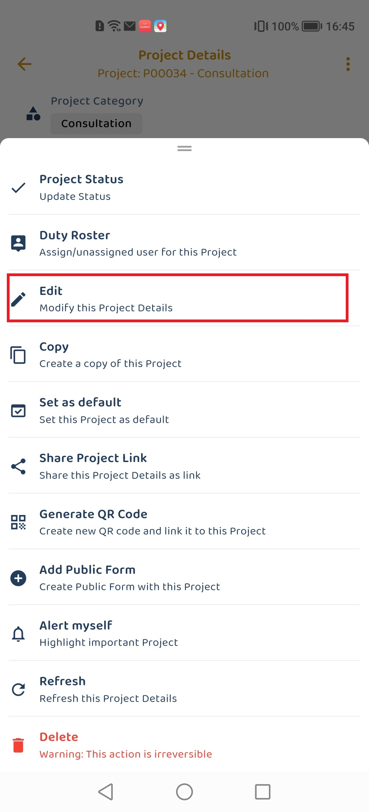
   

    

6. The Edit Project form will open with several sections to modify:

    

   

      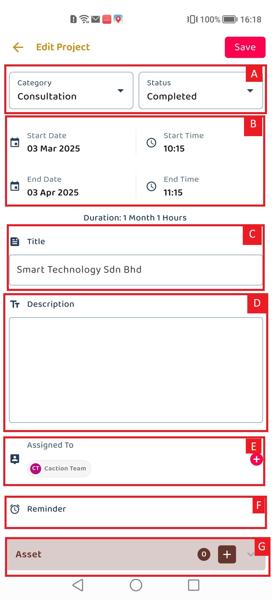
   

    

## Project Edit Form

| No. | Section                 | Description                                                                                |
| --- | ----------------------- | ------------------------------------------------------------------------------------------ |
| A   | **Category and Status** | Defines the project type or classification and indicates the current state of the project. |
| B   | **Start and End Dates** | Sets the project timeline by selecting when the project begins and ends.                   |
| C   | **Title**               | A short title for the project about the project's purpose or scope.                        |
| D   | **Description**         | provides detailed information about the project's purpose                                  |
| E   | **Assign List**         | View the team members assigned to the project and assign users to work on the project.     |
| F   | **Reminder Settings**   | Enable reminders for the project and create custom reminders on events.                    |
| G   | **Asset Information**   | Enter the asset registered in the system associated with the project.                      |

    

**Note:** Contact your manager to enable additional custom fields for your specific needs.

7. After editing the details, click the "Save Changes" button to update the project information.

    

   

      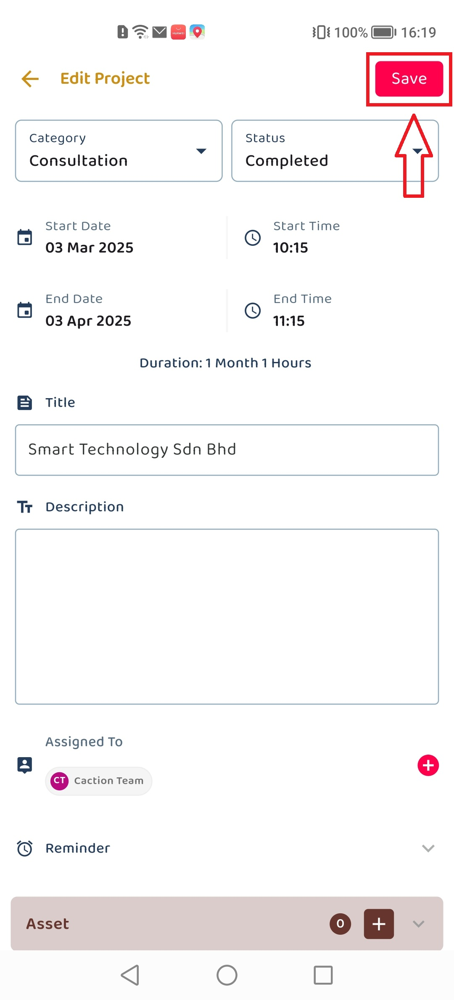
   

    

   

      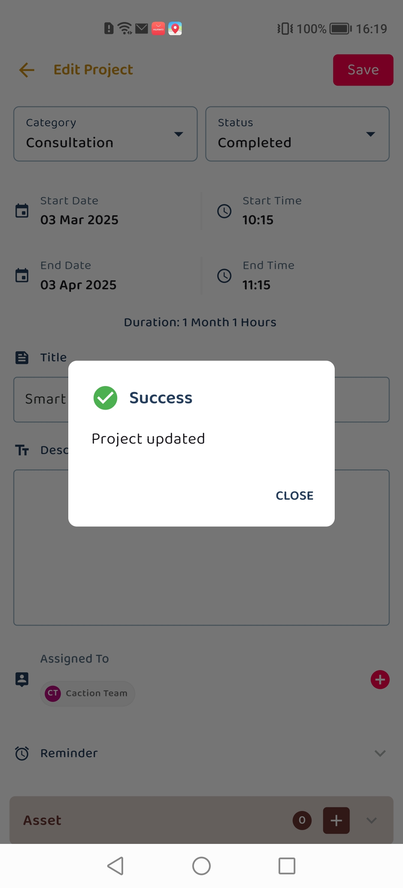
   

    

  

# How to Edit Customer

_Note: In your system, Customer may have been renamed to other (i.e Site, Client, Company, etc.)_

 

1. At the mobile app's navigation bar, go to Customer.

    

   

      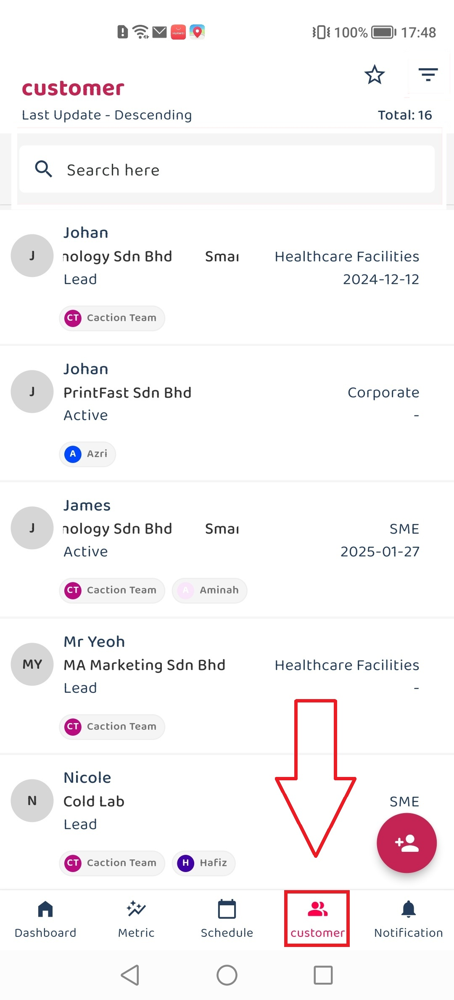
   

    

2. Navigate to the "Filter" button or Using search bar to searh for the target customer that want to update.

    

   

      
   

    

3. Click on the target customer to view the customer details.

    

   

      
   

4. Click on the ellipsis icon to access the options.

    

   

      
   

5. Select "Edit" from the dropdown menu options.

    

   

      
   

6. The Edit Customer form will open with several sections to modify:
    

   

      
   

   

      
   

   

      
   

    

| No. | Field                        | Description                                               |
| --- | ---------------------------- | --------------------------------------------------------- |
| A   | Customer Category and Status | Edit the current status and type of the customer.         |
| B   | Company Name                 | Edit the official name of the customer's company.         |
| C   | Customer Name                | Edit the full name of the customer person.                |
| D   | Manage Phone Number          | Add, Edit or Delete the customer's contact phone number.  |
| E   | Manage Email                 | Add, Edit or Delete the customer's email address.         |
| F   | Manage Address               | Add, Edit or Delete the physical address of the customer. |
| G   | Assigned User                | Assign the user responsible for managing this customer.   |
| H   | Manage Asset                 | Select or remove the asset that related to customer       |
| I   | Manage Reminder              | Edit and unselect the reminder for the reminder section   |
| J   | Custom Field                 | Edit the Custom Field data of customer information.       |

 

**Note:** Contact your manager to enable additional custom fields for your specific needs.

6. After editing the details, click the "Save Changes" button to update the customer information.
    

   

      
   

   

      
   

    

  

# How to Edit Digital Form

 

1. From the desktop's navigation bar, go to Business Reports and select the "Digital Form Report".

   Open Digital Form Report Here: https://system.caction.com/reports/digitalform?code=DR01

    

   

      
   

    

2. Navigate to the dashboard to locate the Digital Form data that wish to edit or update.

    

   

      
   

    

3. In the Digital Form Details view, locate the options menu (three dots) and select the "Edit".

    

   

      
   

    

4. The highlighted sections (marked with red boxes) in the form are editable fields that users can modify:

    

   

      
   

    

| No. | Section                | Description                                                                   |
| --- | ---------------------- | ----------------------------------------------------------------------------- |
| A   | Status section         | Indicates the current status of the quotation.                                |
| B   | Attach Customer button | Can be clicked to associate a different customer                              |
| C   | Date Time section      | The date when the quotation is created.                                       |
| D   | Form Fields section    | “Default Fields Element" which are default field element in the digital form. |

    

   

      
   

    

| No. | Section                 | Description                                                                         |
| --- | ----------------------- | ----------------------------------------------------------------------------------- |
| E   | Asset button            | Button to add a new asset                                                           |
| F   | Assign User button      | Button to assign additional users                                                   |
| G   | Add New Reminder button | Button to tick or create a new reminder in the reminder section                     |
| H   | Quotation details       | "Custom Field Element" Section containing Validity and Delivery Date fields element |

    

   

      
   

    

| No. | Section                 | Description                                                                                 |
| --- | ----------------------- | ------------------------------------------------------------------------------------------- |
| I   | New Attachment          | Section for uploading attachments                                                           |
| J   | Product/Services List   | Form for entering product details including description, quantity , and unit of measurement |
| K   | Product/Services Button | Button to add add products or services to the quotation                                     |
| L   | Disclaimer Section      | Contains a text area that allows users to add disclaimers message for the quotation         |

  

7. After editing the details, click the "Save Changes" button to update the project information.

    

   

      
   

    
