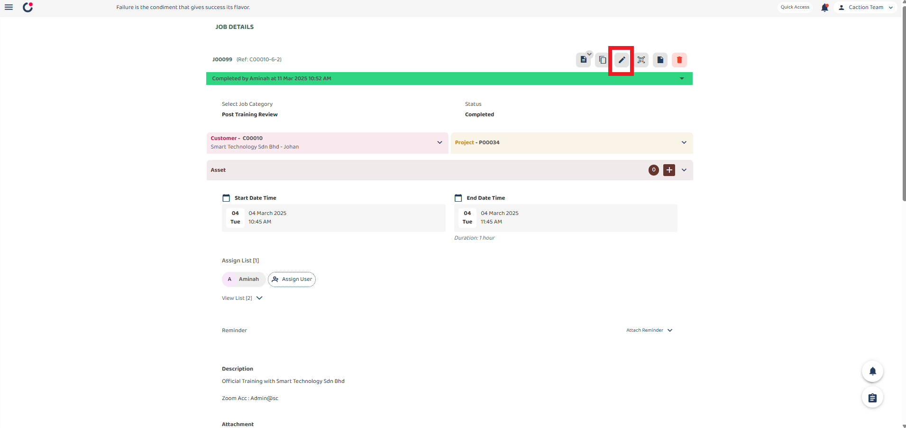
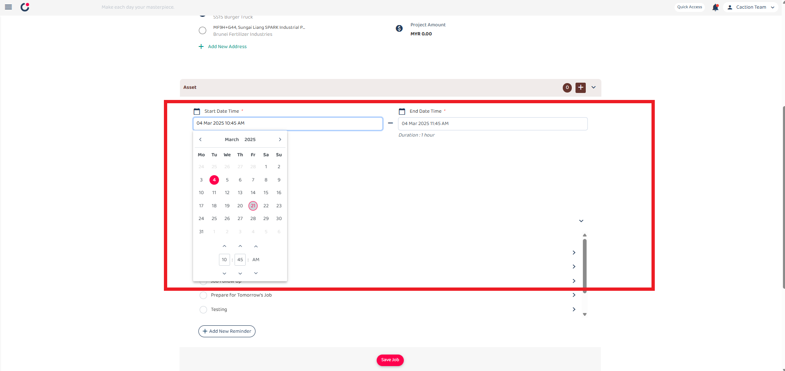
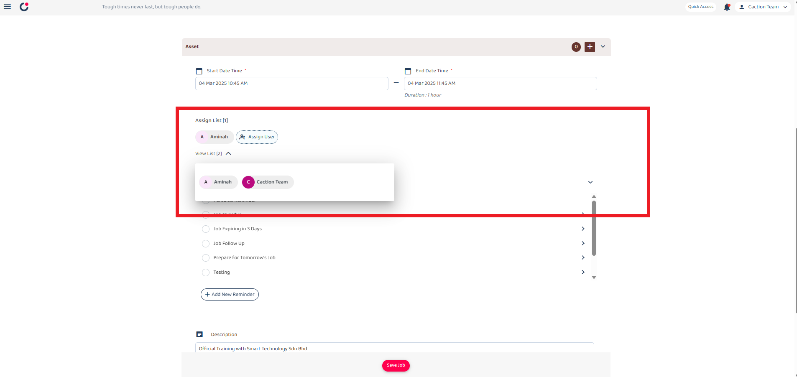
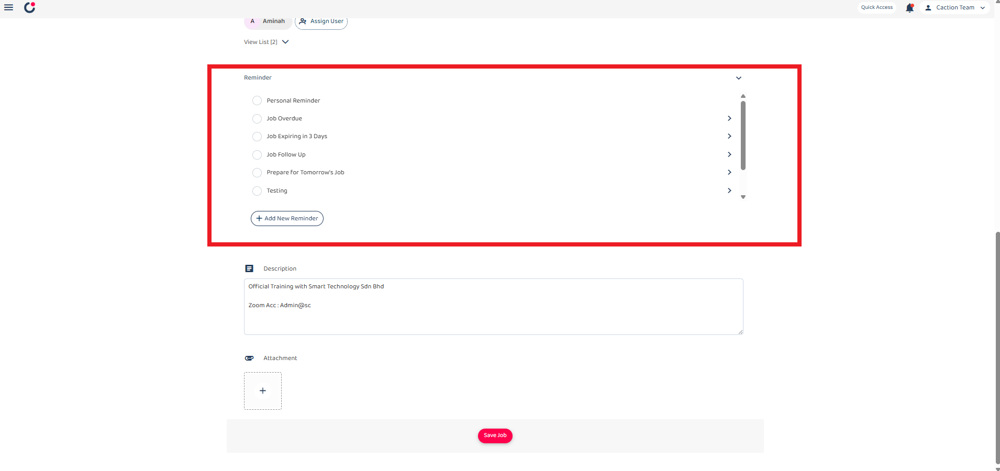

## How to Edit/Update Data Inside System (Mobile)

_Note: If you do not have access to the Edit or Update, please contact your admin._

**Navigate to the section by clicking it.** 

- [Edit Job](#section1) 
- [Edit Project](#section2) 
- [Edit Customer](#section3) 
- [Edit Digital Form](#section4) 

# How to Edit Job

_Note: In your system, Job may have been renamed to other (i.e Task, Ticket, Deal, etc.)_

1. At the mobile app's navigation bar, go to Schedule.

    

   

      
   

    

2. If the target job is not found in the schedule view, navigate to the Job dashboard to locate the job.

    

   

      
   

    

3. Click on the ellipsis icon to access the job options.

    

   

      
   

    

4. For comprehensive editing, click the "Job Details" button to view complete job information in a new tab.

    

   

      
   

    

5. Click on the pencil icon to access the edit job section.

    

   

      
   

    

6. Edit the first section containing "Job Category" and "Status" fields:

   | Field Name   | Description                              |
   | ------------ | ---------------------------------------- |
   | Job Category | Classifies the type of job.              |
   | Status       | Indicates the current status of the job. |

    

   

      
   

    

7. The pencil icon in the customer section allows changing the customer and project associated with this job. When clicked, select a different customer and project to attach to this job.

    

   

      
   

    

8. Click on the Asset section to view asset details. In the asset list, filter assets and add new ones as needed.

    

   

      
   

    

9. Modify start date/time and end date/time by clicking on either field to open a calendar for changing the job schedule.

    

   

      
   

    

10. Use the "Assign User" feature to assign team members to jobs and grant them "View" or "Assign" permissions.

    

   

      
   

    

11. The Reminder section allows users to manage reminders for different tasks.

    

   

      
   

    

12. After completing all information updates, click the "Save" button to commit changes to the system.

    

   

      
   

    

  

# How to Edit Project

1. At the desktop site navigation bar, select the Dashboard and navigate to Project section.
   Open Project Dashboard Here: https://system.caction.com/dashboard/project

    

   

      
   

    

2. Select an existing project that you want to edit.

    

   

      
   

    

3. The project can be edited on the dashboard by clicking the pencil icon.

    

   

      
   

    

4. For more comprehensive editing options, click on the "Project Details" button to view complete information about the project in a new tab.

    

   

      
   

    

5. In the Project Details view, locate the options menu (three dots) and select "Edit" from the dropdown menu options.

    

   

      
   

    

6. The Edit Project form will open with several sections to modify:

    

   

      
   

    

   

      
   

    

## Project Edit Form

| No. | Section                      | Description                                                                                                                              |
| --- | ---------------------------- | ---------------------------------------------------------------------------------------------------------------------------------------- |
| 1   | **Category and Status**      | Defines the project type or classification and indicates the current state of the project in its workflow.                               |
| 2   | **Start and End Dates**      | Sets the project timeline by selecting when the project begins and ends. Click to open a calendar picker and select the dates and times. |
| 3   | **Title and Description**    | A short title for the project and provides detailed information about the project's purpose, scope, and goals.                           |
| 4   | **Reminder Settings**        | Enable reminders for the project and create custom reminders on events.                                                                  |
| 5   | **Asset Information**        | Enter the asset registered in the system associated with the project.                                                                    |
| 6   | **Assign List**              | View the team members assigned to the project and assign users to work on the project.                                                   |
| 7   | **Product/Services Details** | Add and manage products or services associated with the project.                                                                         |

    

**Note:** Contact your manager to enable additional custom fields for your specific needs.

 

7. After editing the details, click the "Save Changes" button to update the project information.

    

   

      
   

    

  

# How to Edit Customer

_Note: In your system, Customer may have been renamed to other (i.e Site, Client, Company, etc.)_

 

1. From the desktop's navigation bar, click on the Business Management and select the "Customer List".

   Open Customer List Here: https://system.caction.com/customers

    

   

      
   

    

2. Navigate to the dashboard to locate the customer data that want to edit or updates.

    

   

      
   

    

3. In the Customer Details page, the pencil icon ✏️ indicates the edit functionality. Each editable field serves a specific function as described below.

    

   

      
   

    

   

      
   

| No. | Field                | Description                                                |
| --- | -------------------- | ---------------------------------------------------------- |
| A   | Customer Status      | Edit the current status of the customer.                   |
| B   | Company Name         | Edit the official name of the customer's company.          |
| C   | Customer Name        | Edit the full name of the customer contact person.         |
| D   | Customer Category    | Edit the customer based on their type.                     |
| E   | Assigned User        | Assign the user responsible for managing this customer.    |
| F   | Manage Phone Number  | Delete or Edit the customer's contact phone number.        |
| G   | Add Phone Number     | Adding the customer's contact phone number.                |
| H   | Customer Address     | Edit, Copy or Delete the physical address of the customer. |
| I   | Add New Address      | Adding new Address for the customer.                       |
| J   | Customer Email       | Edit the customer's email address.                         |
| K   | Add Additional Email | Adding the customer's email address.                       |
| L   | Custom Field         | Edit the Custom Field data.                                |

 

**Note:** Contact your manager to enable additional custom fields for your specific needs.

  

# How to Edit Digital Form

 

1. From the desktop's navigation bar, go to Business Reports and select the "Digital Form Report".

   Open Digital Form Report Here: https://system.caction.com/reports/digitalform?code=DR01

    

   

      
   

    

2. Navigate to the dashboard to locate the Digital Form data that wish to edit or update.

    

   

      
   

    

3. In the Digital Form Details view, locate the options menu (three dots) and select the "Edit".

    

   

      
   

    

4. The highlighted sections (marked with red boxes) in the form are editable fields that users can modify:

    

   

      
   

    

| No. | Section                | Description                                                                   |
| --- | ---------------------- | ----------------------------------------------------------------------------- |
| A   | Status section         | Indicates the current status of the quotation.                                |
| B   | Attach Customer button | Can be clicked to associate a different customer                              |
| C   | Date Time section      | The date when the quotation is created.                                       |
| D   | Form Fields section    | “Default Fields Element" which are default field element in the digital form. |

    

   

      
   

    

| No. | Section                 | Description                                                                         |
| --- | ----------------------- | ----------------------------------------------------------------------------------- |
| E   | Asset button            | Button to add a new asset                                                           |
| F   | Assign User button      | Button to assign additional users                                                   |
| G   | Add New Reminder button | Button to tick or create a new reminder in the reminder section                     |
| H   | Quotation details       | "Custom Field Element" Section containing Validity and Delivery Date fields element |

    

   

      
   

    

| No. | Section                 | Description                                                                                 |
| --- | ----------------------- | ------------------------------------------------------------------------------------------- |
| I   | New Attachment          | Section for uploading attachments                                                           |
| J   | Product/Services List   | Form for entering product details including description, quantity , and unit of measurement |
| K   | Product/Services Button | Button to add add products or services to the quotation                                     |
| L   | Disclaimer Section      | Contains a text area that allows users to add disclaimers message for the quotation         |

  

7. After editing the details, click the "Save Changes" button to update the project information.

    

   

      
   

    
