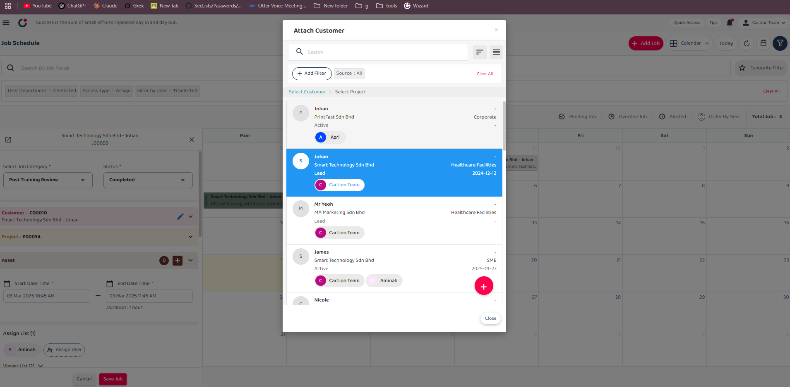

## How to Edit/Update Data Inside System ? (For All Data Level Except Public Form)

_Note: If you do not have access to the Edit or Update, please contact your admin._

**Navigate to the section by clicking it.** 

 

- [Desktop](#section1) 

  - [Edit Job](#section2) 
  - [Edit Project](#section3) 
  - [Edit Customer](#section4) 
  - [Edit Digital Form](#section5) 

 

- [Mobile App](#section6) 

  - [Edit Job](#section7) 
  - [Edit Project](#section8) 
  - [Edit Customer](#section9) 
  - [Edit Digital Form](#section10) 

  

# How to Edit Job

1. From the desktop's navigation bar, access the Job Schedule where you can select the job you wish to edit.

 

   

 

2. If you cannot find your target job in the schedule view, navigate to the Job dashboard to locate the job data you wish to edit or update.

 

   

 

3. Click on the job details button to view comprehensive information about the job in a new tab.

 

   

 

4. Click on the eclipse icon to access the edit job section

 

   

 

5. The first section contains "Job Category" and "Status" fields:

- The "Job Category" field defines the type or classification of the job within the system.
- The "Status" field indicates the current state of the job in its workflow.

 

   

 

6. this pencil icon in customer section is to change the customer and project associated with this job. When clicked, you can select a different customer and project to attach to this job.

 

   

 

   

 

7. The Asset section can be click to see the details of asset. In asset list, you can filter out the assets and add asset on it.

 

   

 

 

   

 

8. Next section is start date time and end date time, after change and the schedule will be changed too.

 

   

 

9. The "Assign User" feature allows you to assign team members to jobs which grant "View" or "Assign" permissions.

 

   

 

10. The Reminder section allows users to manage reminders for different tasks.

 

   

 

11. After fill out all information, click "save" button to save it in system.

 

   

 
  

# How to Edit Project
