## How to Edit/Update Data Inside System (For All Data Level Except Public Form)

_Note: If you do not have access to the Edit or Update, please contact your admin._

**Navigate to the section by clicking it.** 

 

- [Desktop](#section1) 

  - [Edit Job](#section2) 
  - [Edit Project](#section3) 
  - [Edit Customer](#section4) 
  - [Edit Digital Form](#section5) 

 

- [Mobile App](#section6) 

  - [Edit Job](#section7) 
  - [Edit Project](#section8) 
  - [Edit Customer](#section9) 
  - [Edit Digital Form](#section10) 

  

# How to Edit Job

1. From the desktop's navigation bar, access the Job Schedule where you can select the job you wish to edit.

 

   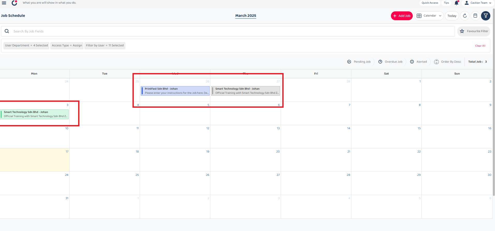

 

2. If you cannot find your target job in the schedule view, navigate to the Job dashboard to locate the job data you wish to edit or update.

 

   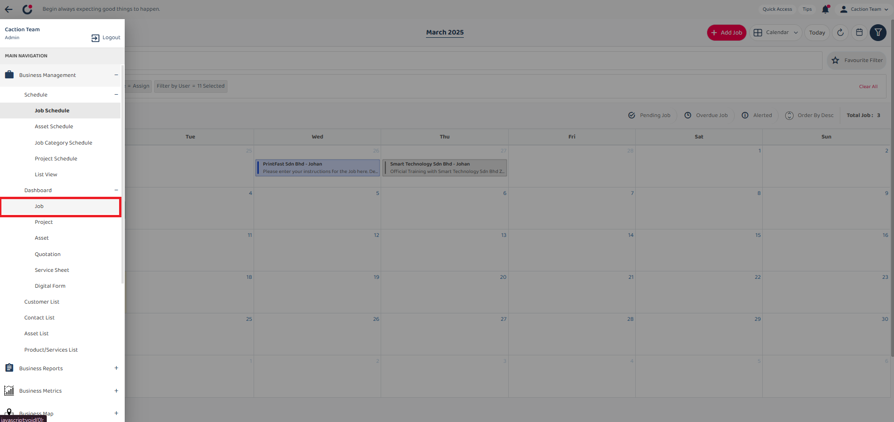

 

3. Click on the ellipsis icon to access the job options.

 

   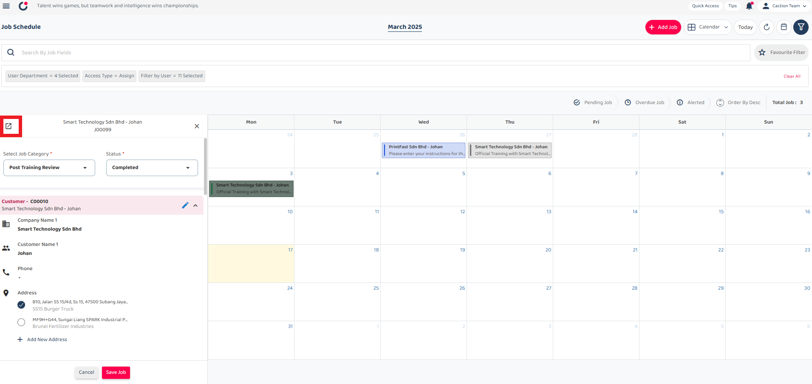

 

4. For more detailed editing, click on the "Job Details" button to view comprehensive information about the job in a new tab.

 

   

 

5. Click on the pencil icon to access the edit job section.

 

   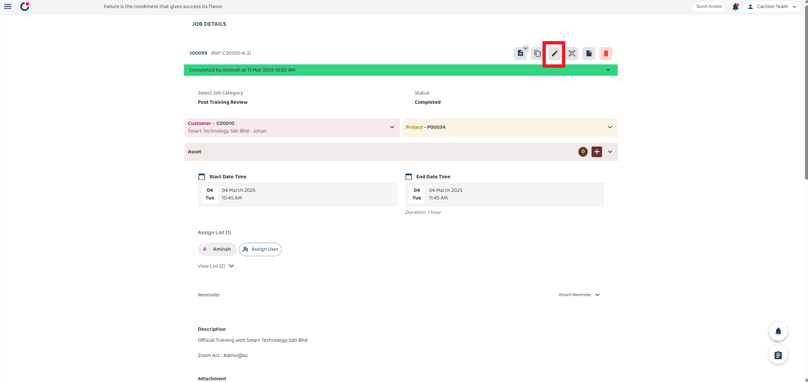

 

6. The first section contains "Job Category" and "Status" fields:
   - The "Job Category" field defines the type or classification of the job within the system.
   - The "Status" field indicates the current state of the job in its workflow.

 

   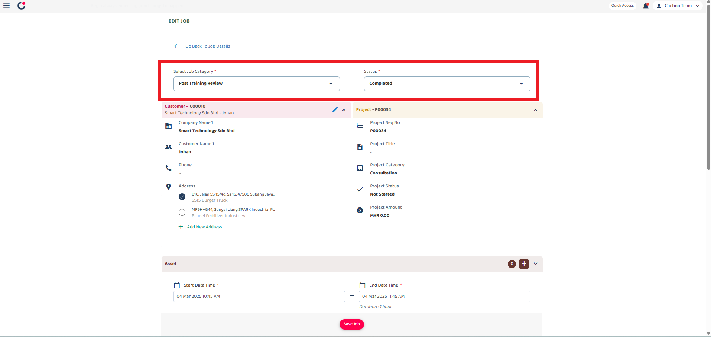

 

7. The pencil icon in the customer section allows you to change the customer and project associated with this job. When clicked, you can select a different customer and project to attach to this job.

 

   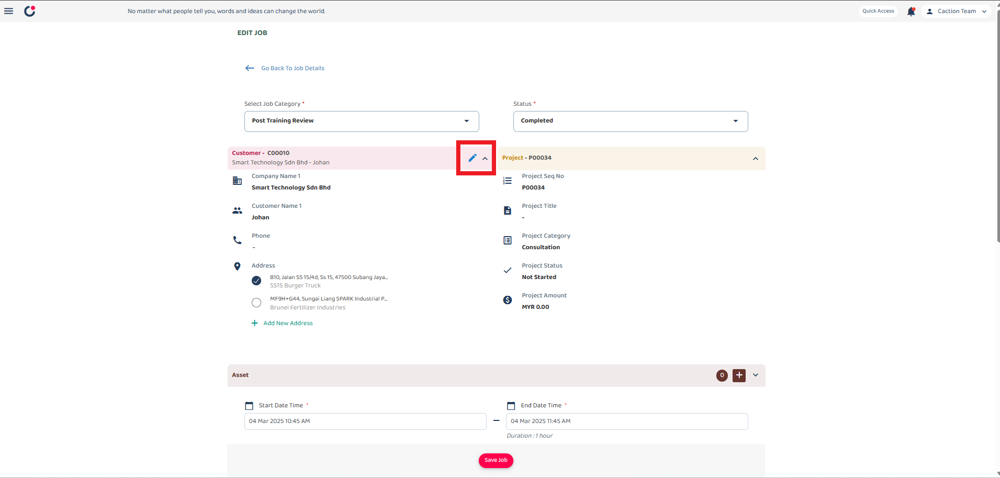

 

8. Click on the Asset section to view asset details. In the asset list, you can filter assets and add new ones.

 

   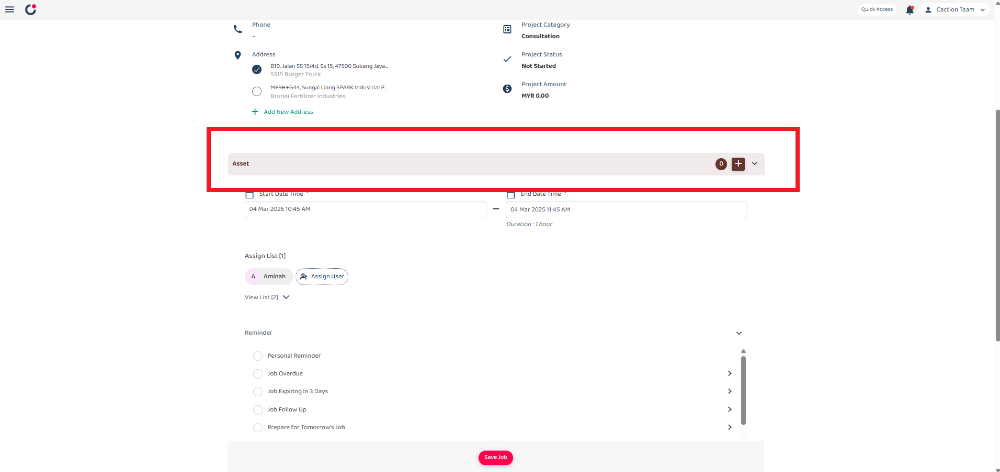

 

9. The next section displays start date/time and end date/time. Click on either field to open a calendar where you can change the job schedule.

 

   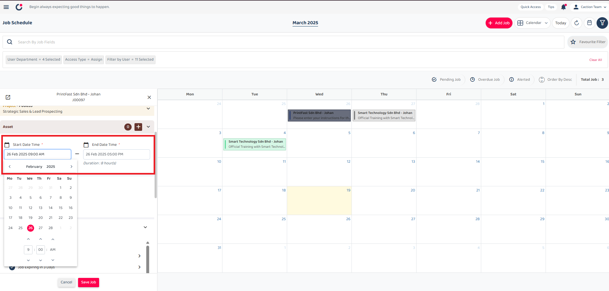

 

10. The "Assign User" feature allows you to assign team members to jobs and grant them "View" or "Assign" permissions.

 

   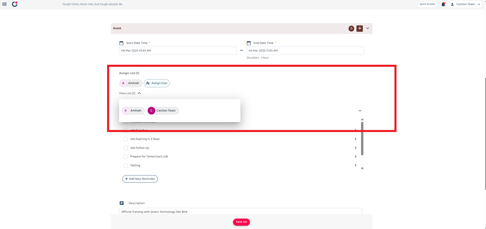

 

11. The Reminder section allows users to manage reminders for different tasks.

 

   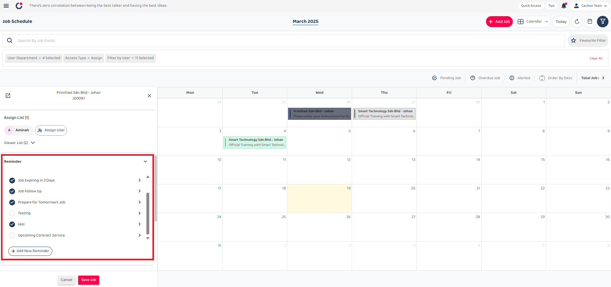

 

12. After filling out all information, click the "Save" button to save your changes in the system.

 

   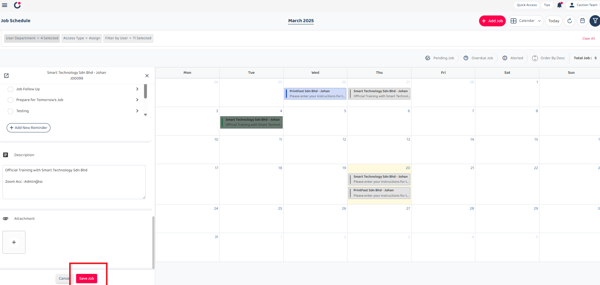

 
  

# How to Edit Project

1. At the desktop site navigation bar, select the Dashboard and navigate to Project section.

 

   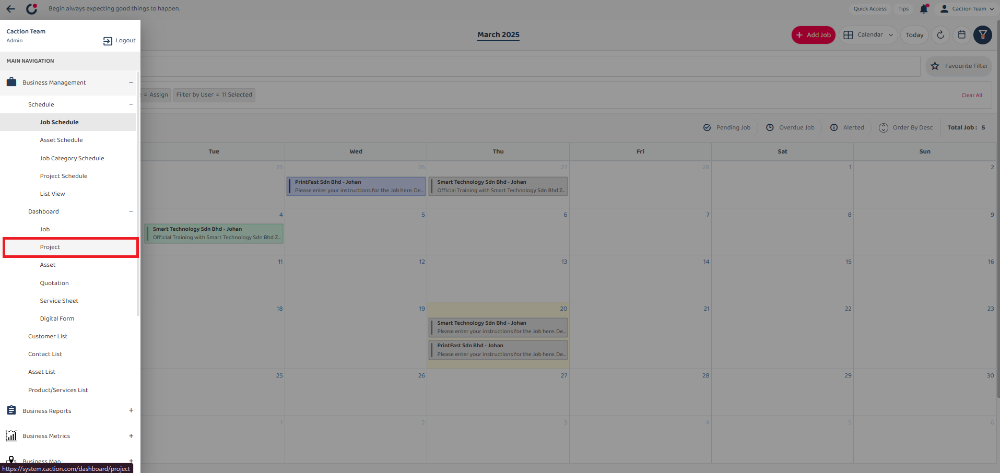

 

2. Select an existing project that you want to edit.

 

   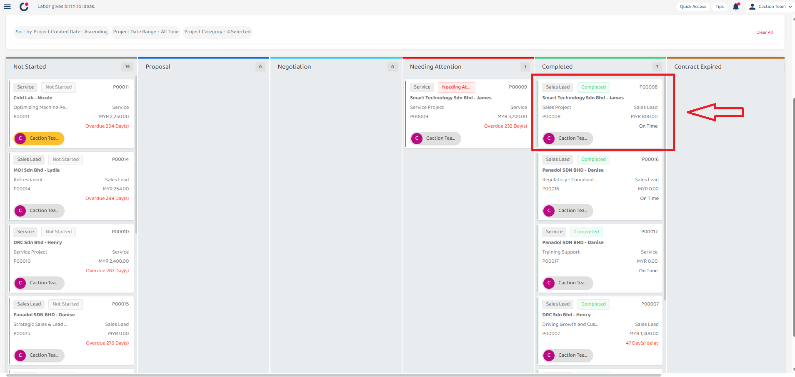

 

3. The project can be edited directly on the dashboard by clicking the pencil icon.

 

   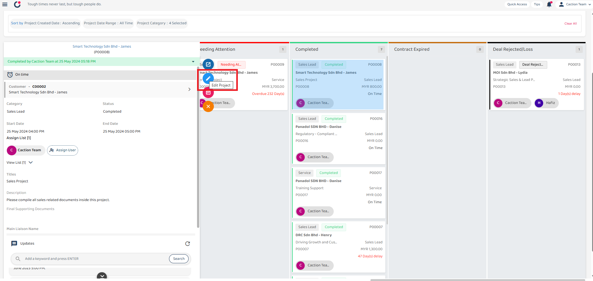

 

4. For more comprehensive editing options, click on the "Project Details" button to view complete information about the project in a new tab.

 

   

 

5. In the Project Details view, locate the options menu (three dots) in the upper right corner of the screen.

 

   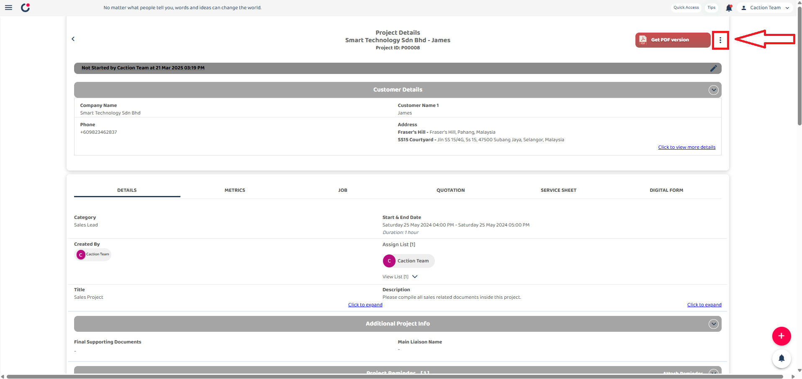

 

6. Select "Edit" from the dropdown menu options.

 

   

 

7. The Edit Project form will open with several sections to modify:

 

   

 

   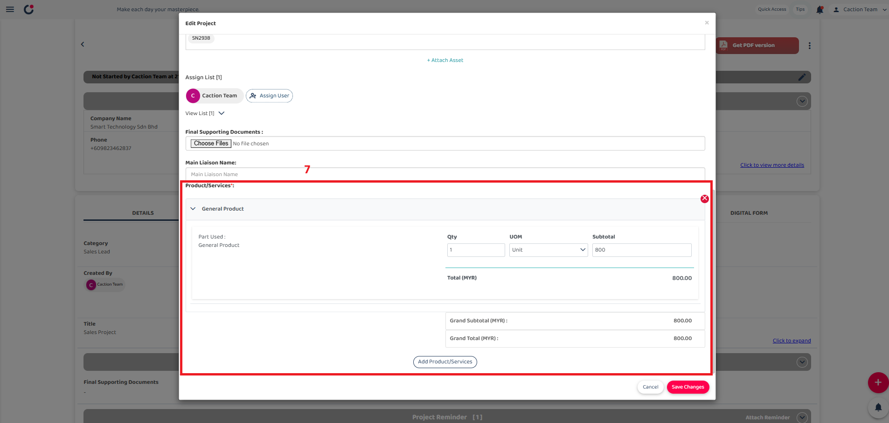

 

# Project Edit Form

| No. | Section                      | Description                                                                                                                                    |
| --- | ---------------------------- | ---------------------------------------------------------------------------------------------------------------------------------------------- |
| 1   | **Category and Status**      | Defines the project type or classification and indicates the current state of the project in its workflow.                                     |
| 2   | **Start and End Dates**      | Sets the project timeline by selecting when the project begins and ends. Click to open a calendar picker and select the dates and times.       |
| 3   | **Title and Description**    | The name of the project that appears in listings and reports, and provides detailed information about the project's purpose, scope, and goals. |
| 4   | **Reminder Settings**        | Enable reminders for the project and create custom reminders for specific project milestones or events.                                        |
| 5   | **Asset Information**        | Enter the identification for equipment, property, or other assets associated with the project and link additional assets.                      |
| 6   | **Assign List**              | View the team members assigned to the project and assign users to work on the project.                                                         |
| 7   | **Product/Services Details** | Add and manage products or services associated with the project.                                                                               |

 

**Note:** Contact your manager to enable additional custom fields for your specific business needs.

 

8. After editing the details, click the "Save Changes" button to update the project information.

 

   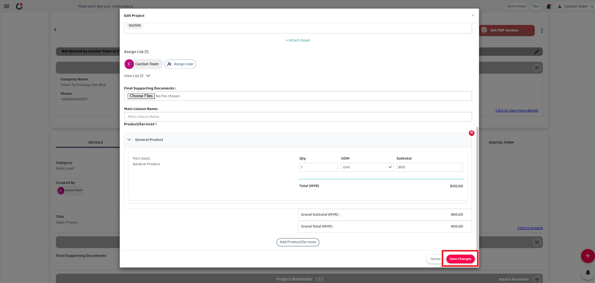

 
