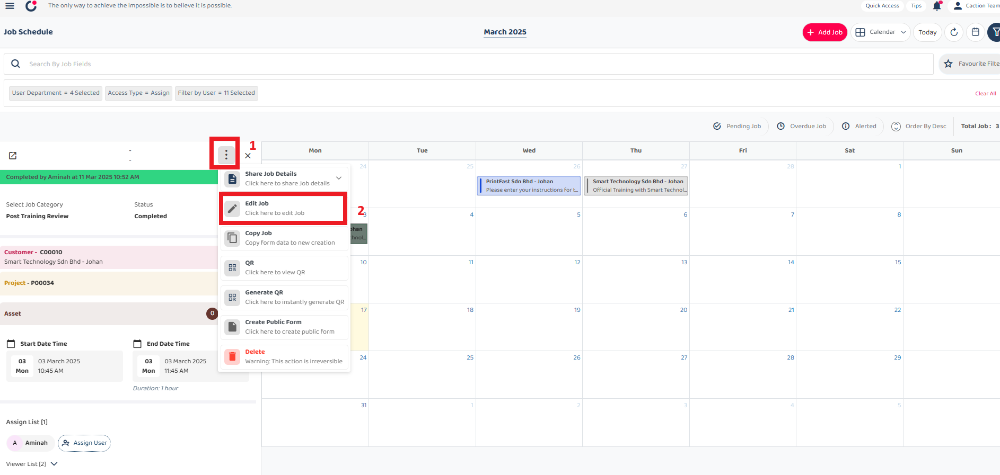
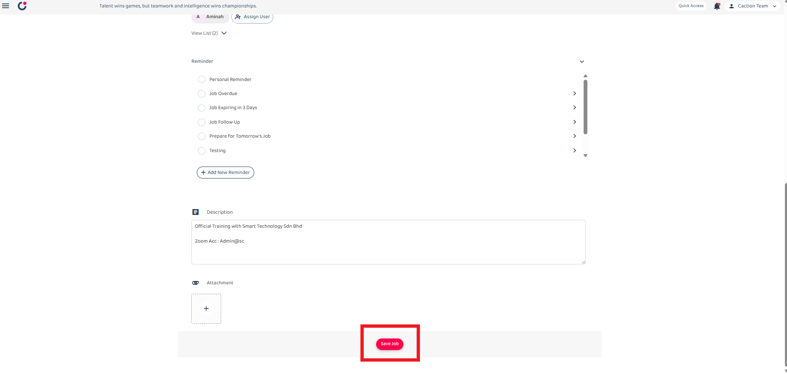

## How to Edit/Update Data Inside System ? (For All Data Level Except Public Form)

_Note: If you do not have access to the Edit or Update, please contact your admin._

**Navigate to the section by clicking it.** 

 

- [Desktop](#section1) 

  - [Edit Job](#section2) 
  - [Edit Project](#section3) 
  - [Edit Customer](#section4) 
  - [Edit Digital Form](#section5) 

 

- [Mobile App](#section6) 

  - [Edit Job](#section7) 
  - [Edit Project](#section8) 
  - [Edit Customer](#section9) 
  - [Edit Digital Form](#section10) 

  

# How to Edit Job

1. From the desktop's navigation bar, access the Job Schedule where you can select the job you wish to edit.

 

   

 

2. If you cannot find your target job in the schedule view, navigate to the Job dashboard to locate the job data you wish to edit or update.

 

   

 

3. Click on the eclipse icon to access the edit job section

 

   

 

4. Prefer Click on the job details button to view comprehensive information about the job in a new tab.

 

   

 

4. Click on the pencil icon to access the edit job section

 

   

 

5. Edit the details and save it.

 

   

 

6. After fill out all information, click "save" button to save it in system.

 

   

 
  

# How to Edit Project
