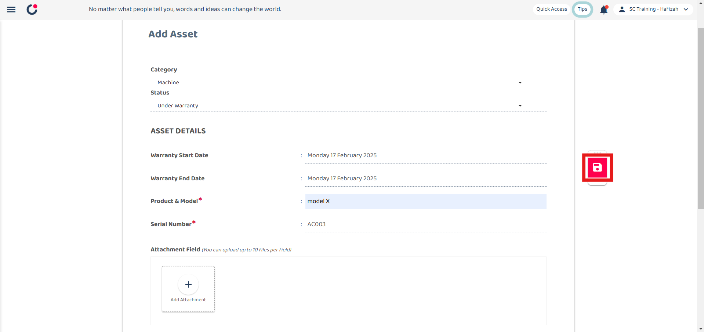

## How to Add New Asset?

1.  Go to desktop site “Main Navigation" > "Business Management" > "Asset List".  
   **Add New Asset here**: [https://salesconnection.my/asset-list](https://salesconnection.my/asset-list) 

    

       
    
 

2. Click the "+ Add Asset" button.

   

     
   
 

3. The "Add Asset" page shown below is to enter the information of the new asset.

   |   Term  | Definition |
   | :-----------: | :------------------------------------------------------------------------------------------------------------------------------------------------------------------------------- |
   | Category | Indicates the type of asset |
   | Status | Indicates Current status of the asset|
   | Warranty Start Date | The date when the warranty period for the asset begins |
   | Warranty End Date | The date when the warranty period for the asset ends|
   | Serial No*| Unique code assigned to the asset by the manufacturer |
   | Attachment Field |  Field to add attachments related to the asset|
   | Asset Reminder | Notifications or alerts related to the asset maintenance or checks   |
   |  Model | Specific model code of the asset |
   | Remarks | Additional notes or comments about the asset |

   *Note: Fields marked with an asterisk ( * ) are required. 

   

     
   
 

5. Click the save icon.

   

     
   
 

6. Click "OK"

   

     
   
 

7. When this "Successfully Saved" prompt appears, it means that your asset has been successfully saved.

   

     
   
 

8. This is the Asset Details result.

   

     
   

     

**Related Articles**
- [How to Add New Customer?](Add_New_Customer.md)
- [How to Add New Project?](Add_New_Project.md)
- [How to Add New Job?](Add_New_Job.md)
- [How to Create Digital Form?](Create_Digital_Form.md)
