Version 1.0 
Created: 18 June 2024 
Updated: 18 June 2024 
## How to Add New Asset?
*Note: In your system, Asset may have been renamed to others (i.e Lift/Esc, Machine, Equipment, Printer, Aircond, etc.) 

**Navigate to the section by clicking it.** 

- [From Asset List](#section1) 
- [From Job Creation Page](#section2) 
- [From Customer Creation Page](#section3)
   

### From Asset List

- [Using Desktop](#section4)
- [Using Mobile](#section5)

**Using Desktop**

1.  Go to desktop site “Main Navigation" > "Business Management" > "Asset List".  
   **Add New Asset here**: [https://salesconnection.my/asset-list](https://salesconnection.my/asset-list) 

    

       
    
 

2. Click the "+ Add Asset" button. 
   *Note: If you do not see a "+ Add Asset" button, you may need to request permission or help from your Admin to register new Asset. 

   

     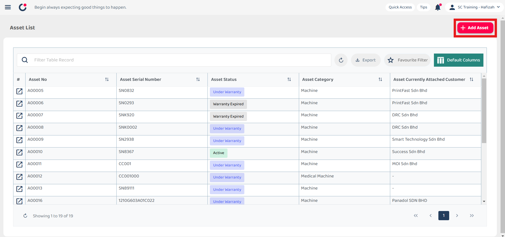
   
 

3. Fill out the details of the new Asset. Available fields may differ depending on your company’s system setup.

   |   Term  | Definition |
   | :-----------: | :--------------------------------------------------------------------- |
   | Category | Indicates the type of asset |
   | Status | Indicates Current status of the asset|
   | Warranty Start Date | The date when the warranty period for the asset begins |
   | Warranty End Date | The date when the warranty period for the asset ends|
   | Serial No*| Unique code assigned to the asset by the manufacturer |
   | Model | Specific model code of the asset |

   *Note: Fields marked with an asterisk ( * ) are required. 

   

     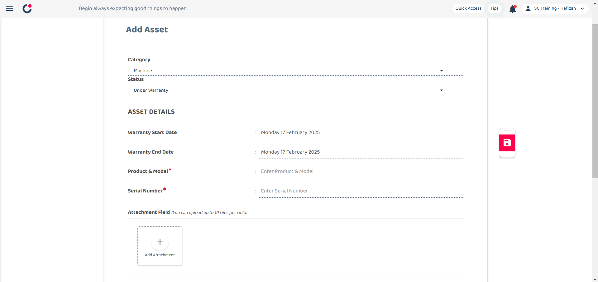
   
 

4. Click the save icon.

   

     
   
 

5. Click "OK" to confirm your save.

   

     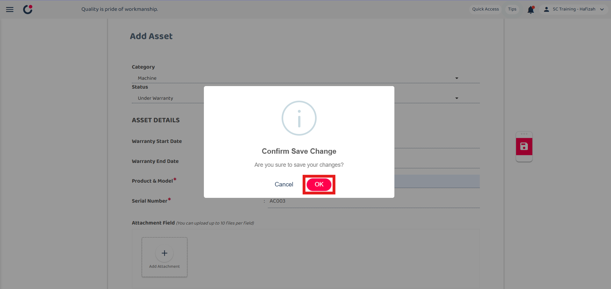
   
 

6. Your Asset is successfully saved when the “Successfully Saved” prompt appears.

   

     
   
 

7. You will then be directed to the new Asset Details page.

   

     
   

     

**Using Mobile**

1.  At the mobile app's navigation bar, go to "Dashboard".  

    

       
    
 

2. Click the "Asset". 
   *Note: If you do not see a "+" button, you may need to request permission or help from your Admin to register new Job. 

   

     
   
 

3. Click the "+" button to add new asset.

   

     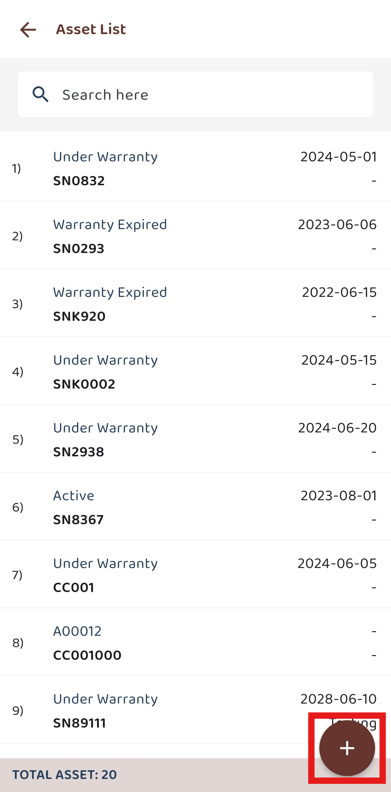
   
 

4. Select the asset category.

   

     
   
 
  
5. Fill out the details of the new Asset. Available fields may differ depending on your company’s system setup.

   |   Term  | Definition |
   | :-----------: | :--------------------------------------------------------------------- |
   | Category | Indicates the type of asset |
   | Status | Indicates Current status of the asset|
   | Warranty Start Date | The date when the warranty period for the asset begins |
   | Warranty End Date | The date when the warranty period for the asset ends|
   | Serial No*| Unique code assigned to the asset by the manufacturer |
   | Model | Specific model code of the asset |

   *Note: Fields marked with an asterisk ( * ) are required. 

   

     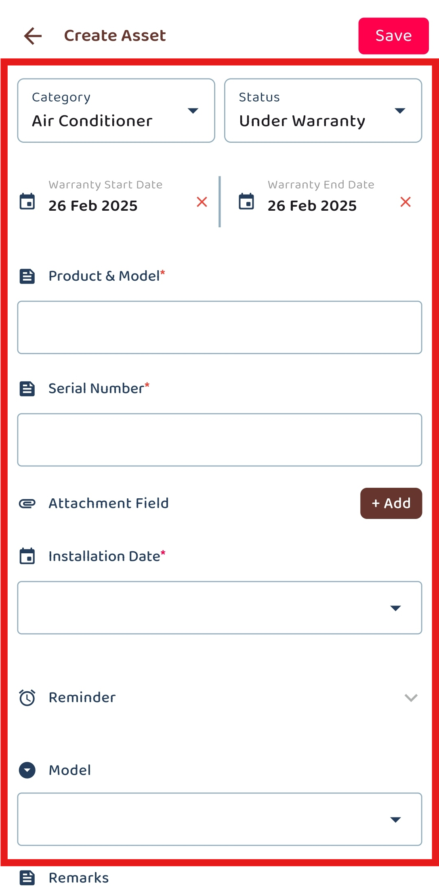
   
 

6. Click the "tick" icon.

   

     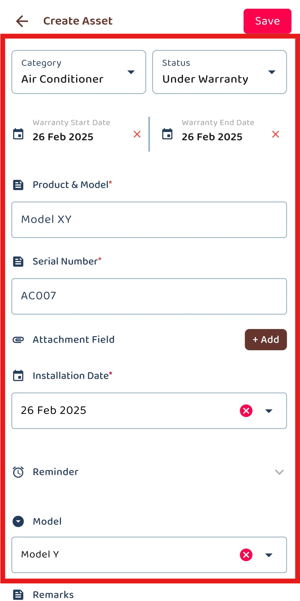
   
 

7. The new asset is saved successfully when this prompt appears.

   

     
   

     

### From Job Creation Page

- [Using Desktop](#section6)
- [Using Mobile](#section7)

**Using Desktop**

1.  Go to desktop site “Main Navigation" > "Business Management" > "Schedule" > "Job Schedule".  
   **Open Job Schedule Page here**: [https://salesconnection.my/activity/scheduler](https://salesconnection.my/activity/scheduler) 

    

       
    
 

2. Click the "+" button to create new Job. 
   *Note: If you do not see a "+" button, you may need to request permission or help from your Admin to register new Job. 

   

     
   
 

3. Select the Job Category.

   

     
   
 

4. Click on the "SAVE" button.

   

     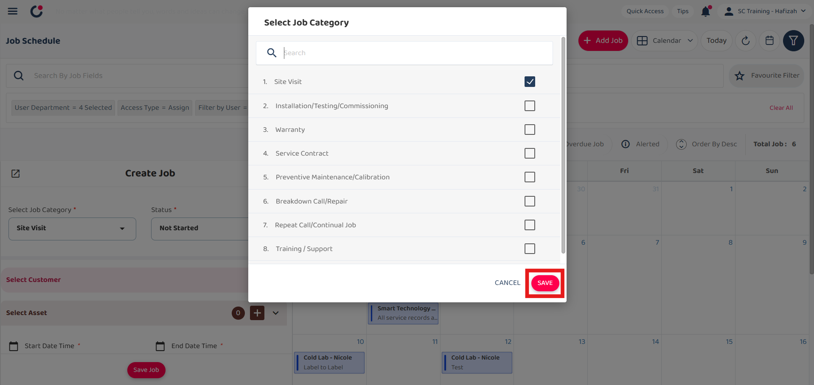
   
 
  
5. Click the "+" button.

   

     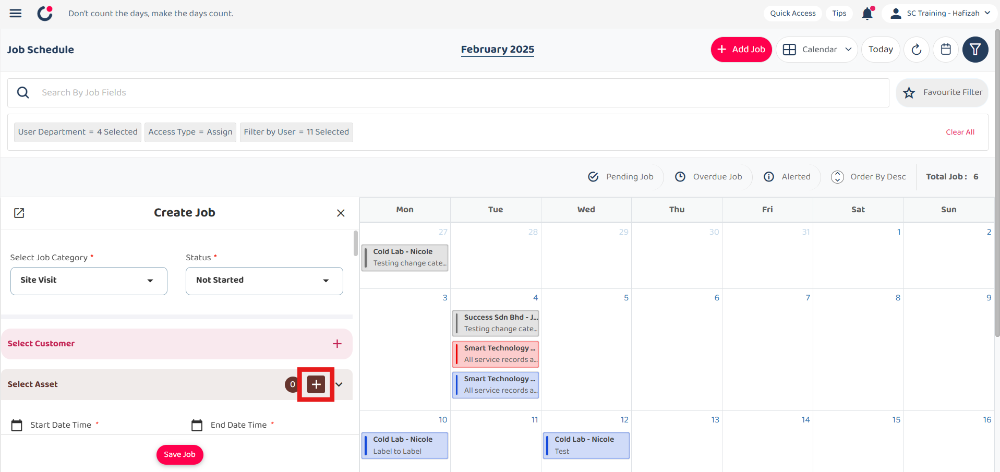
   
 

6. Click "+ Add Asset"  to add new asset.

   

     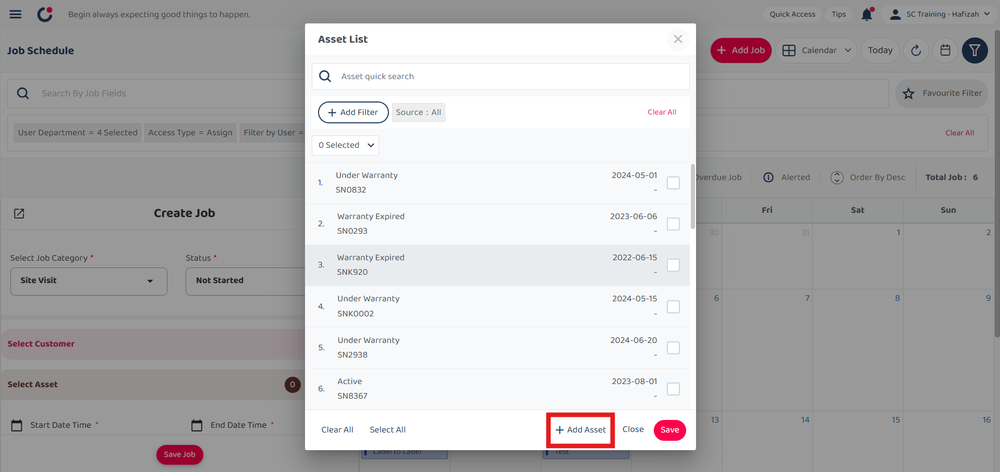
   
 

7. Fill out the details of the new Asset. Available fields may differ depending on your company’s system setup.

   |   Term  | Definition |
   | :-----------: | :--------------------------------------------------------------------- |
   | Category | Indicates the type of asset |
   | Status | Indicates Current status of the asset|
   | Warranty Start Date | The date when the warranty period for the asset begins |
   | Warranty End Date | The date when the warranty period for the asset ends|
   | Serial No*| Unique code assigned to the asset by the manufacturer |
   | Model | Specific model code of the asset |

   *Note: Fields marked with an asterisk ( * ) are required. 

   

     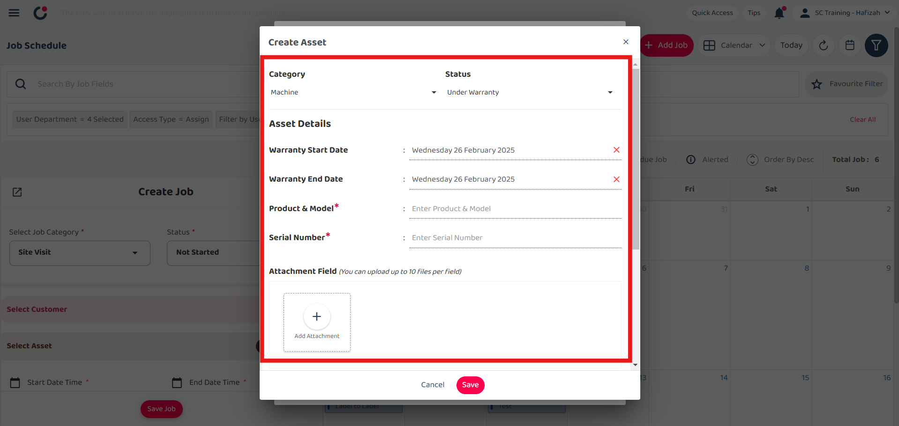
   
 

8. Click on the "Save" button.

   

     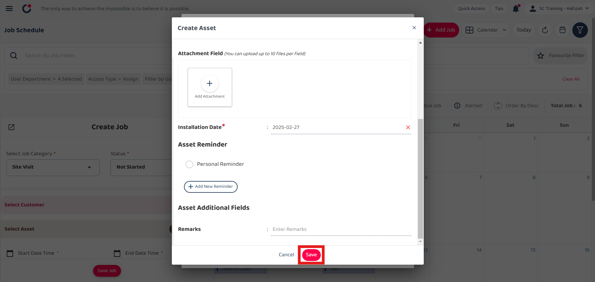
   
 

9. Click "OK" to confirm your save and your asset is successfully saved. You may continue with creating new Job.

   

     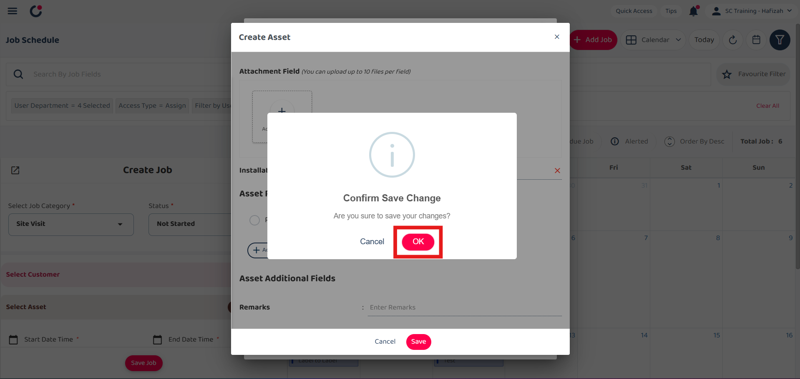
   

**Using Mobile**

1.  At the mobile app's navigation bar, go to "Schedule".  

    

       
    
 

2. Click the "+" button to create new Job. 
   *Note: If you do not see a "+" button, you may need to request permission or help from your Admin to register new Job. 

   

     
   
 

3. Select the Job Category.

   

     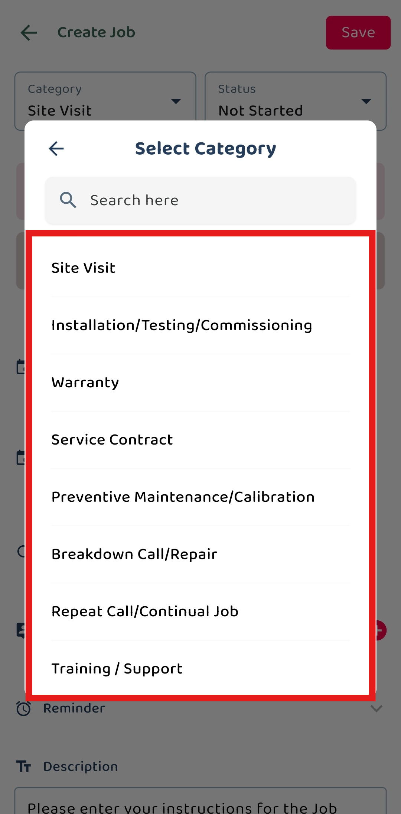
   
 

4. Click the "+" button for asset.

   

     
   
 
  
5. Click the "+" button.

   

     
   
 

6. Select the asset category.

   

     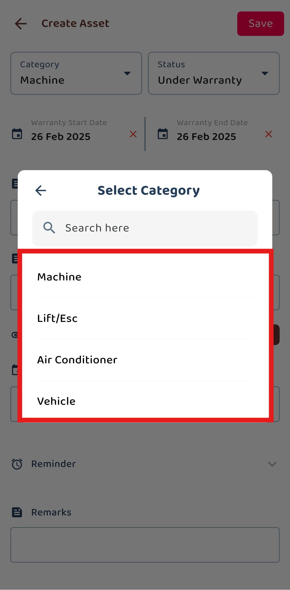
   
 

7. Fill out the details of the new Asset. Available fields may differ depending on your company’s system setup.

   |   Term  | Definition |
   | :-----------: | :--------------------------------------------------------------------- |
   | Category | Indicates the type of asset |
   | Status | Indicates Current status of the asset|
   | Warranty Start Date | The date when the warranty period for the asset begins |
   | Warranty End Date | The date when the warranty period for the asset ends|
   | Serial No*| Unique code assigned to the asset by the manufacturer |
   | Model | Specific model code of the asset |

   *Note: Fields marked with an asterisk ( * ) are required. 

   

     
   
 

8. Click the "tick" icon.

   

     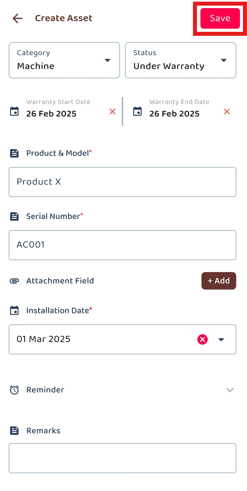
   
 

9. The new asset is saved successfully when this prompt appears. You may continue with creating new Job.

   

     
   

     

### From Asset List

- [Using Desktop](#section8)
- [Using Mobile](#section9)

**Using Desktop**

1.  Go to desktop site “Main Navigation" > "Business Management" > "Customer List".  
   **Open Customer List Page here**: [https://salesconnection.my/customers](https://salesconnection.my/customers) 

    

       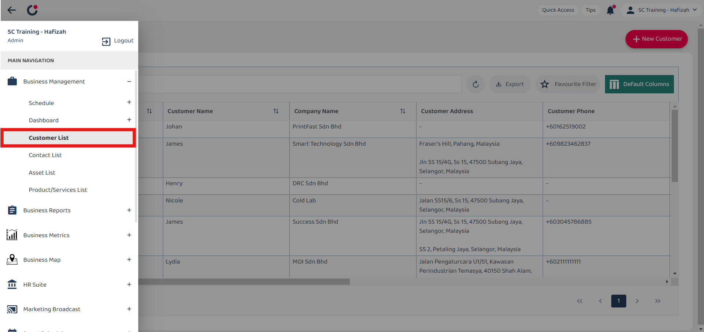
    
 

2. Click the "+" button to create new Customer. 
   *Note: If you do not see a "+" button, you may need to request permission or help from your Admin to register new Customer. 

   

     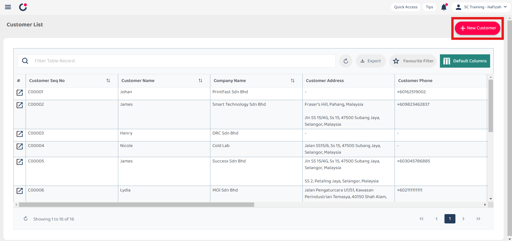
   
 

3. Click "Asset".

   

     
   
 

4. Click "+ Add Asset" to add new asset.

   

     
   
 
  
5. Fill out the details of the new Asset. Available fields may differ depending on your company’s system setup.

   |   Term  | Definition |
   | :-----------: | :--------------------------------------------------------------------- |
   | Category | Indicates the type of asset |
   | Status | Indicates Current status of the asset|
   | Warranty Start Date | The date when the warranty period for the asset begins |
   | Warranty End Date | The date when the warranty period for the asset ends|
   | Serial No*| Unique code assigned to the asset by the manufacturer |
   | Model | Specific model code of the asset |

   *Note: Fields marked with an asterisk ( * ) are required. 

   

     
   
 

6. Click on the "Save" button.

   

     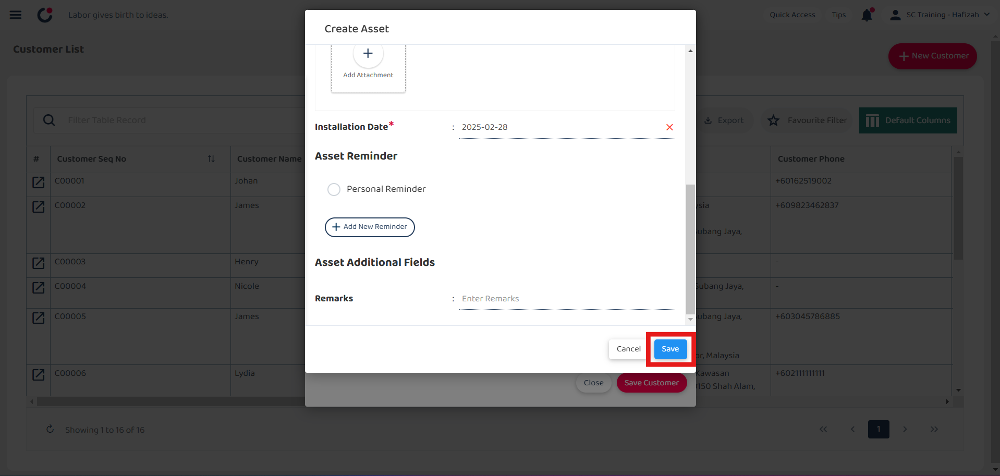
   
 

7. Click "OK" to confirm your save.

   

     
   
 

8. Your Asset is successfully saved when the “Successfully Saved” prompt appears. You may continue with creating new Customer.

   

     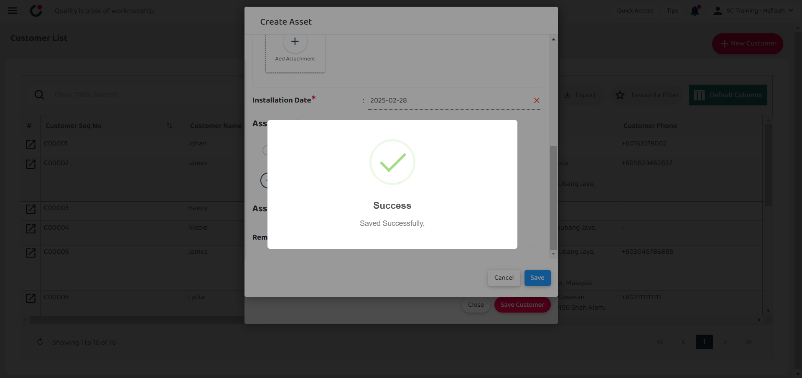
   

     

**Using Mobile**

1.  At the mobile app's navigation bar, go to "Dashboard".  

    

       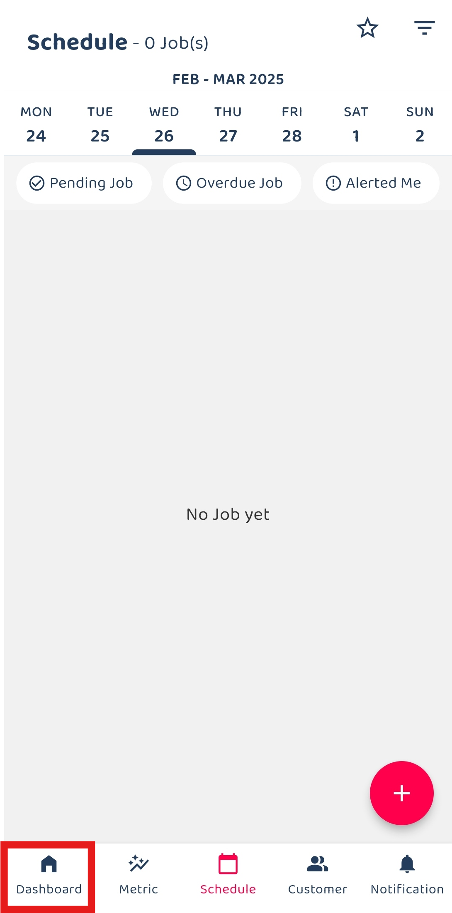
    
 

2. Click the "Customer". 
   *Note: If you do not see a "+" button, you may need to request permission or help from your Admin to register new Job. 

   

     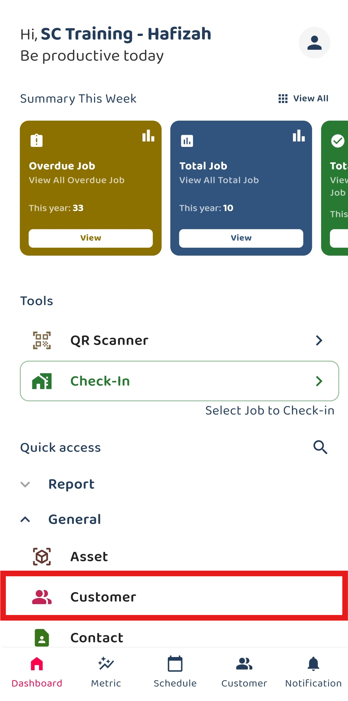
   
 

3. Click on the "+" button to add new customer.

   

     
   
 

4. Click the "+" button for asset.

   

     
   
 
  
5. Click the "+" button.

   

     
   
 

6. Select the asset category.

   

     
   
 

7. Fill out the details of the new Asset. Available fields may differ depending on your company’s system setup.

   |   Term  | Definition |
   | :-----------: | :--------------------------------------------------------------------- |
   | Category | Indicates the type of asset |
   | Status | Indicates Current status of the asset|
   | Warranty Start Date | The date when the warranty period for the asset begins |
   | Warranty End Date | The date when the warranty period for the asset ends|
   | Serial No*| Unique code assigned to the asset by the manufacturer |
   | Model | Specific model code of the asset |

   *Note: Fields marked with an asterisk ( * ) are required. 

   

     
   
 

8. Click the "tick" icon.

   

     
   
 

9. The new asset is saved successfully when this prompt appears. You may continue with creating new Customer.

   

     
   

     

**Related Articles**
- [How to Add New Customer?](Add_New_Customer.md)
- [How to Add New Project?](Add_New_Project.md)
- [How to Add New Job?](Add_New_Job.md)
- [How to Create Digital Form?](Create_Digital_Form.md)
- [How to Generate and Share QR Code for Public Form?](Creation_of_Public_Form.md)

<!-- [Link Text](https://salesconnection.github.io/Sales-Connection-Support/How_to_Add_New_Asset.html) -->
