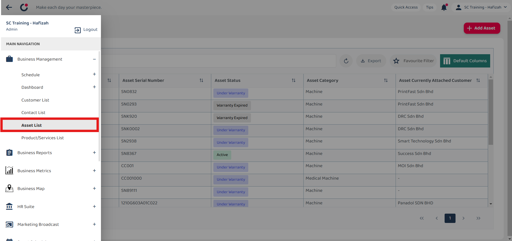
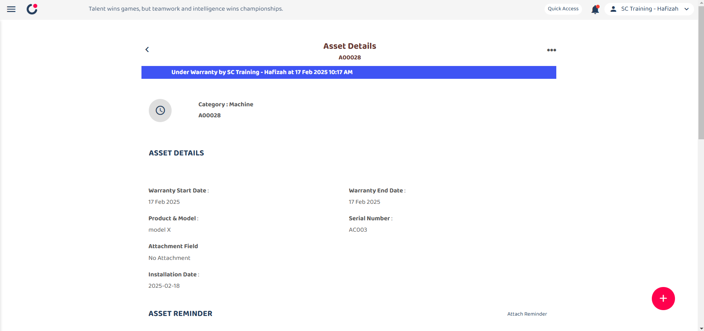

## How to Add New Asset?

1.  Go to desktop site “Main Navigation" > "Business Management" > "Asset List"  
   **Add New Asset here**: [https://salesconnection.my/asset-list](https://salesconnection.my/asset-list) 

   

     
   
 

2. Click the "+ Add Asset" button.

   

     
   
 

3. The "Add Asset" page shown below is to enter the information of the new asset.

   

     
   
 

4. Click the save icon.

   

     
   
 

5. Click "OK"

   

     
   
 

6. When this "Successfully Saved" prompt appears, it means that your asset has been successfully saved.

   

     
   
 

7. This is the Asset Details result.

   

     
   
 
