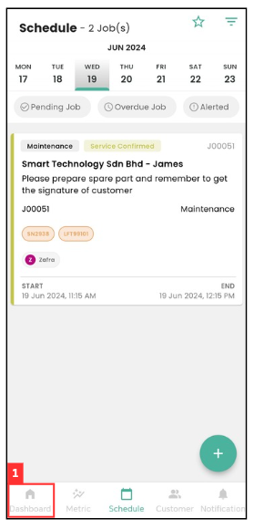
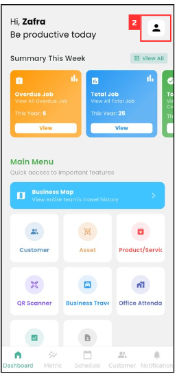
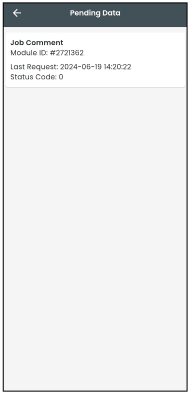

## How to Check Pending Data?

### Here are the potential issues and solutions:

i. Poor Internet Connection:

*Note: The following step done is done by user in Mobile App

1. On the Sales Connection mobile app, go to the "Dashboard" page.

   

      
   
 

2. Press on the profile icon.

   

      
   
 

3. Press on the "Pending Data".

   

      
   
 

4. Pending data will be displayed here. Ensure your internet connection is stable, and the attachment will be uploaded as soon as possible.

   

      
   
 

5. If the comment has been showing as pending for a long time on the job details page, you can take a screenshot of the pending data page and send it to your admin so they can check on it.   

   
**Related Articles**
- [How Does an Admin Reset App Access for a User?](Admin_Reset_App_Access.md)
- [My updates are not received by my admin and other team members. Why?](Updates_Not_Received_by_Team_Members.md)

