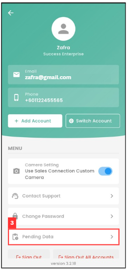

## How to Check Pending Update?

### Here are the potential issues and solutions:

i. Poor Internet Connnection:

**Mobile App**

1. On the Sales Connection mobile app, go to the "Dashboard" page.

   

      
   
 

2. Press on the profile icon.

   

      
   
 

3. Press on the "Pending Data".

   

      
   
 

4. Pending data will be displayed here. Ensure your internet connection is stable, and the attachment will be uploaded as soon as possible.

   

      
   
   

ii. User has already upload, but admin said did not receeived it: 

1. At the desktop site's Main Navigation, go to User Management > Check Pending Update. 
   **Check Pending Update here**: [https://salesconnection.my/checkPendingUploads](https://salesconnection.my/checkPendingUploads) 

   

      
   

*Note: Only certain admins can perform this action. 

2. Click on the refresh button for the user with pending upload.

   

      
   
 

3. This prompt will send the notification to the user's phone.

   

      
   
 

4. Remind the user to press the "Pending Update Check" in their phone.

   

      
   
 

5. After the user press the prompt from previous step, their app will either show one of the result as pictures below. 

   a. The user has pending upload:
   

      
   
 

   b. The user didn't have pending upload:
   

      
   
 

6. In the desktop admin's view, either one of the results shown in the pictures below will appear. 

   a. The user has pending upload:
   

      
   
 

   b. The user didn't have pending upload:
   

      
   
 

7. If the user has pending updates, they will be automatically updated in the system. On the contrary, if the action performed above shows that there are no pending updates, the user needs to update again.

   
**Related Articles**
- [How Does an Admin Reset App Access for a User?](Admin_Reset_App_Access.md)
- [My updates are not received by my admin and other team members. Why?](Updates_Not_Received_by_Team_Members.md)

