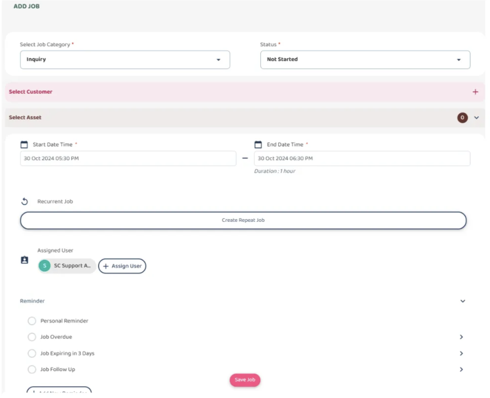
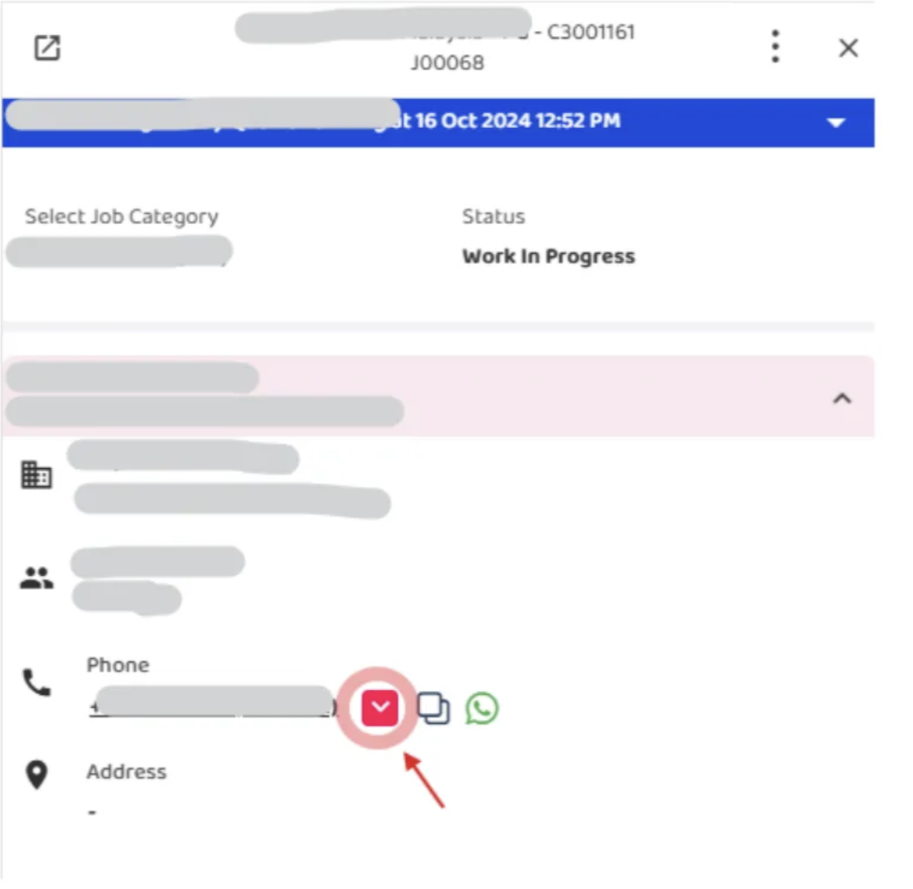
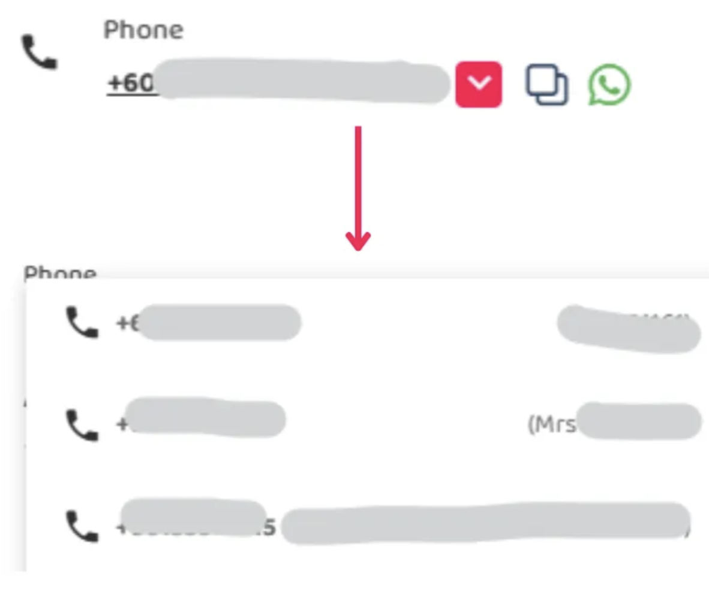

## How to Choose Contact for Job

1. Create Job, and save 

  

       
     
 

2. Click to the job, go to Phone details dropdown arrow and choose contact 
   (Dont have to edit the job, just directly click the dropdown arrow) 

   

       
     
 

     

       
     
 

   Note:
   You can only choose contact after create and save the job, the contact will initially choose from default contact of the Customer.
