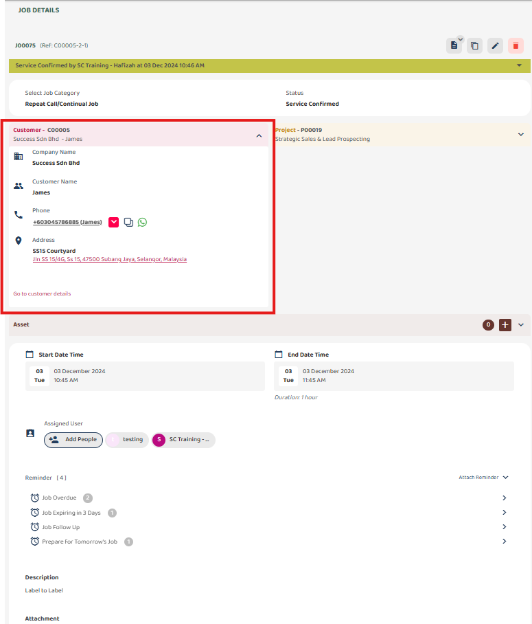
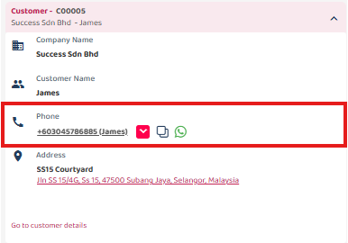
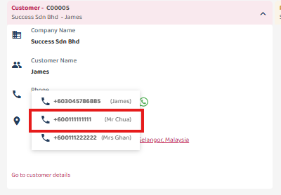

## How to Change Default Contact in Job

1. Go to Job, and Click on ‘Customer’ to expend Customer details. 

  

       
     
 

2. Click to Phone number. 
*Note: Customer default phone number will be choose by default when job created
(provide picture with phone number.) 

   

       
     
 

3. Select Phone Number from the dropdown.  
     

       
     
 

4. Prompt will appear showing the contact is changed and saved for this Job. 

     

       
     
 
     
   Note: Changing phone number in Job will not change the default phone number of the customer. 
