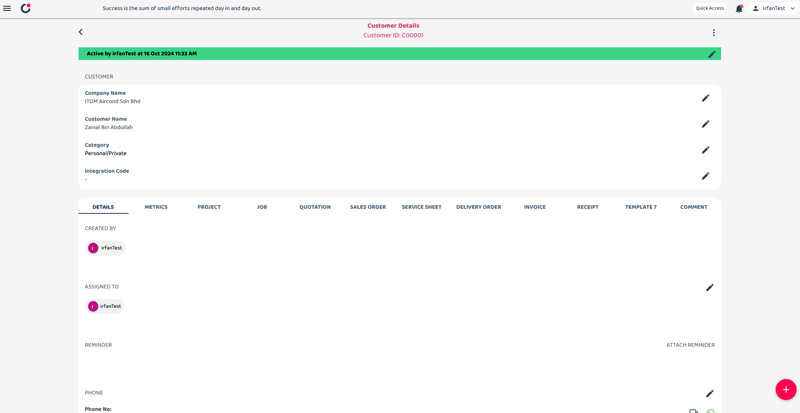
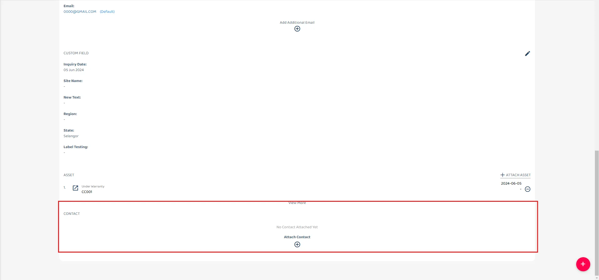
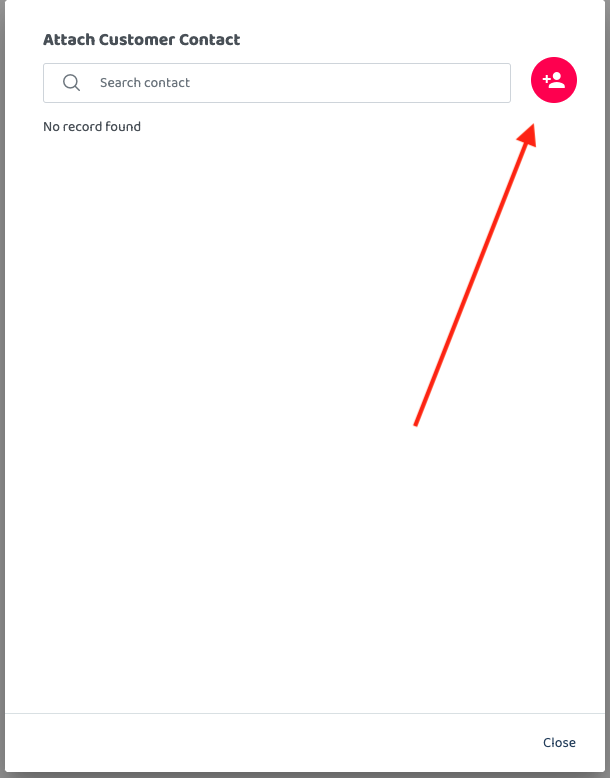

## How to Create Contact

**Navigate to section by clicking it** 

- [Desktop Version](How_to_Create_Contact.md) 
- [Mobile Version - Phone](How_to_Create_Contact_Mobile_Version.md) 
 
1. Go to Customer details page, scroll down until you find the contact section.   

  

         
       

       

         
       

       

 

2. Click to the plus button to attach contact 

         

 

3. Click contact icon to add new contact. Fill in contact details and click Save. 

         <table>
           <tr>
             <td></td>
             <td></td>
           </tr>
         </table>

   

4. To add multiple contacts at once, you can use the Import Module to upload contacts into the system: [Import Contact](https://system.caction.com/contact/import) 
         For detailed instructions, refer to the guide: [How to Import Contacts](https://support.caction.com/Import_Contact.html)

         
       
 
