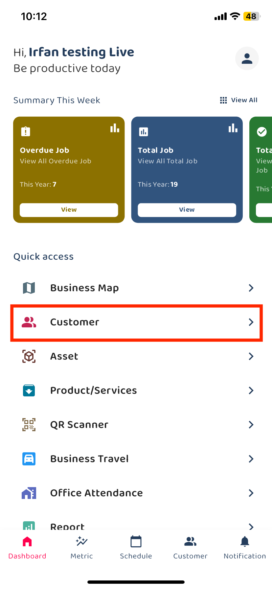
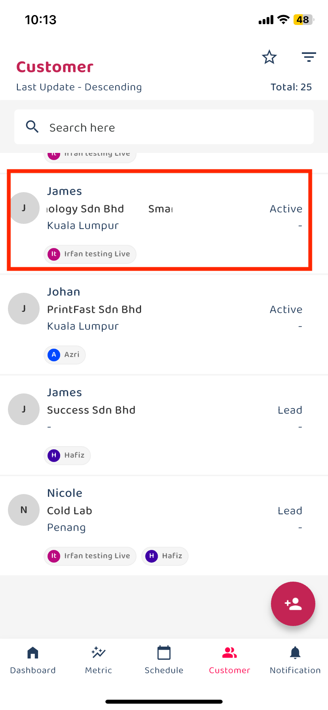
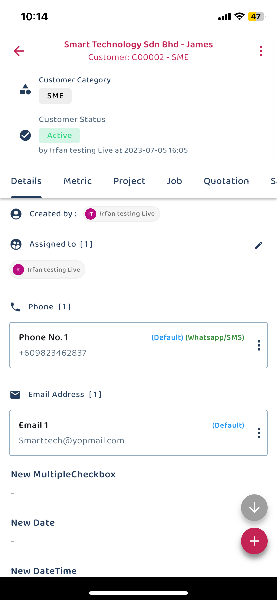
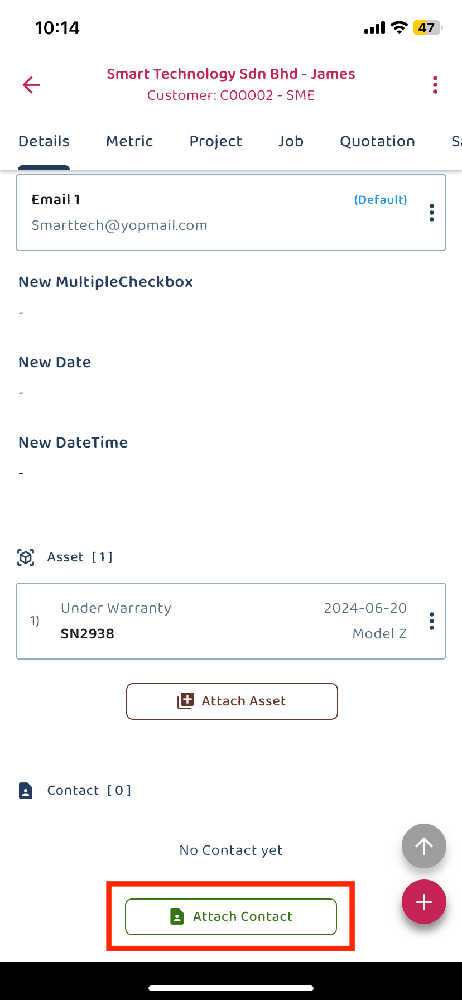
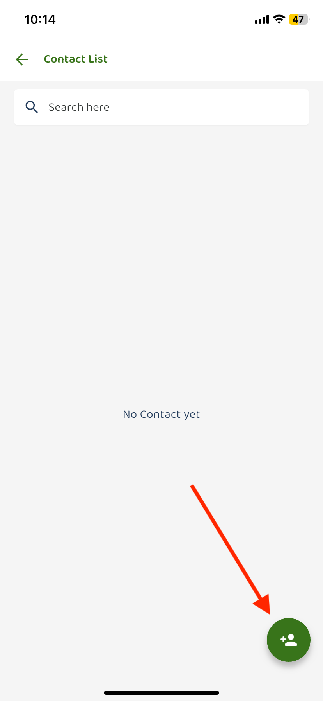
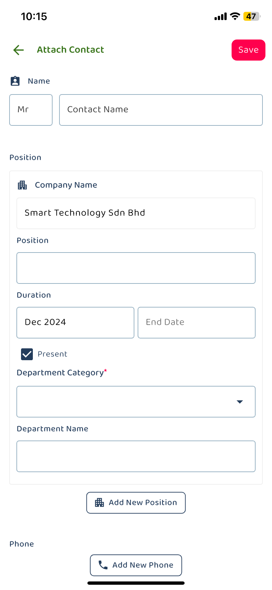
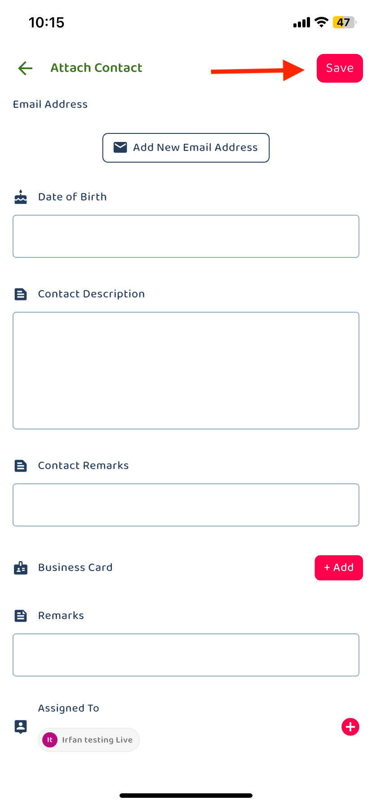

## How to Create Contact - Mobile Version

1. Go to the Dashboard and click on the Customer 

         
       
 
       
2. Choose a customer 

         
       
 
3. From the customer deatils page, scroll down until you find contact session. Click to add contact  

         
       

         
       
 

4. Click contact icon to add new contact, fill in the details. 

         
       
 

5. Click the save button to save your new contact. 

         
       

         
       
 
