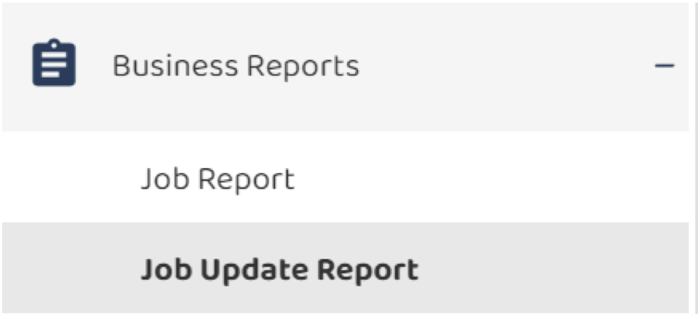
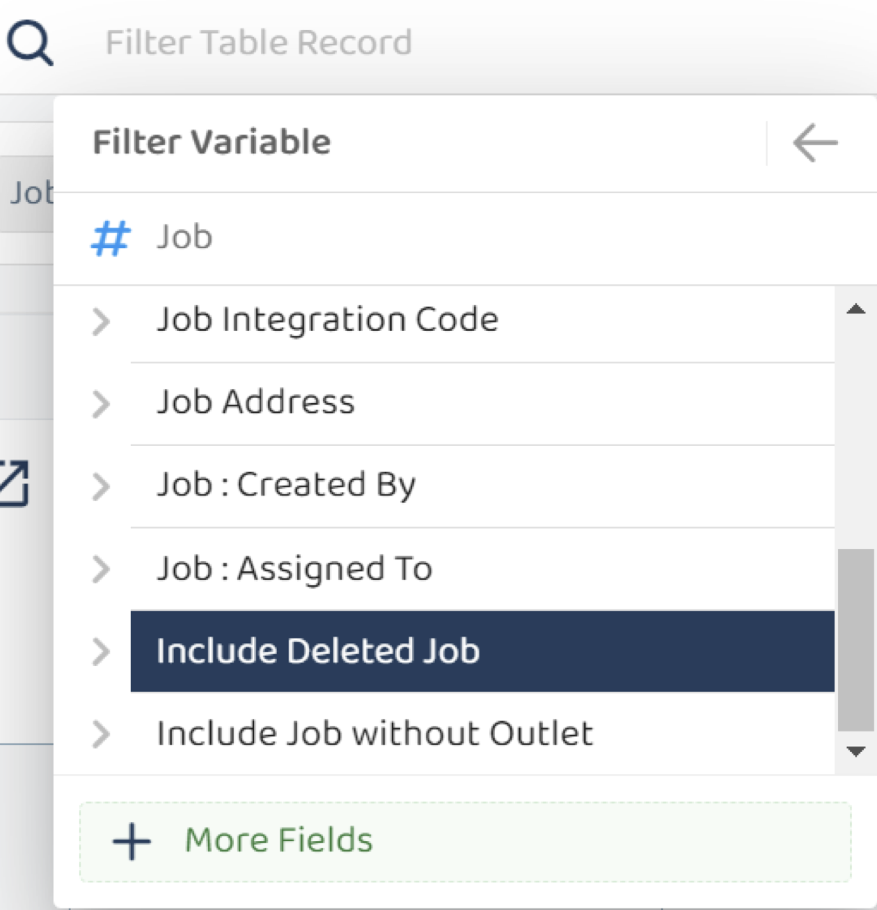
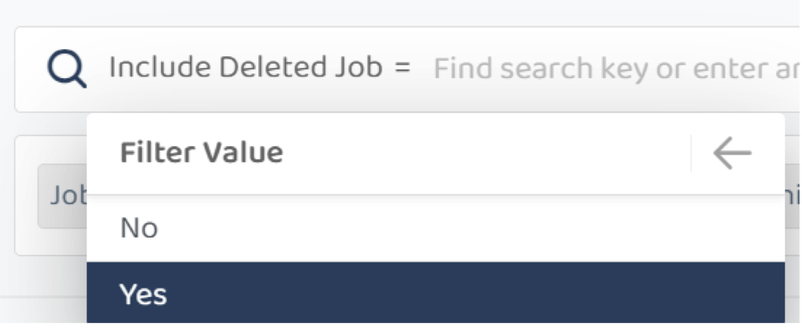
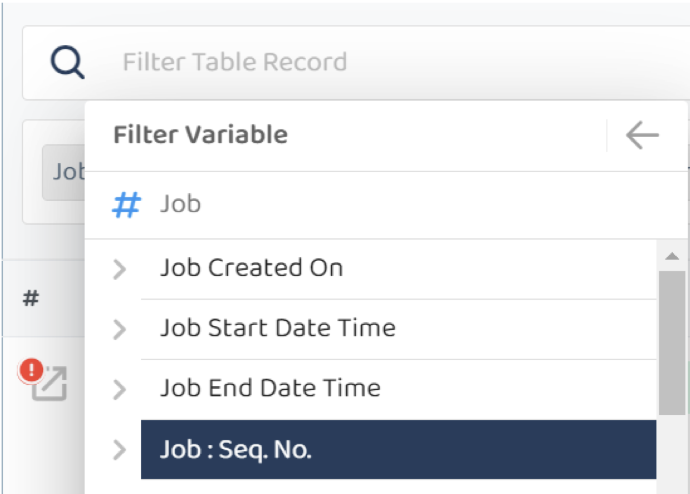
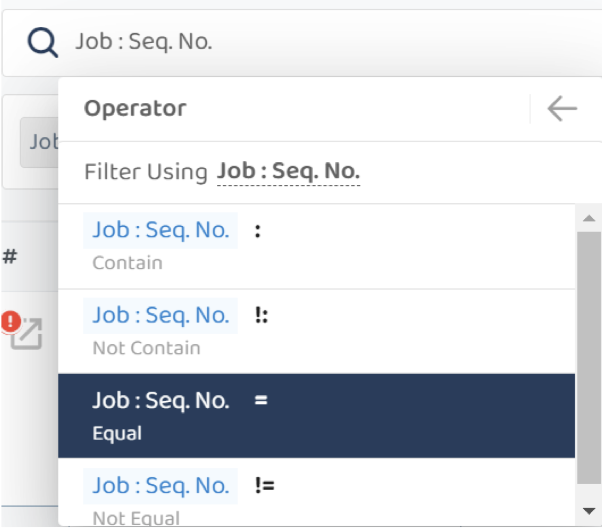
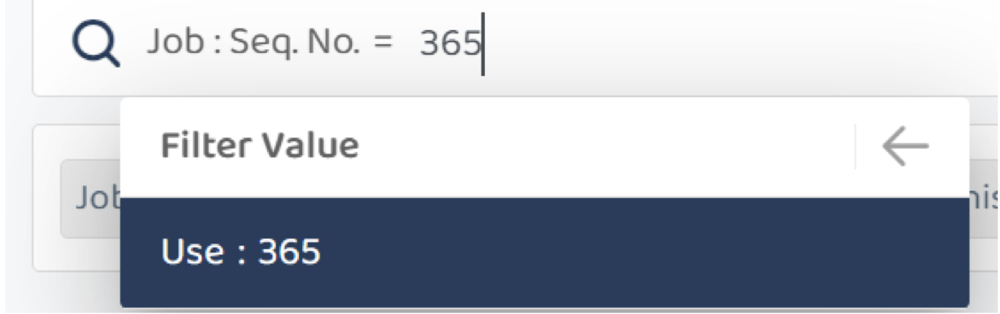
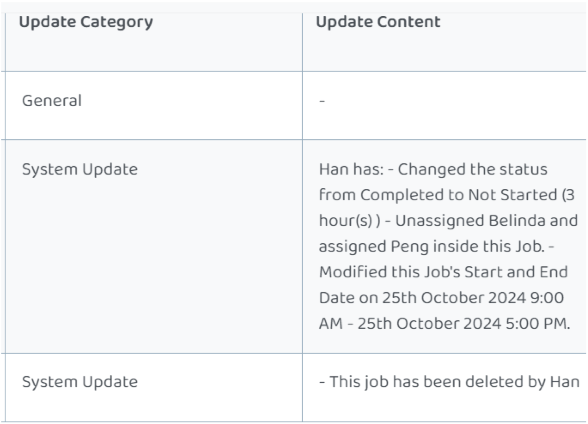

## How to Filter Deleted Job

1. Under Business Reports -> Job Update Report 

   

       
    
 

2. Under filter table, got to Job -> scroll down to the most bottom and select ->
Include Deleted Job 

   

       
    
 

3. Then Select Yes

    

       
    
 

4. In this case if you know which job id, you may also need to include this filter for
job Sep No

   

       
    
 

5. Job Equal to J00365

    

       
    
 

     

       
    
 

6. Then scroll to the most bottom right and see who deleted in Update Content
Section

   

       
    
 
