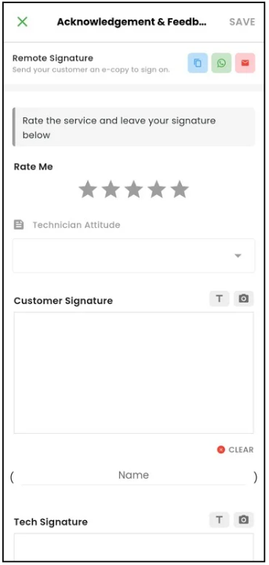
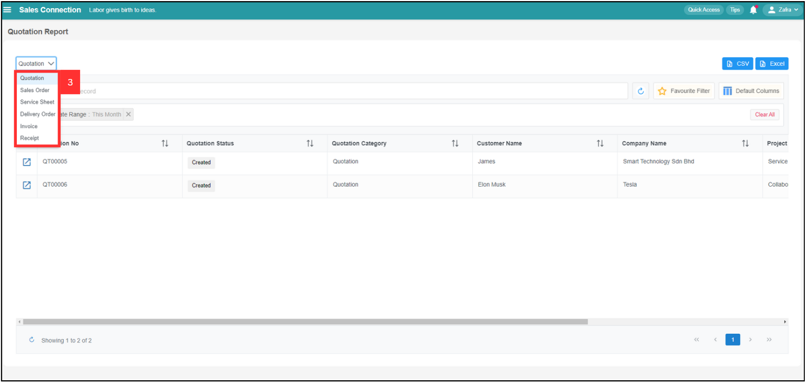
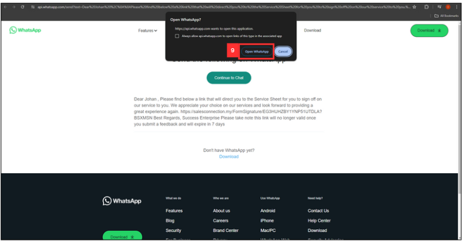

Version 1.0 
Created: 18 June 2024 
Updated: 18 June 2024 
## How to Request for Remote Signature From Customer?

 

**Navigate to the section by clicking it.** 

- [Mobile Version](#section1) 
- [Desktop Version](#section2)
  

### Mobile Version

- [Through WhatsApp](#section3)
- [Through Email](#section4)
- [In Person with Customer](#section7)
- [Through Copy Link](#section8)
  

**Through WhatsApp**

1. For example, if you want to get a remote signature of Service Sheet from customer. At the mobile app's navigation bar, go to Customer. 

   

      
   

 
2. Click on the Customer that the Service Sheet is from. 

   

      
   

3. Scroll to the right to find the relevant "Digital Form".

   

      
   

4. Click the relevant "Digital Form".

   

      
   

5. Click on the relevant "Digital Form" that needs to request remote signature from the customer.

   

      
   

6. Scroll down until you see "Customer Feedback".

   

      
   

7. Click the WhatsApp icon.

   

      
   

8. Select the customer.

   

      
   

9. Click on the "arrow" icon.

   

      
   

10. Edit the message before sending to the customer.

    

      
    

11. Click on the "send" icon.

    

      
    

12. The message has been sent successfully as the picture shown below.

    

      
    

      

**Through Email**

1. For example, if you want to get a remote signature of Service Sheet from customer. At the mobile app's navigation bar, go to Customer. 

   

      
   

 
2. Click on the Customer that the Service Sheet is from.

   

      
   

3. Scroll to the right to find the relevant "Digital Form".

   

      
   

4. Click the relevant "Digital Form".

   

      
   

5. Click on the relevant "Digital Form" that needs to request remote signature from the customer.

   

      
   

6. Scroll down until you see "Customer Feedback".

   

      
   

7. Click the Email icon.

   

      
   

8. Fill in the details and edit the message for the email.

   | Terms | Description |
   |-------|---------|
   | To | Primary recipients of the email. They are the main audience and are expected to respond or take action. |
   | Cc | "Carbon Copy." Recipients who are copied on the email for their information. All recipients in the "To" and "CC" fields can see each other's email addresses. |
   | Bcc | "Blind Carbon Copy." Recipients who receive the email without others knowing. Email addresses in this field are hidden from other recipients. |

   

      
   

9. Click "SEND EMAIL"

    

      
    

10. The email has been sent successfully when this prompt appears.

    

      
    

     

**In Person with Customer**

1. For example, if you want to get a remote signature of Service Sheet from customer. At the mobile app's navigation bar, go to Customer. 

   

      
   

 
2. Click on the Customer that the Service Sheet is from.

   

      
   

3. Scroll to the right to find the relevant "Digital Form".

   

      
   

4. Click the relevant "Digital Form".

   

      
   

5. Click on the relevant "Digital Form" that needs to request remote signature from the customer.

   

      
   

6. Scroll down until you see "Customer Feedback".

   

      
   

7. Click "Get Feedback".

   

      
   

8. Scroll down until you see "Customer Signature" and "Tech Signature".

   

      
   

9. Request the signature from customer.

   

      
   

   
10. After getting the signature from customer and technician, click on "SAVE".

    

      
    

11. The remote signature is saved when this prompt appears.

    

      
    

     
   

**Through Copy Link**

1. For example, if you want to get a remote signature of Service Sheet from customer. At the mobile app's navigation bar, go to Customer. 

   

      
   

 
2. Click on the Customer that the Service Sheet is from.

   

      
   

3. Scroll to the right to find the relevant "Digital Form".

   

      
   

4. Click the relevant "Digital Form".

   

      
   

5. Click on the relevant "Digital Form" that needs to request remote signature from the customer.

   

      
   

6. Scroll down until you see "Customer Feedback".

   

      
   

7. Click "Get Feedback".

   

      
   

8. Click on the "Copy" icon.

   

      
   

9. Click either "Copy URL" and "Copy URL & message" and send it by pasting the link on the chatbox.

   | Terms | Description |
   |-------|-------------|
   | Copy URL | Only the link of the remote signature will be copied. |
   | Copy URL & message | Link and the template message of the remote signature will be copied. |

   

      
   

     
   

### Desktop Version

- [Through WhatsApp](#section5)
- [Through Email](#section6)
  

**Through WhatsApp**

1. For example, if you want to get a remote signature of Service Sheet from customer. At the desktop site's navigation bar, go to Business Reports > Digital Form Report. 
   **Open Digital Form Report page here**: [https://salesconnection.my/reports/digitalform?code=DR01](https://salesconnection.my/reports/digitalform?code=DR01) 

   

      
   

 
2. Click the expand button to select for the type of Digital Form.

   

      
   

3. Select Form you would like to view.

   

      
   

4. Click the expand button of the "Digital Form" that you want to get signature from customer.

   

      
   

5. You will see this result. Scroll down until you see "Acknowledge and Feedback".

   

      
   

6. Click "Get Signature/Feedback".

   

      
   

7. Click "SEND WhatsApp".

   

      
   

8. Click "Yes".

   

      
   

9. Click "Open WhatsApp".

   

      
   

10. Select the customer and tick the box.

    

      
    

11. Click "Forward". 

    

      
    

12. The message has been sent successfully as the picture shown below.

    

      
    

      
    

**Through Email**

1. For example, if you want to get a remote signature of Service Sheet from customer. At the desktop site's navigation bar, go to Business Reports > Digital Form Report. 
   **Open Digital Form Report page here**: [https://salesconnection.my/reports/digitalform?code=DR01](https://salesconnection.my/reports/digitalform?code=DR01) 

   

      
   

 
2. Click the expand button to select for the type of Digital Form.

   

      
   

3. Select "Service Sheet".

   

      
   

4. Click the expand button of the "Digital Form" that you want to get signature from customer.

   

      
   

5. You will see this result. Scroll down until you see "Acknowledge and Feedback".

   

      
   

6. Click "Get Signature/Feedback".

   

      
   

7. Enter the email address of the receiver.

   

      
   

8. Click "Send Email".

   

      
   

9. Click "YES".

   

      
   

10. Click "OK" and the email has been sent to the customer successfully.

    

      
    

   

**Related Articles**
- [How to Edit Remote Signature Email Template?](Edit_Remote_Signature_Email_Template.md)
- [How to Sign and Upload Company Stamp into Digital Form？](Request_Signature_Company_Stamp.md)
  
<!-- [Link Text](https://salesconnection.github.io/Sales-Connection-Support/How_to_Get_Remote_Signature_From_Customer.html) -->
