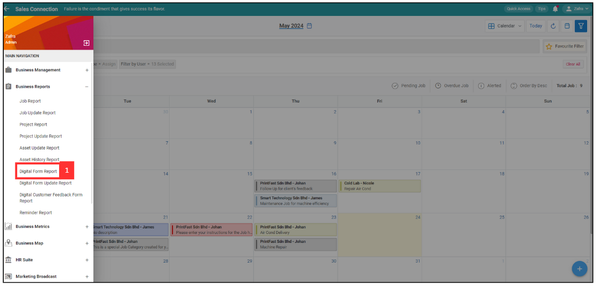

## How to Get Remote Signature From Customer? 

 

**Navigate to the section by clicking it.** 

- [Get Remote Signature using WhatsApp](#section1) 
- [Get Remote Signature using Email](#section2) 
  

### Get Remote Signature using WhatsApp

1. For example, if you want to get a remote signature of Service Sheet from customer. At the desktop site's navigation bar, go to Business Reports > Digital Form Report. 
   **Open Digital Form Report page here**: [https://salesconnection.my/reports/digitalform?code=DR01](https://salesconnection.my/reports/digitalform?code=DR01) 

   

      
   

 
2. Click the expand button to select for the type of Digital Form.

   

      
   

3. Select "Service Sheet".

   

      
   

4. Click the expand button of the "Service Sheet" that you want to get signature from customer.

   

      
   

5. You will see this result. Scroll down until you see "Acknowledge and Feedback".

   

      
   

6. Click "Get Signature/Feedback".

   

      
   

7. Click "SEND WhatsApp".

   

      
   

8. Click "Yes".

   

      
   

9. Click "Open WhatsApp".

   

      
   

10. Select the customer and tick the box.

    

      
    

11. Click "Forward". 

    

      
    

12. The message has been sent successfully as the picture shown below.

    

      
    
 

### Get Remote Signature using Email

1. For example, if you want to get a remote signature of Service Sheet from customer. At the desktop site's navigation bar, go to Business Reports > Digital Form Report. 
   **Open Digital Form Report page here**: [https://salesconnection.my/reports/digitalform?code=DR01](https://salesconnection.my/reports/digitalform?code=DR01) 

   

      
   

 
2. Click the expand button to select for the type of Digital Form.

   

      
   

3. Select "Service Sheet".

   

      
   

4. Click the expand button of the "Service Sheet" that you want to get signature from customer.

   

      
   

5. You will see this result. Scroll down until you see "Acknowledge and Feedback".

   

      
   

6. Click "Get Signature/Feedback".

   

      
   

7. Enter the email address of the receiver.

   

      
   

8. Click "Send Email".

   

      
   

9. Click "YES".

   

      
   

10. Click "OK".

    

      
   

   

**Related Articles**
- [How to Edit Remote Signature Email Template?](Edit_Remote_Signature_Email_Template.md)

  
