## ⏰ How to Set Personal Reminder?

**Navigate to the section by clicking it.** 

- [Mobile App](#section1) 
- [Desktop](#section2) 
   
 

**Note:** In most case, you were suggested to set a personal reminder when you create a new job. 

 - **Mobile App**:

  1. At "Sales Connection" Schedule page, click the add button.

     

       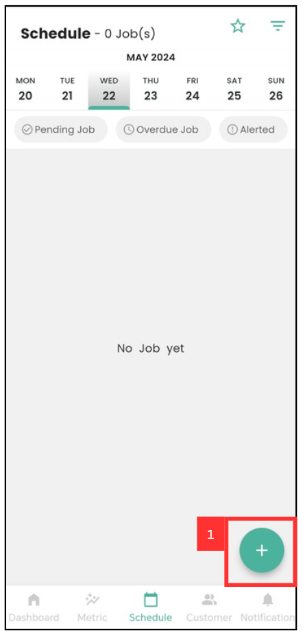
     
 

  2. Select for the job category.

     

       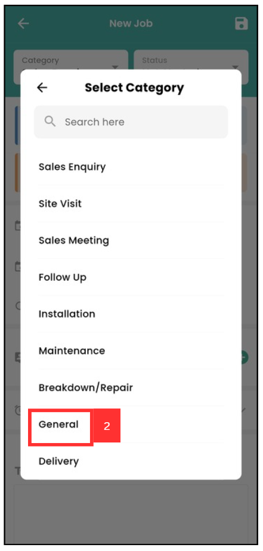
     
 

  3. Edit the job details.

     

       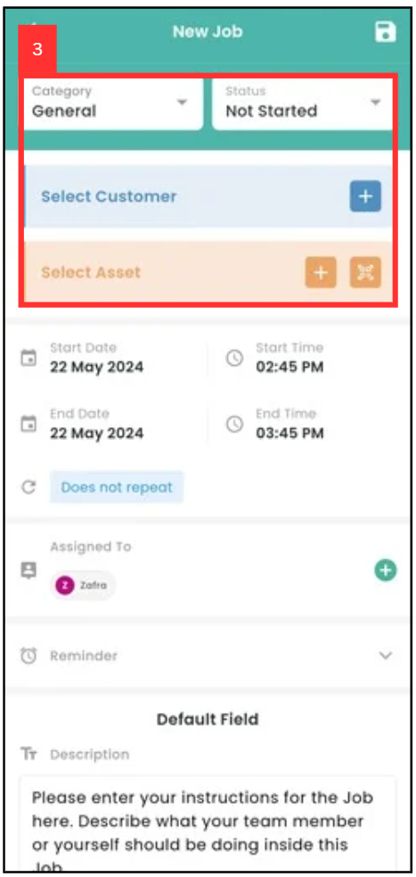
     
 

  4. To set personal reminder, click the expand button beside "Reminder".

     

       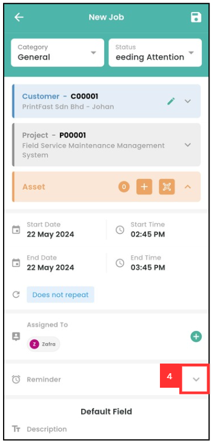
     
 

  5. Click the pencil icon.

     

       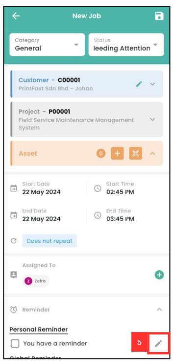
     
 

  6. Click the content box to edit the title of the personal reminder.

     

       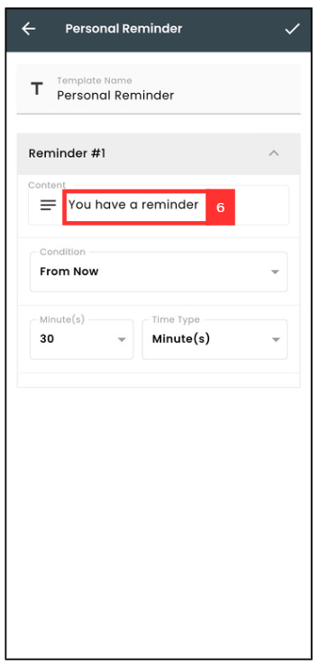
     
 
  
  7. Click the expand button beside "Condition" box to select the reminder's condition.

     

       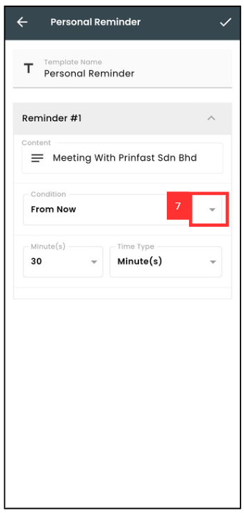
     
 
  
  8. Select the condition. For example, select "before start time", the personal reminder will appears before the job start.

     

       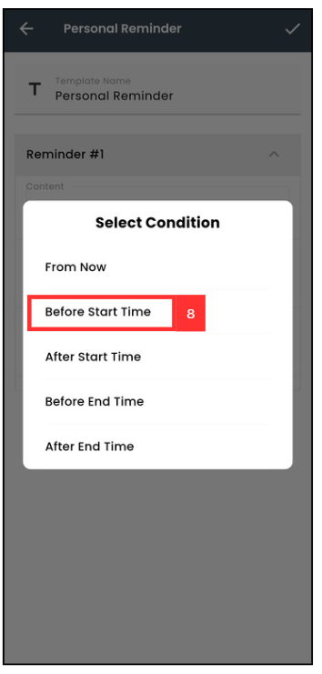
     
 

  9. To edit the time type, click the expand button beside "Time Type".

     

       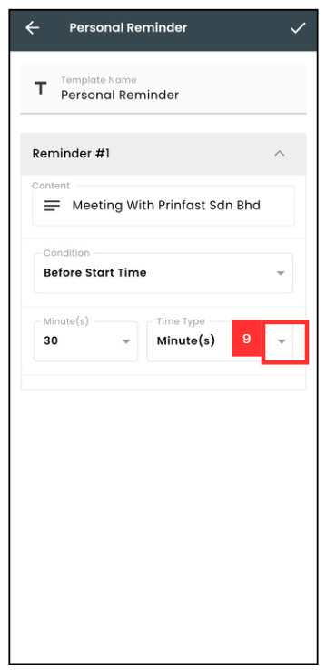
     
 

 10. Select for the time type.

     

       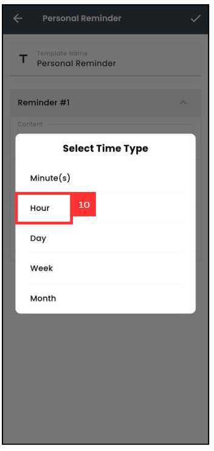
     
 

 11. Click the expand button beside "hour" to change the hour.

     

       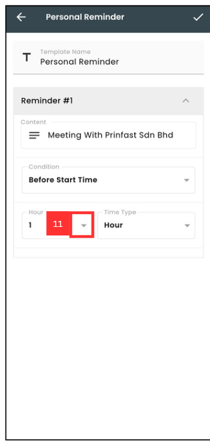
     
 

 12. For example, select 1 hour. It means that the personal reminder will appears before 1 hour of the job.

     

       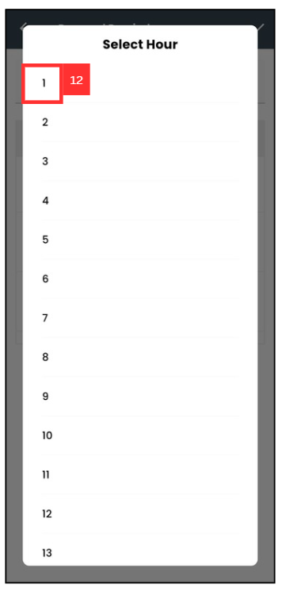
     
 

 13. Click the tick button.

     

       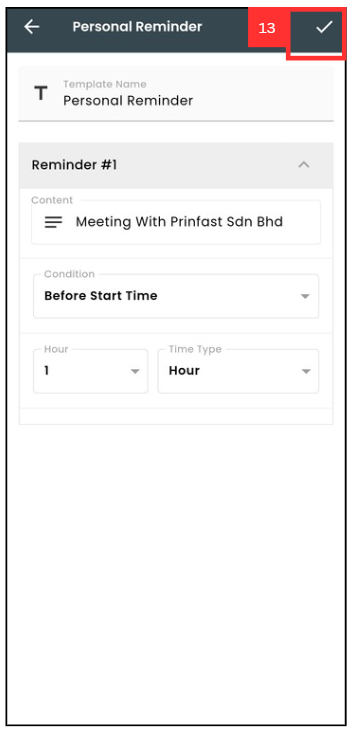
     
 

 14. Make sure the personal reminder's tick button is appear.

     

       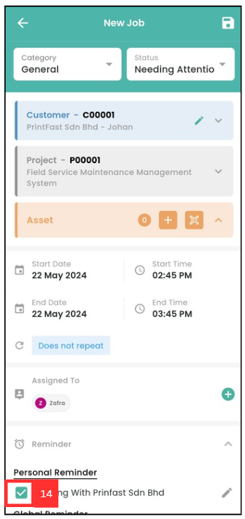
     
 

 15. Click the save button to save the job details and set a personal reminder.

     

       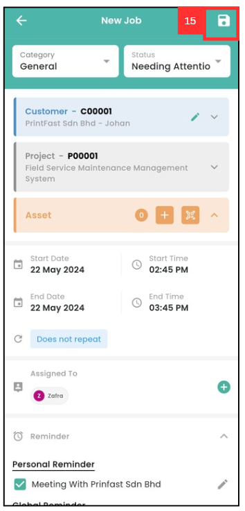
     
 

<!-- [Link Text](https://salesconnection.github.io/Sales-Connection-Support/How_to_Set_Personal_Reminder.html) -->
