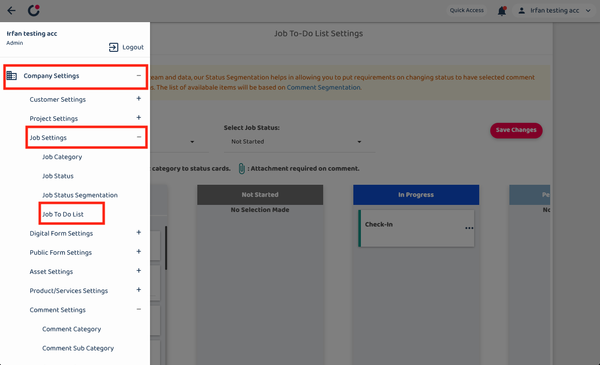
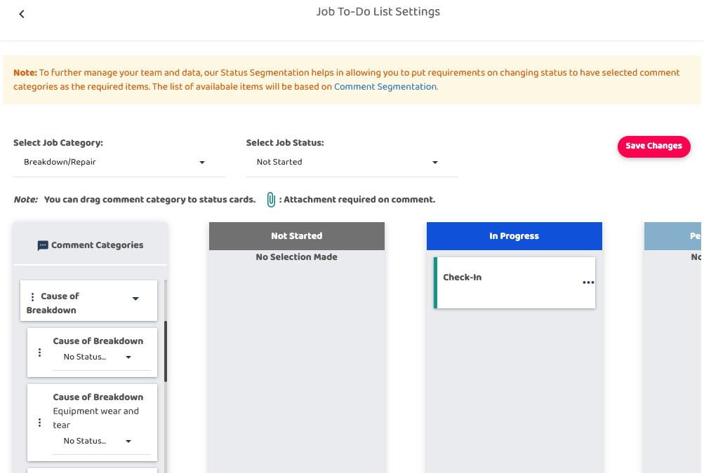
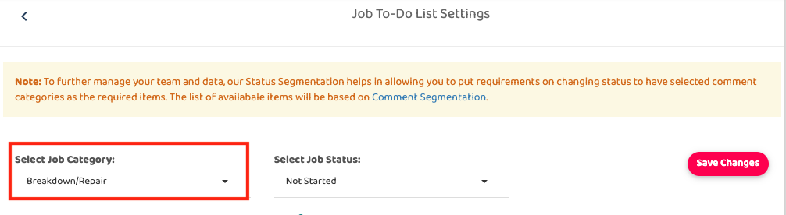
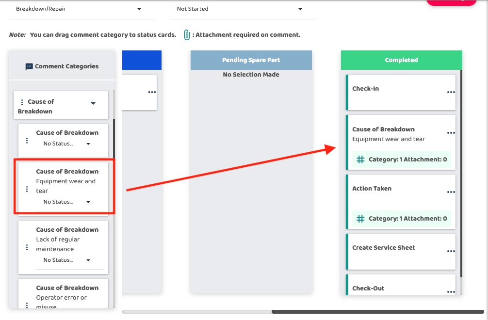

## How to Set Up Sub Comment Categories In The To - Do List

1. Go to sidebar and choose Company Settings, inside it pick Job Settings and Job To Do List.

   

       
    
 

2. You will bring to this page.

   

       
    
 

3. Select Job Category by clicking the arrow and choose your category. 
   Disclaimer: If your category doesnt available there, click here and it will guide you.

   

       
    
 

4. Choose and drag the comment category to the status cards.

   

       
    
 
