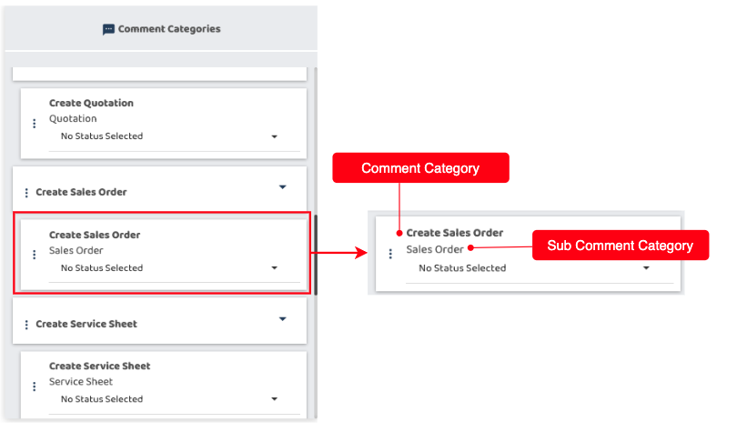

## How to Set Up Sub Comment Categories In The To - Do List

1.  Go to the sidebar and select Company Settings. Inside, choose Job Settings, and then Job To-Do List.

   

       
    
 

2. Select Job Category from the dropdown.  

   

       
    
 

3. Choose and drag the comment categories with sub comment category to the status cards.

   

       
    
 

    

       
    
 

*Note: If the required comment category is not listed, you may visit [https://support.caction.com](https://support.caction.com/Comment_Category_Segmentation.html) to adjust the comment category segmentation.

**Related Articles** 
- [How to Add New Sub Comment Category](How_Add_a_New_Sub_Comment_Category_In_The_To_Do_List_Feature.md)
