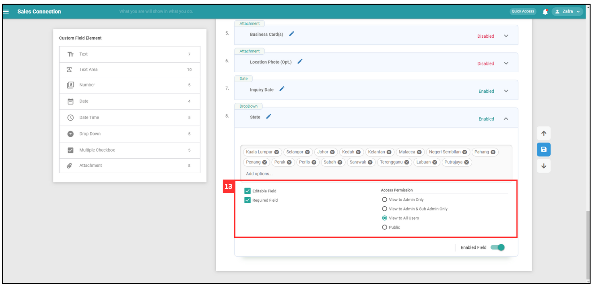
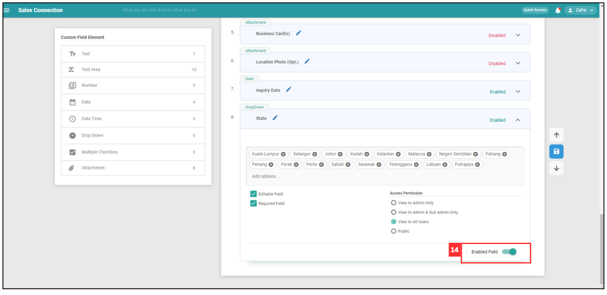
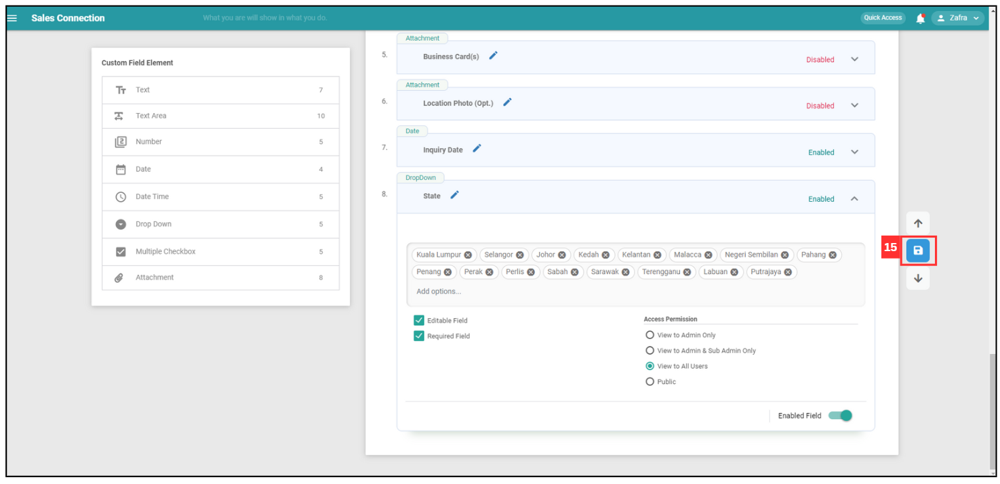

Version 1.0 
Created: 18 June 2024 
Updated: 18 June 2024 
## How to Use Dropdown Field in Job/Project/Customer?

**Navigate to the section by clicking it.** 

- [Add Dropdown Field](#section1) 
- [Add More Dropdown Option](#section2) 
- [Edit Dropdown Option](#section3) 
- [Explain Terms](#section4)

   

   

   **Add Dropdown Field**

1. For example, if you want to add a dropdown options for Customer. Go to desktop site navigation bar > Template Settings > Customer Templates. 
   **Open Customer Templates Here**: [https://salesconnection.my/templateSettings/CustomerTemplates](https://salesconnection.my/templateSettings/CustomerTemplates) 
   **Open Project Templates Here**: [https://salesconnection.my/templateSettings/DealTemplates](https://salesconnection.my/templateSettings/DealTemplates) 
   **Open Job Templates Here**: [https://salesconnection.my/templateSettings/ActivityTemplates](https://salesconnection.my/templateSettings/ActivityTemplates) 

   

     
   

   *Note: If you do not have access to Template Settings page, please contact your admin. 

2. Choose the correct category before proceed. 
   
    | Field Name| Description |
    |-------|---------|
    | Customer Category | Classifies the customer based on their type. |
    | Template Short Code | A short code identifier for the template. |
    | Template Name | The name of the template. |
    | Company Label| The label used for company names within the template. |
    | Name Label | The label used for customer names within the template. |
   
   

     
   
 

3. Scroll down to "Custom Field Settings". Click "Drop Down" to add it to the "Custom Field View". 

   

     
   
 
   
4. Click the 🖋️ Pencil Icon to rename the new dropdown. 

   

     
   
 
  
5. Enter the name of the dropdown. 

   

     
   
 

6. After renaming for the new dropdown, click the tick icon to save the name. 

   

     
   
 
  
7. Click the expand button to edit the dropdown field. 

   

     
   
 
  
8. Click "Add Options" to add options. 

   

     
   
 
  
    

   **Add More Dropdown Option**

9. After you have input the options, press “Enter” on your keyboard to save it as an option. 

   

     
   
 
   
    

    **Edit Dropdown Option**

10. If you wish to amend the one of the option, you can double-click on the option to enter edit mode.

    

      
    
 

11. Enter the correct name of the option.

    

      
    
 

12. After edit the name of the option, press Enter key on your keyboard.

    

      
    
 

    

    **Explain Terms**

13. The area below shows the users's access settings for the dropdown field.

    | Field Name| Description |
    |-------|---------|
    | Editable Field | Allows the user to edit the field after it is saved. |
    | Required Field | This field must be filled out before save the customer details. |
    | View to Admin Only | Only admin can view this field. |
    | View to Admin & Sub Admin Only| Both admin and sub-admin can view this field. |
    | View to All Users | All users have viewing access to this field. |
    | Public | This field is publicly visible to everyone, including non-logged-in users.|

    

      
    
    

14. Make sure the dropdown field is enabled so that it appears on the customer category detail page. 

    

      
    
 

 15. Click the save button to save all changes on the Template Setting page. 

     

       
     
 

 16. Click "OK".

     

       
     
 

 17. Choose the "Template Overwrite" option you want. 

     | Field Name| Description |
     |-------|---------|
     | Overwrite All Templates | Apply for all customer category. |
     | Overwrite Current Template | Apply for existing customer category. |
    
     

       
     
 

 18. Click "OK" and your dropdown options have been added successfully. 

     

       
     
 

**Related Articles** 
- [How to Add Dropdown Options in Digital Form?](Add_Dropdown_Options_in_Digital_Form.md)
- [How to Edit Checklist Dropdown Options?](Edit_Checklist_Dropdown_Options.md)

<!-- [Link Text](https://salesconnection.github.io/Sales-Connection-Support/How_to_Use_Dropdown_Field_in_Job_Project_Customer.html) -->
