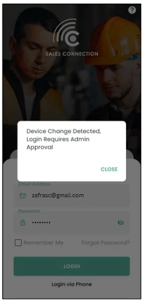
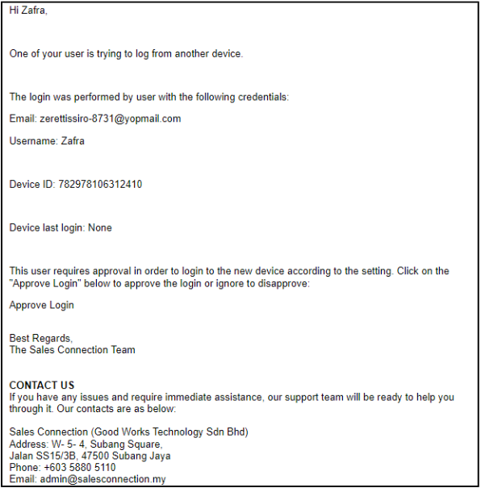

Version 1.0 
Created: 23 May 2024 
Updated: 23 May 2024 
## 📱 I Can't Login to My Other Phone. Why?

### Scenarios below you might face now:

1. Error message popup when staff login to the app. 

   

     
   

2. As an admin, you keep receiving the emails below. 

   

     
   

 

### How to solve these problems with IMEI?
*Note: IMEI can be performed by certain admins and it can be enabled through the website only. 
1. To enable the IMEI, go to the desktop site’s navigation bar > User Management > User List. 
   **Open User List Here:** [https://salesconnection.my/usermanage/userlist](https://salesconnection.my/usermanage/userlist) 

   

     
   

   *Note: Admins can also perform this action through the notification email received using the verified email address. 

2. The blue icon indicates “IMEI login check”. To approve the user login with a new device, admin needs to approve the blue icon shown below. 

   

     
   

   
3. Click the blue icon and you will see a popup message. Please confirm the details before you allow it. 

   

     
   

