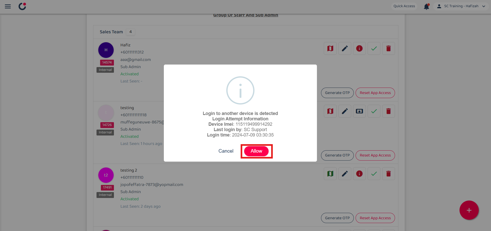

## 📱 IMEI

**What is IMEI?**

IMEI stands for International Mobile Equipment Identity. It is used to track the phone's ID so the user may not be able to log in using other devices.  

**Scenarios below might need to disable IMEI:**

1. The company allows to use of two different devices for work. 
2. Device change due to the current device being broken. 

If you face any of these problems, please find your admin to assist you with disabling the IMEI.  

**Where is IMEI and How to Disable It?** 
*Note: IMEI can be enabled through the website only. 
1. To enable the IMEI, go to the desktop site’s navigation bar > User Management > User List. 
   **Open User List Here:** [https://salesconnection.my/usermanage/userlist](https://salesconnection.my/usermanage/userlist) 

   

     
   

   *Note: Admins can also perform this action through the notification email received using the verified email address. 

2. The blue icon indicates “IMEI login check”. To approve the user login with a new device, admin needs to approve the blue icon shown below. 

   

     
   

   
3. Click the blue icon and you will see a popup message. Please confirm the details before you allow it. 

   

     
   

   
