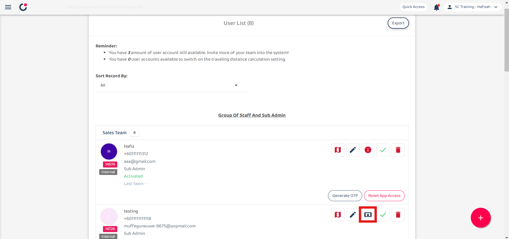

## 📱 Why My Staff Cannot Login with New Device?

### Scenarios below you might face now:

1. 
2. As an admin, you keep receiving the emails below. 

   

     
   

If you face any of these problems, please find your admin to assist you with disabling the IMEI.  

### Where is IMEI and How to Disable It?
*Note: IMEI can be performed by certain admins and it can be enabled through the website only. 
1. To enable the IMEI, go to the desktop site’s navigation bar > User Management > User List. 
   **Open User List Here:** [https://salesconnection.my/usermanage/userlist](https://salesconnection.my/usermanage/userlist) 

   

     
   

   *Note: Admins can also perform this action through the notification email received using the verified email address. 

2. The blue icon indicates “IMEI login check”. To approve the user login with a new device, admin needs to approve the blue icon shown below. 

   

     
   

   
3. Click the blue icon and you will see a popup message. Please confirm the details before you allow it. 

   

     
   

   
**Rel**
