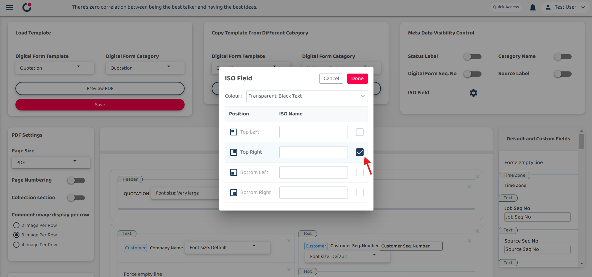

## How to add ISO in PDF ? 
### What is ISO field?
The ISO field is used for the document number stores and standardizes document identifiers, ensuring consistent formatting and easy tracking across systems.

1) Select left corner menu icon to open sidebar.  

         

 

2) Go to Template Setting, select Digital Form Template and then choose PDF Template Customization.  

         

 

3) Select Digital Form Template and Digital Form Category.  

         
         

 

4) Select setting icon next to the ISO Field.  

         

 

5) Choose ISO Field colour, position and the ISO Name and then click done.  

         
         
         

 

6) Click 'Save' to save the settings and confirm it.  

         
         

 

7) As a result, the ISO name will appear in the top-right corner of the digital form, as shown below.  

         

 
