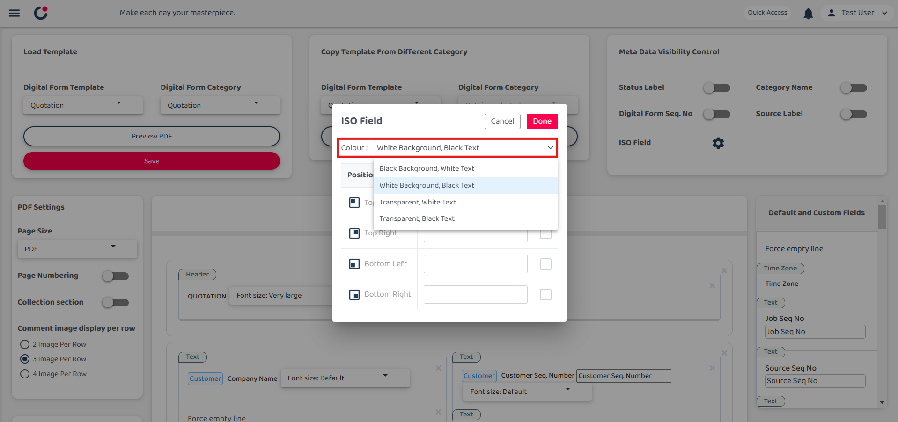

## What is ISO field?
#### Definition: Field that allows you to put the form version number at PDF

1) Select left corner menu icon to open sidebar.  

         

 

2) Select 'Template Settings', under it select 'Digital Form Templates' and continue select 'PDF Template Customization'.  

         

 

3) Select category and select 'Quotation'.  

         
         

 

4) Select setting icon beside ISO Field.  

         

 

5) The position decide where the ISO Field in the PDF will located, while the ISO name represent the name of the ISO Field.  
   Example: ISO name write 'FORM A' and tick the checkbox, then click 'Done' to proceed. 

         
         

 

6) Click 'Save' to save the settings and confirm it.  

         
         

 

7) FORM A located in top right of the digital form.  
*Note: Generate PDF under DF details and open it in new tab. 

         
         

 
