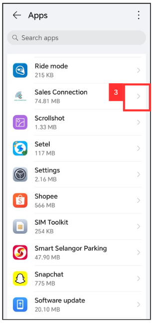

 ## I am not getting any notification from system. Why?

 **Navigate to the section by clicking it.** 

- [Desktop Version](#section1) 
- [Mobile Version](#section2)
   
 
 

- **Desktop Version**:

  *Note: Only certain admins can edit the notification settings. Please contact your admin if you wish to enable the notifications. 
 
 1. To disable notifications for users, go to desktop site navigation bar > User Management > User Account Customisation. 
     **Open UAC Page Here:** [https://salesconnection.my/uac](https://salesconnection.my/uac) 
     
     

       
     

     
  2. Click on the department name. 
  
     

       
     

     
  3. Enter the name of the user who needs this authority (normally admin). 

     

       
     

  
  4. Click on the "Select Department" button. 

     

       
     

  5. Click the "pencil" icon beside the user who needs to disable the notifications. 

     

        
     

  6. Click on the "Notification Settings". 

     

        
     

  
 
   

 - **Mobile App**:

 1. In Settings page of your phone, Select "Apps".

    

      
    
 

 2. Click "Apps".

    

      
    
 

 3. Click "Sales Connection".

    

      
    
 

 4. Click "Notifications".

    

      
    
 

 5. Make sure the "Allow Notification" has been toggled.

    

      
    
 

    
