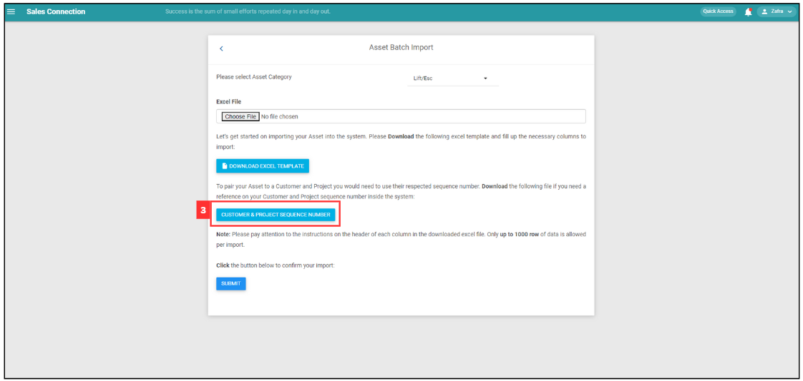
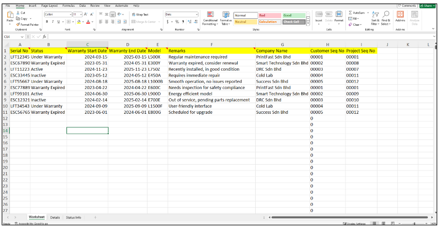

Version 1.0 
Created: 18 June 2024 
Updated: 18 June 2024 
## How do I Import New Asset(s)?

1. At the desktop site's navigation bar, go to Import > Asset Import. 
   **Import Asset(s) Here:** [https://salesconnection.my/AssetImport/assetExcelImport](https://salesconnection.my/AssetImport/assetExcelImport)

   

     
   

   *Note: You must have access to Import menu to perform this action. Please request permission or help from your admin if you do not have access to the menu. 

2. Select for the asset category that you want to import.

   

     
   
 

3. Download this file and refer to the Customer and Project sequence number.

   

     
   
 

   This is the sample of Customer and Project sequence number Excel file. 

   

     
   
 

4. Click "DOWNLOAD EXCEL TEMPLATE".

   

     
   
 

5. The "EXCEL TEMPLATE" file has 3 sheets: "Worksheet","Details", and "Status Info". 

   | Sheet | Usage |
   | :----- | :-------- |
   | Worksheet | Enter the aseet details in this page. |
   | Details | Reference for customer details. |
   | Status Info | Reference for the asset's warranty type. |

   Worksheet: 
   

     
   
 

   Details:
   

     
   
 

   Status Info:
   

     
   
 

6. Fill out the details of the new Asset. Available column fields may differ depending on your company’s system setup. 
   a. The details include: 
      - Serial No 
      - Status 
      - Warranty 
      - Model 
      - Remarks 
      - Company 
      - Customer 
      - Project Seq No 

   

     
   
 

7. Make sure all the information of the asset is correct and save the file.

   

     
   
 

8. Go back to the asset import page and choose the correct file by clicking "Choose File" to import. 

   

     
   

   *Note: Make sure select for the correct Asset Category. 

9. Make sure the file uploaded is correct.

   

     
   
 

10. Click on the "Submit" button.

    

      
    
 

11. Click "Yes" to insert data.

    

     
    
 

12. Your Assets are successfully added when the “Uploaded successfully” prompt appears.

    

      
    
 
   

**Related Articles** 
- [How to Add New Asset?](How_to_Add_New_Asset.md)
- [How to Import New Customer(s)?](Import_Customer.md)
- [How do I Import New Project(s)?](Import_Project.md)
- [How to Import New Product/Services(s)?](Import_Product_Services.md)
- [How to Import New UOM(s)?](Import_UOM.md)
- [How do I Import New User(s)?](Import_User.md)
- [How to Import New Contact(s)?](Import_Contact.md)

<!-- [Link Text](https://salesconnection.github.io/Sales-Connection-Support/Import_Asset.html) -->
