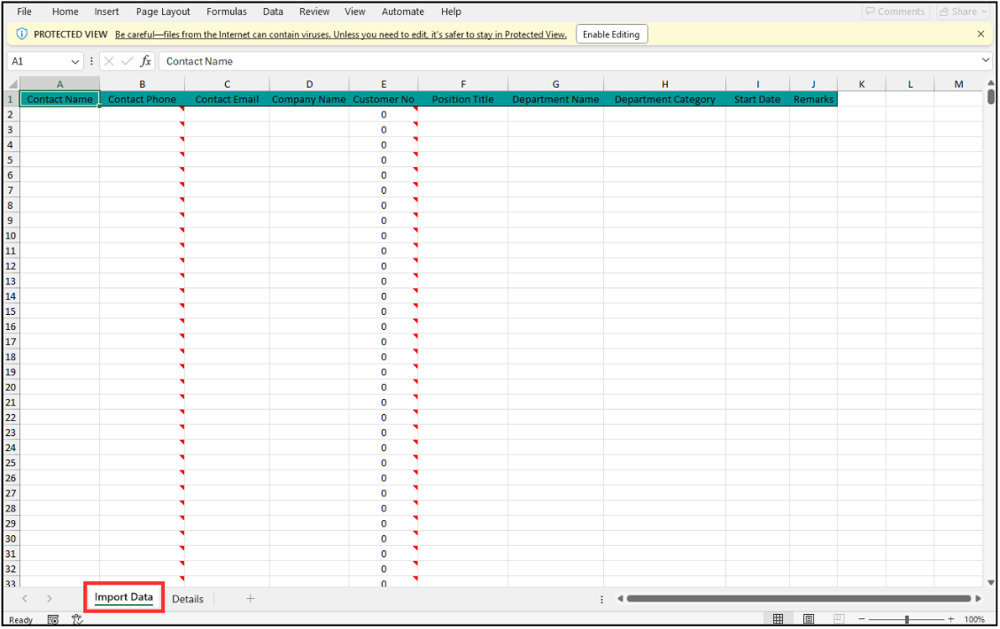

## How to Import New Contact?
    
  1. At the desktop site's navigation bar, go to User Management > Contact Import. 
     **Import Contact Here:** [https://salesconnection.my/contact/import](https://salesconnection.my/contact/import) 

     

       
     

  2. Click "Template Download". 

     

       
     

  3. Fill out the details of the new contacts. 
     a. The details include: 
        - Contact Name 
        - Contact Phone 
        - Contact Email 
        - Company Name 
        - Position Title 
        - Department Name 
        - Department Category 
        - Start Date 
        - Remarks 
        
     *Note: Only up to 1000 row of data is allowed per import. 

     

       
     

     
  4. Make sure all the information of the contacts is correct and save the file. 

     

       
     

  5. Go back to the contact import page and choose the correct file by clicking "Choose" to import. 

     

       
     

  6. Make sure the file uploaded is correct. 

     

       
     

  7. Click on the "SUBMIT" button. 

     

       
     

  8. Click "OK" and the contacts have been imported successfully. 

     

       
     

     

**Related Articles** 
- [How to Import New Customer/Project?](Import_Customer_Project.md)
- [How to Import New Product/Services?](Import_Product_Services.md)
- [How to Import New User?](Import_User.md)
