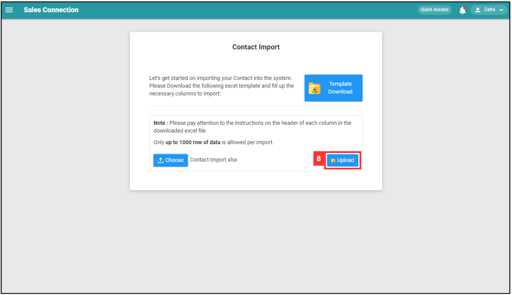
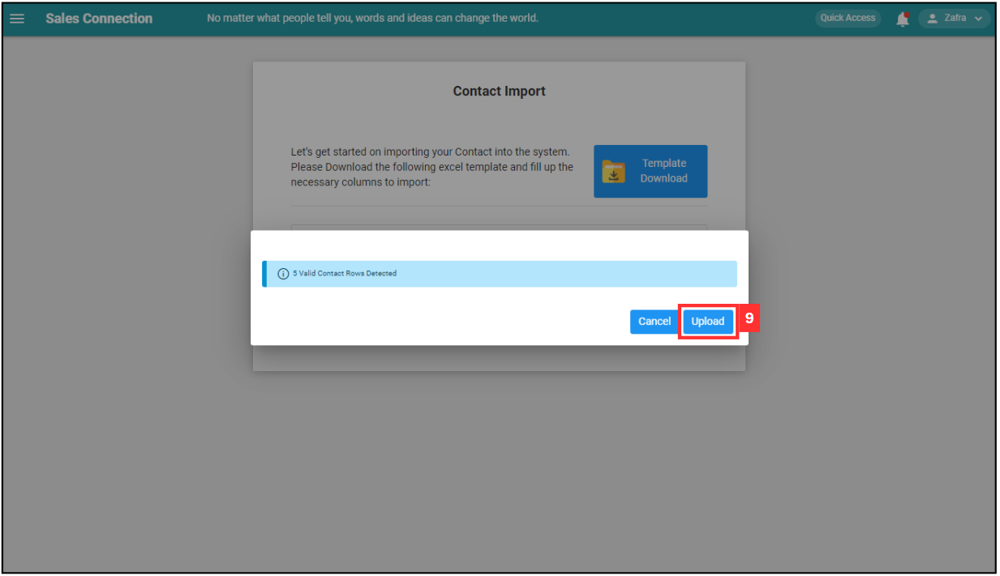
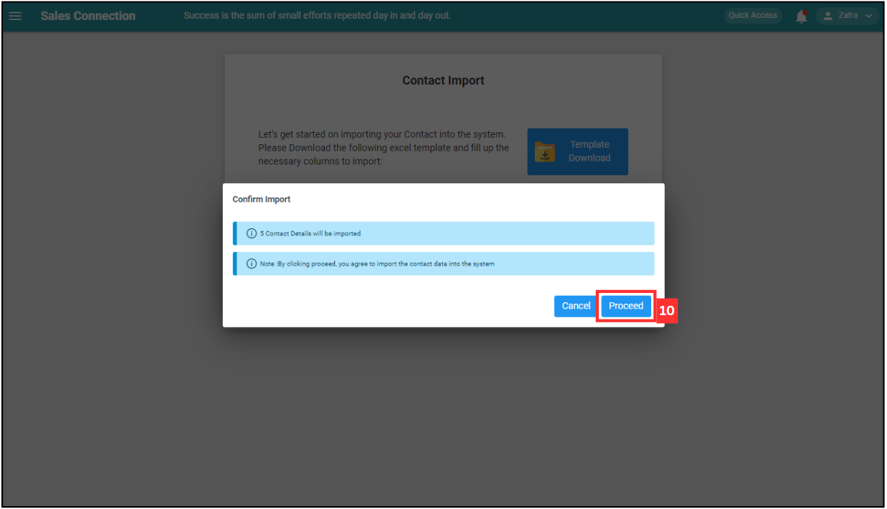

Version 1.0 
Created: 28 June 2024 
Updated: 28 June 2024 
## How do I Import New Contact(s)?
    
  1. At the desktop site's navigation bar, go to Import > Contact Import. 
     **Import Contact(s) Here:** [https://salesconnection.my/contact/import](https://salesconnection.my/contact/import) 

     

       
     

  2. Click "Template Download". 

     

       
     

  3. The "Excel Template" file has 2 sheets: "Import Data" and "Details". 

     | Sheet | Usage |
     |-------|-------|
     | Import Data | Enter the contact details in this page. |
     | Details | Reference for customer and company details. |

     Import Data: 

     

       
     

     Details: 

     

       
     

  
  4. Fill out the details of the new contacts. 
     a. The details include: 
        - Contact Name 
        - Contact Phone 
        - Contact Email 
        - Company Name 
        - Customer No (will be auto-populated after the company name is entered) 
        - Position Title 
        - Department Name 
        - Department Category 
        - Start Date 
        - Remarks 
        
     *Note: Only up to 1000 rows of data are allowed per import. 

     

       
     

  
  5. Make sure all the information of the contacts is correct and save the file. 

     

       
     

  6. Go back to the contact import page and choose the correct file by clicking "Choose" to import. 

     

       
     

  7. Make sure the file uploaded is correct. 

     

       
     

  8. Click on the "SUBMIT" button. 

     

       
     

  9. Click "Upload". 

     

       
     

  
  10. Click on the "Proceed" button to confirm the upload. 

      

         
      

  
  11. When this prompt shows, it means the contacts have been imported successfully. 

      

        
      

     

**Related Articles** 
- [How do I Import New Customer(s)?](Import_Customer.md)
- [How to Import New Project(s)?](Import_Project.md)
- [How to Import New Product/Services(s)?](Import_Product_Services.md)
- [How do I Import New Asset(s)?](Import_Asset.md)
- [How do I Import New UOM(s)?](Import_UOM.md)
- [How do I Import New User(s)?](Import_User.md)

<!-- [Link Text](https://salesconnection.github.io/Sales-Connection-Support/Import_Contact.html) -->
