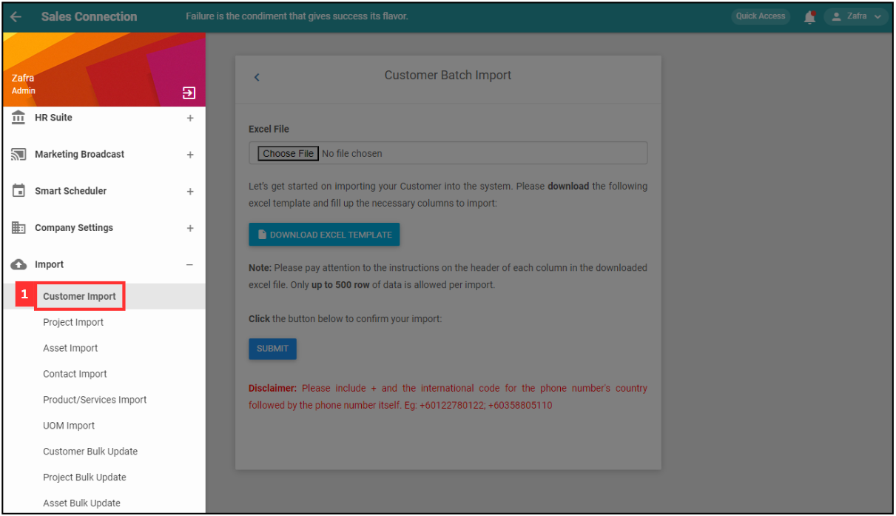
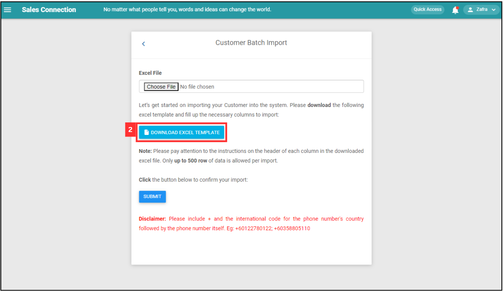
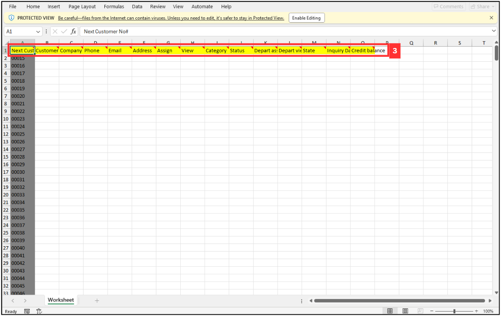
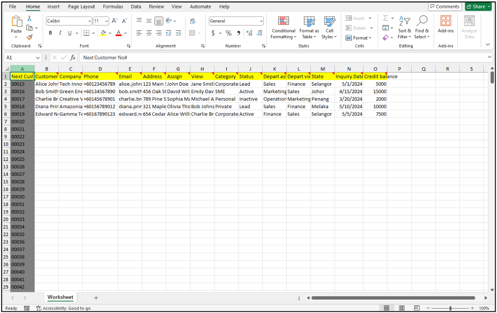
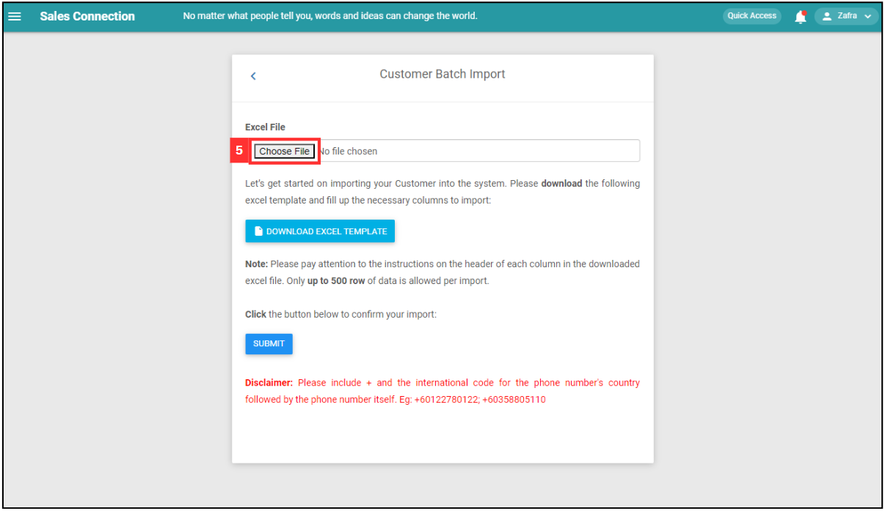
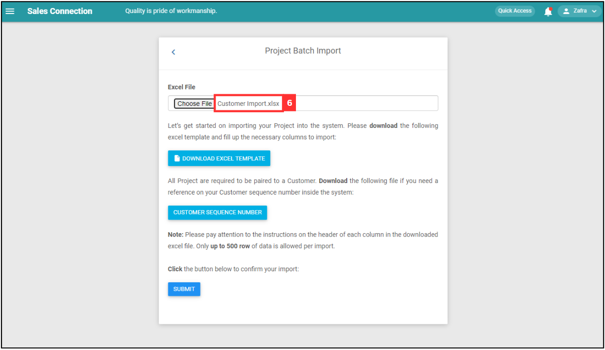
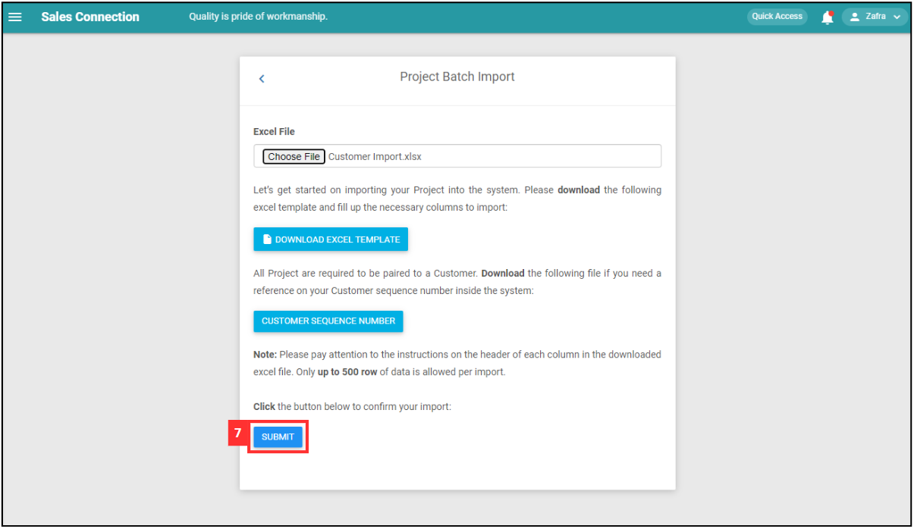
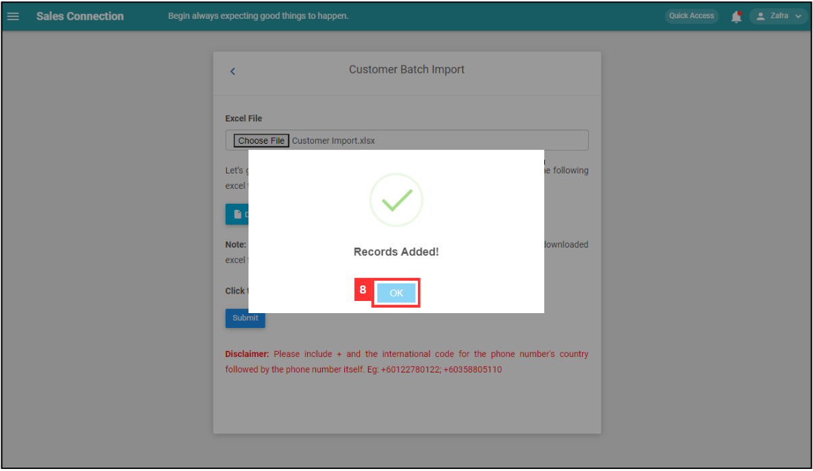

Version 1.0 
Created: 19 June 2024 
Updated: 19 June 2024 
## How do I Import New Customer(s)?
    
  1. At the desktop site's navigation bar, go to Import > Customer Import. 
     **Import Customer(s) Here:** [https://salesconnection.my/customerimport](https://salesconnection.my/customerimport) 

     

       
     

     *Note: You must have access to Import menu to perform this action. Please request permission or help from your admin if you do not have access to the menu. 

  2. Click "DOWNLOAD EXCEL TEMPLATE". 

     

       
     

  3. Fill out the details of the new customers. Available column fields may differ depending on your company’s system setup. 
     a. The details include: 
        - Customer Name 
        - Company Name 
        - Phone 
        - Email 
        - Address 
        - Assign 
        - View 
        - Category 
        - Status 
        - Depart assign 
        - Depart view 
        - State 
        - Inquiry Date 
        - Credit Balance 
    
     *Note: Please include + and the international code for the phone number's country followed by the phone number itself. Eg: +60122780122; +60358805110. 

     

       
     

     
  4. Make sure all the information of the customers is correct and save the file. 

     

       
     

  5. Go back to the customer import page and choose the correct file by clicking "Choose File" to import. 

     

       
     

  6. Make sure the file uploaded is correct. 

     

       
     

  7. Click on the "SUBMIT" button. 

     

       
     

  8. Your items are successfully added when the “Records Added” prompt appears. 

     

       
     

     

**Related Articles** 
- [How to Add New Customer?](Add_New_Customer.md)
- [How do I Import New Project(s)?](Import_Project.md)
- [How do I Import New User(s)?](Import_User.md)
- [How to Import New Product/Services(s)?](Import_Product_Services.md)
- [How do I Import New Asset(s)?](Import_Asset.md)
- [How to Import New UOM(s)?](Import_UOM.md)
- [How to Import New Contact(s)?](Import_Contact.md)

<!-- [Link Text](https://salesconnection.github.io/Sales-Connection-Support/Import_Customer.html) -->
