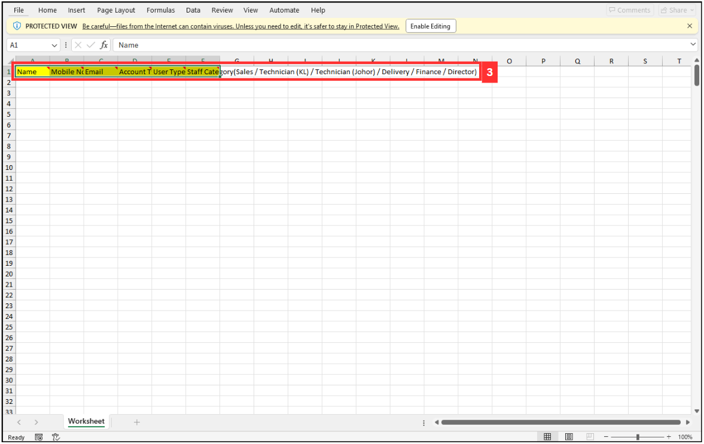
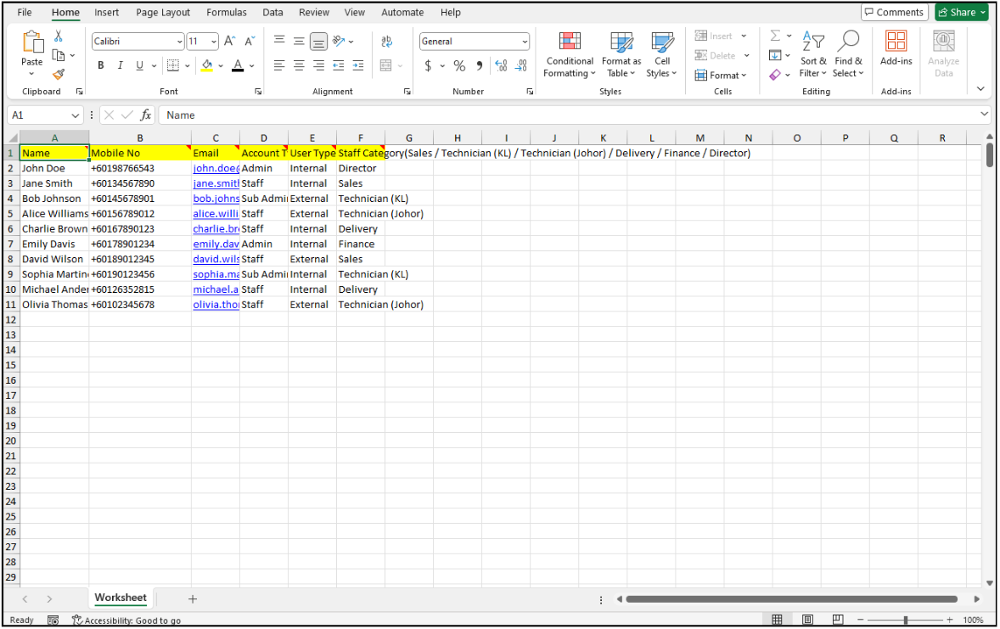
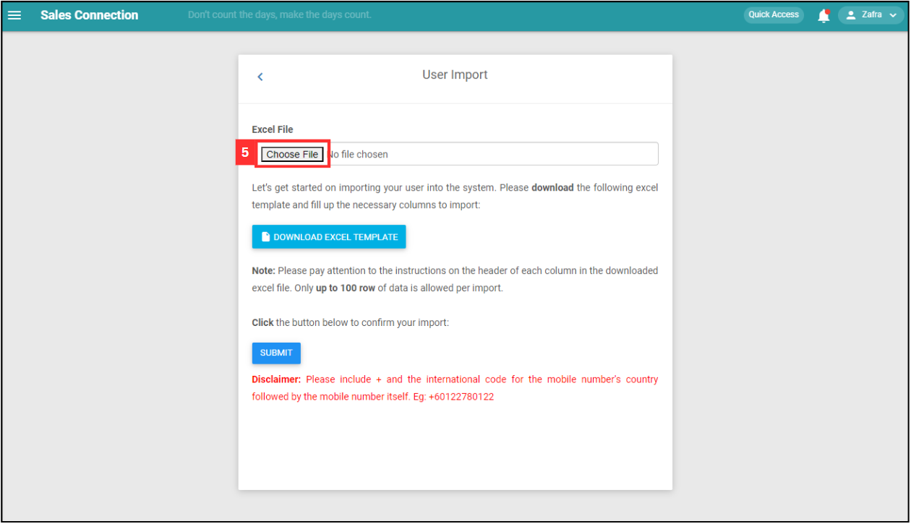
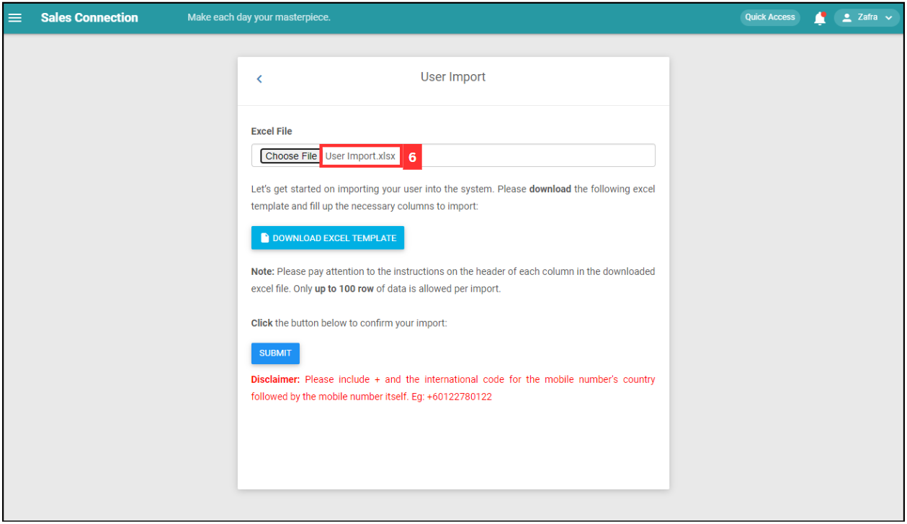
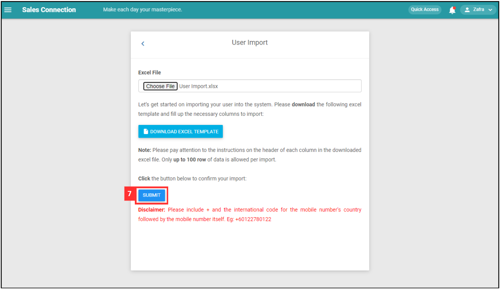

## How to Import New Customer/Project/Asset?
    
  1. At the desktop site's navigation bar, go to Import > Customer Import. 
     **Import Customer Here:** [https://salesconnection.my/customerimport](https://salesconnection.my/customerimport) 
     **Import Project Here:** [https://salesconnection.my/dealupload](https://salesconnection.my/dealupload) 
     **Import Asset Here:** [https://salesconnection.my/AssetImport/assetExcelImport](https://salesconnection.my/AssetImport/assetExcelImport) 

     

       
     

  2. Click "DOWNLOAD EXCEL TEMPLATE". 

     

       
     

  3. Fill out the details of the new users. 
     a. The details include: 
        - Name 
        - Mobile No 
        - Email (optional if the user only uses a mobile device) 
        - Account Type 
        - User Type 
        - Staff Category 
        
     *Note: Please include + and the international code for the mobile number's country followed by the mobile number itself. Eg: +60122780122. 

     

       
     

     
  4. Make sure all the information of the users is correct and save the file. 

     

       
     

  5. Go back to the user import page and choose the correct file by clicking "Choose File" to import. 

     

       
     

  6. Make sure the file uploaded is correct. 

     

       
     

  7. Click on the "SUBMIT" button. 

     

       
     

  8. Click "OK" and the users have been imported successfully. 

     

       
     

     

**Related Articles** 
- [How to Import New User?](Import_User.md)
